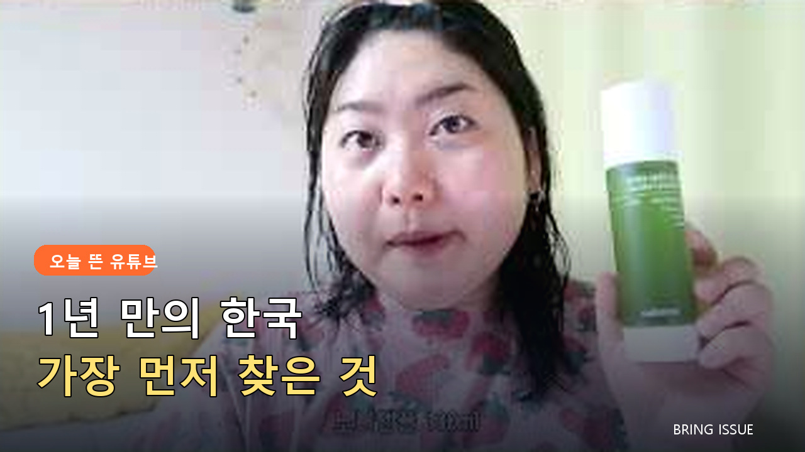
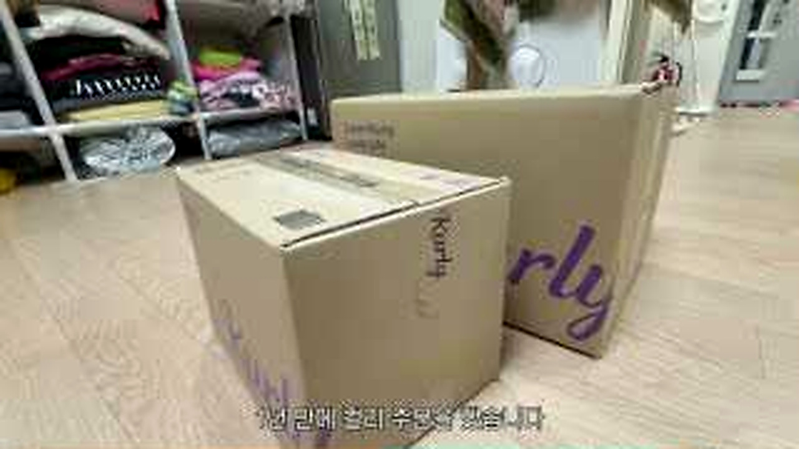
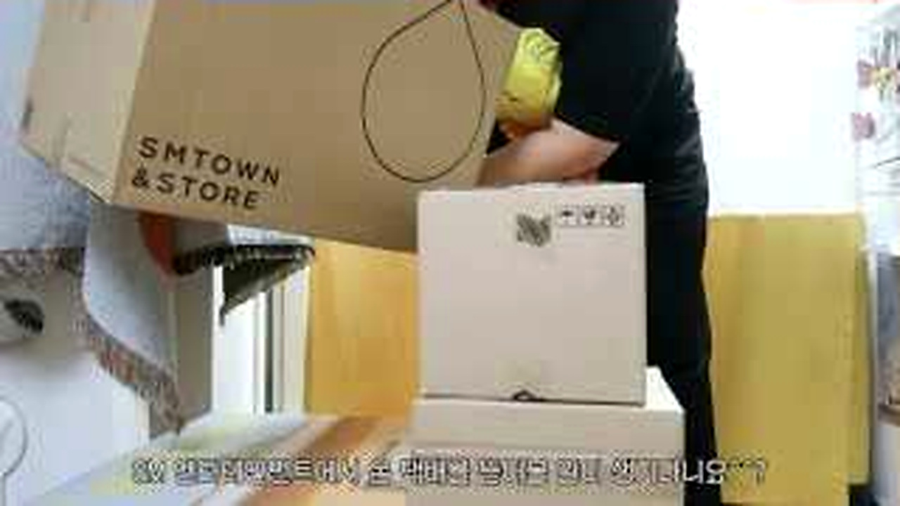
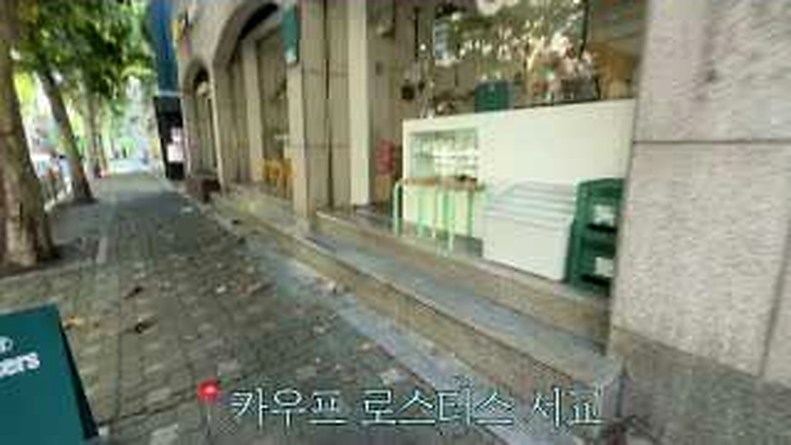
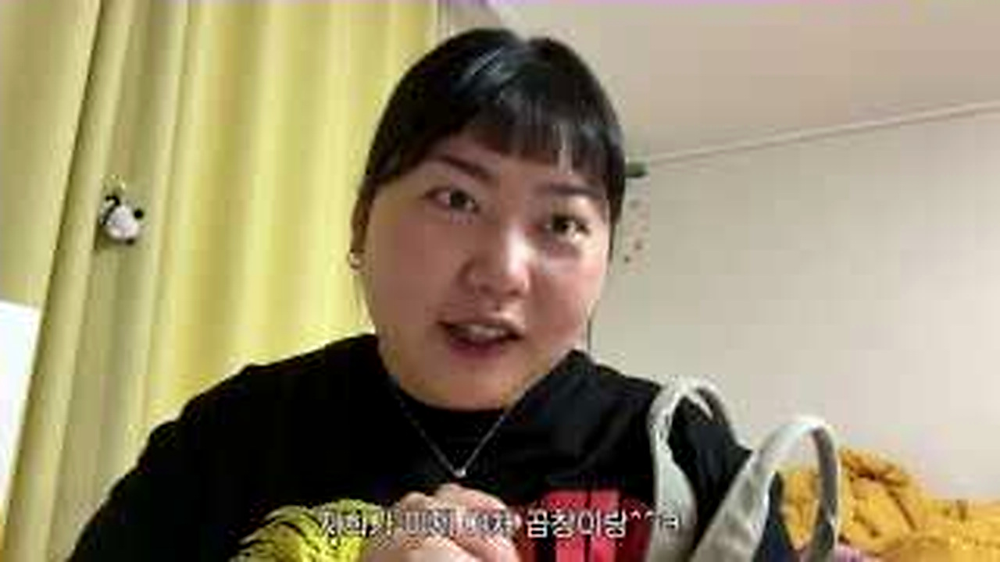
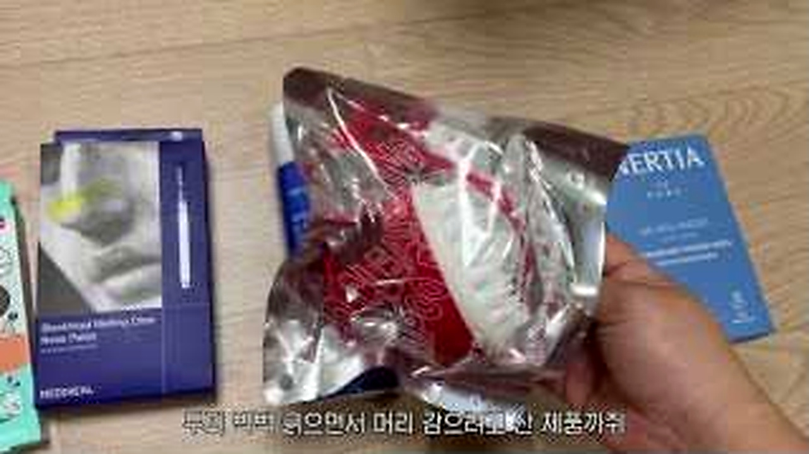
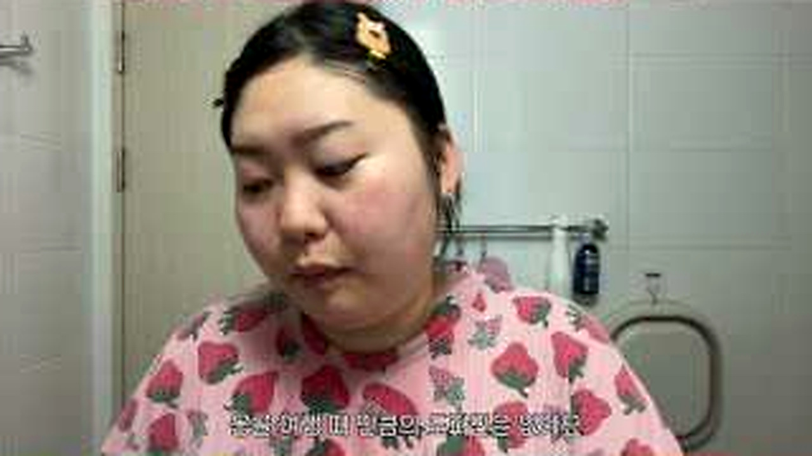
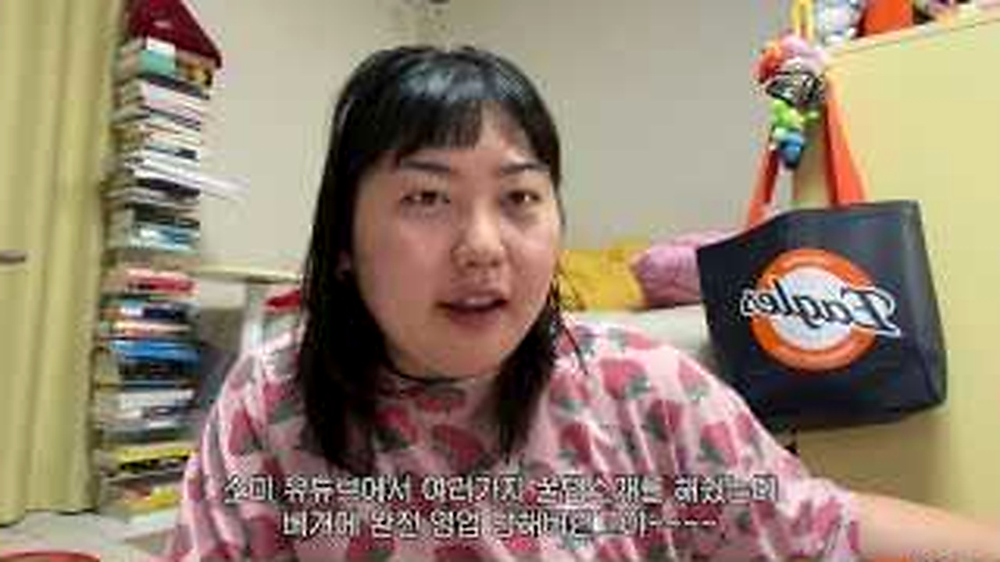
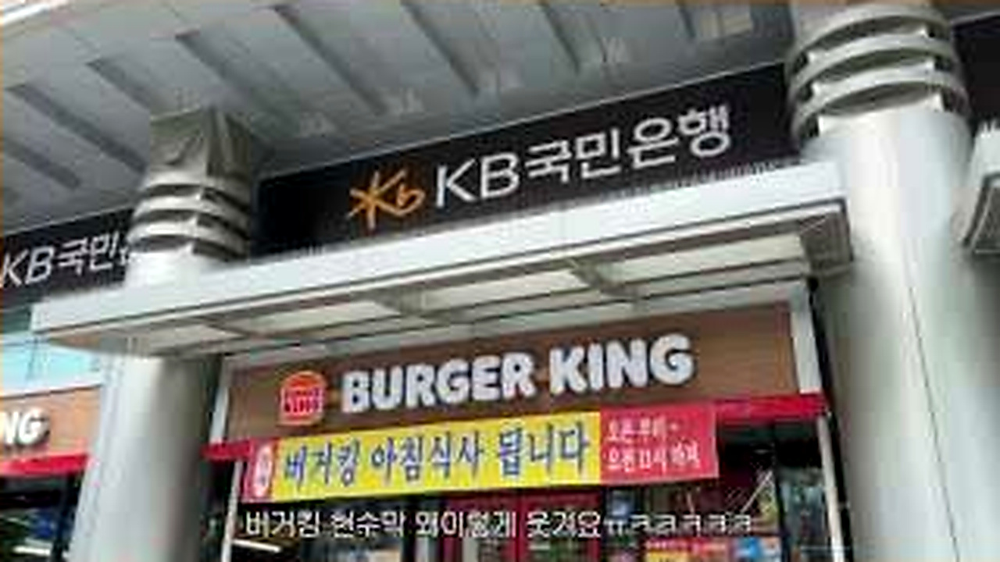
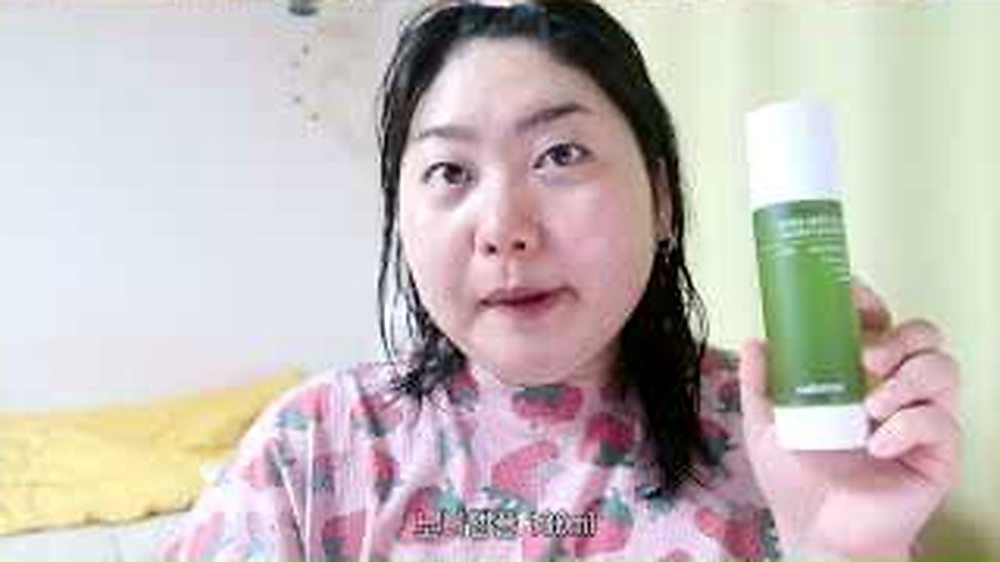

# 1년 만에 한국으로 돌아온 사람이 가장 먼저 챙긴 평범하지만 구체적인 일상

오랜 해외 생활 뒤 한국에 오면 거창한 관광지부터 갈 것 같았습니다.
콩빈의 영상에 먼저 등장한 건 택배 상자, 장보기, 익숙한 매장 같은 생활의 조각들이었습니다.
그래서 이 브이로그는 귀국기보다 <u>몸이 기억하는 일상을 되찾는 기록</u>에 가깝습니다.

## 📦 택배 상자에서 시작된 귀국

<b>그림 설명</b> 컬리 주문과 배송 상자가 첫 장면을 채웁니다. 돌아왔다는 실감이 공항보다 냉장고를 채우는 일에서 먼저 옵니다.

브링이슈 해설: 첫 컷은 글의 기준점을 잡습니다. 이번 글에서 계속 볼 장면은 '1년 만에 돌아와 다시 챙긴 구체적인 한국 생활'입니다. 인물과 공간을 먼저 익혀두면 뒤의 변화가 훨씬 잘 보입니다.

<b>그림 설명</b> 오랫동안 기다린 물건을 하나씩 뜯습니다. 포장보다 '이걸 다시 살 수 있다'는 반응이 더 크게 들립니다.

브링이슈 해설: 여기서부터 이야기가 움직입니다. 화면은 '1년 만에 돌아와 다시 챙긴 구체적인 한국 생활'라는 주제를 설명문보다 실제 상황으로 먼저 보여줍니다.

<b>그림 설명</b> 동네를 걸으며 바뀐 가게와 길을 발견합니다. 익숙한 곳의 작은 변화가 1년이라는 시간을 확인시킵니다.

브링이슈 해설: 첫 선택이 나오자 각자의 기준이 보입니다. 사소해 보여도 뒤의 반응을 이해하려면 놓치기 어려운 장면입니다.

<b>그림 설명</b> 작년에 반응이 좋았던 제품을 다시 꺼내 듭니다. 해외 생활 중 기억해둔 물건이 귀국 쇼핑 목록으로 이어집니다.

브링이슈 해설: 반응은 준비된 멘트보다 빠릅니다. 이 표정과 동작 덕분에 영상이 홍보물보다 생활 기록에 가까워집니다.

## 🛍️ 익숙한 매장을 다시 걷는 기분

<b>그림 설명</b> 아침을 챙기고 가족 일정을 보낸 뒤 자기 시간을 시작합니다. 여행과 달리 일상이 바로 돌아가는 장면입니다.

브링이슈 해설: 중간 질문이 앞의 흐름을 다시 세웁니다. 시청자도 같은 지점에서 '정말 그런가?' 하고 한 번 멈추게 됩니다.

<b>그림 설명</b> 선스프레이와 선쿠션을 비교하며 필요한 것을 고릅니다. 매장 선택지가 많다는 사실 자체가 반가워 보입니다.

브링이슈 해설: 여섯 번째 장면에서는 말보다 행동이 빠릅니다. 앞에서 쌓인 흐름이 실제 선택으로 바뀌는 순간이라 글에서도 중심에 두었습니다.

<b>그림 설명</b> 해외에서 불편했던 생활 조건을 떠올리며 제품을 봅니다. 구매 이유가 유행보다 지난 생활 경험에 붙어 있습니다.

브링이슈 해설: 반전 직전에는 작은 어긋남이 쌓입니다. 처음 예상했던 결론이 그대로 가지 않을 것이라는 신호가 보입니다.

## 🏠 특별하지 않아 더 반가운 하루

<b>그림 설명</b> 호주에서부터 따라 사고 싶었던 물건을 실제로 만납니다. 화면 속 정보가 손에 잡히는 순간의 반응이 솔직합니다.

브링이슈 해설: 여덟 번째 장면에서 제목의 답이 나옵니다. 놀라움만 키우지 않고 앞선 조건과 연결해서 봐야 과장이 줄어듭니다.

<b>그림 설명</b> 익숙한 패스트푸드 간판과 거리 풍경이 이어집니다. 대단한 장소가 아니어도 귀국자의 눈에는 장면이 됩니다.

브링이슈 해설: 일이 지나간 뒤의 표정은 결과를 정리해줍니다. 성공이나 실패 한 단어보다 사람이 무엇을 느꼈는지가 남습니다.

<b>그림 설명</b> 뷰티 제품을 들고 오랜만의 한국 일상을 정리합니다. 무엇을 샀는지보다 선택할 수 있는 생활이 돌아왔다는 느낌입니다.

브링이슈 해설: 마지막 장면은 억지 교훈을 붙이지 않습니다. 앞의 흐름을 본 사람이 자기 경험을 떠올릴 만큼만 여백을 남깁니다.

<u>한 줄 정리: 1년 만에 돌아와 다시 챙긴 구체적인 한국 생활</u>

<b>에디터의 시선</b>

이 글에 올리브영 제품이나 장보기 아이템을 붙일 때는 영상에 실제 등장한 범위만 다뤄야 합니다. 피부 타입과 거주 환경이 다르면 같은 제품도 필요가 달라집니다. <u>귀국 브이로그의 소비는 그 사람의 생활 맥락</u>에서 읽는 편이 자연스럽습니다.

<u>오래 떠나 있다 돌아왔을 때 가장 먼저 찾고 싶은 한국의 평범한 일상은 무엇인가요?</u>

---

원본 채널: 콩빈Cong Been
원본 영상 제목: 1년 만에 한국 돌아와서 하고 싶었던 거 원없이 하는 브이로그
원본 링크: https://www.youtube.com/watch?v=7OP9yBcLeO4

이 글은 원본 영상을 대체하지 않는 리뷰·해설 콘텐츠입니다. 장면 저작권은 원저작자와 해당 채널에 있으며, 영상의 맥락을 확인하려면 원본을 함께 봐주세요.

#콩빈 #한국귀국 #귀국브이로그 #한국일상 #올리브영 #장보기 #생활브이로그 #유튜브리뷰 #오늘뜬유튜브 #브링이슈
