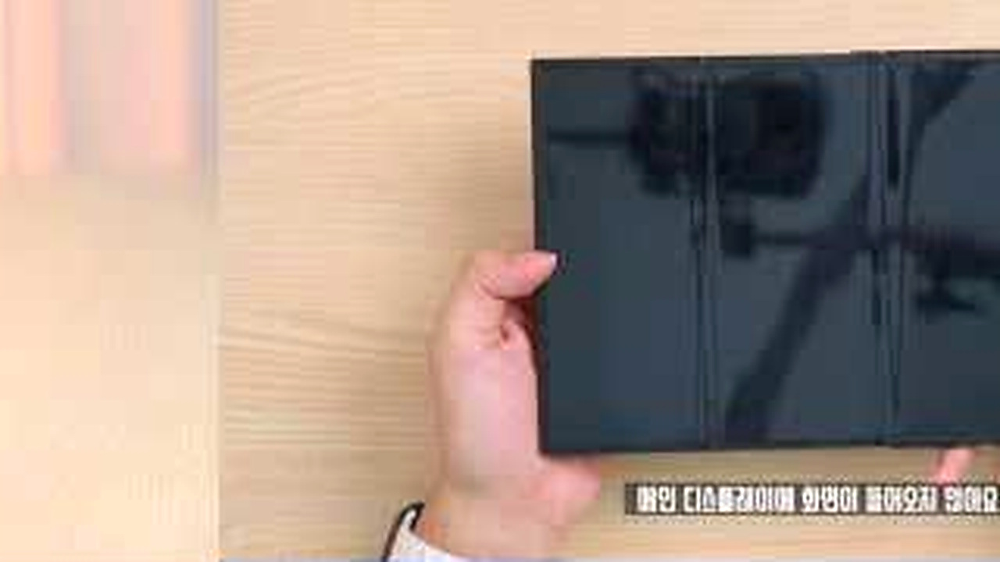
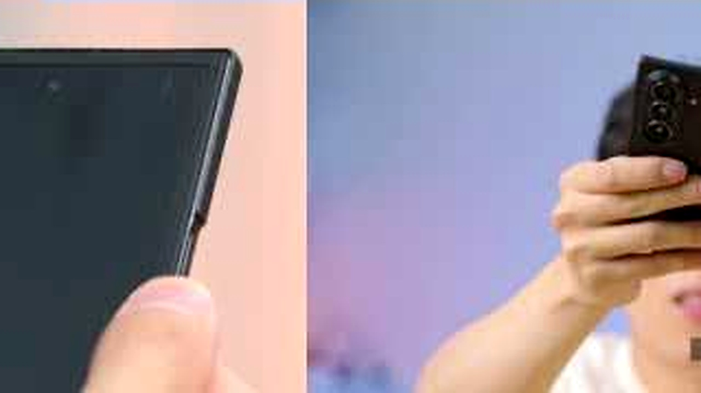
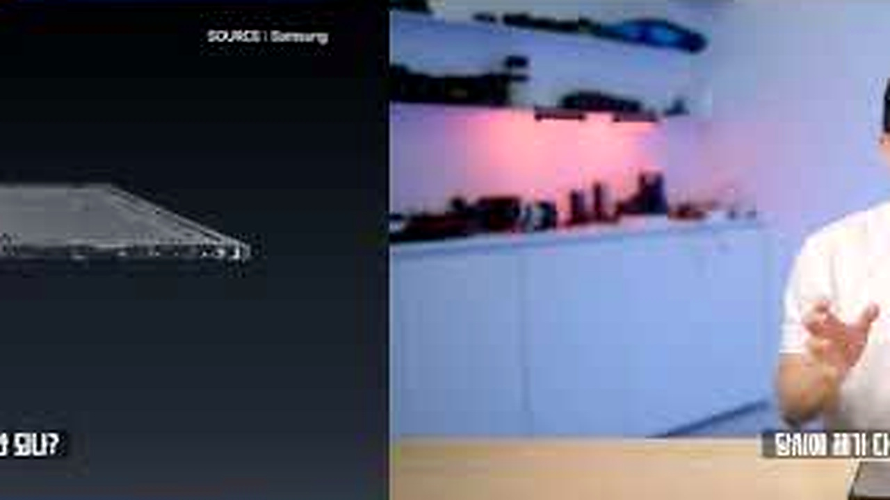
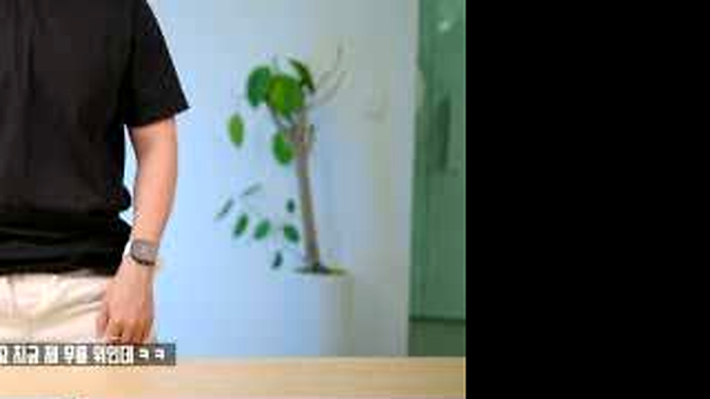

# 359만원 갤럭시 트라이폴드가 깨졌다면, 실제 수리 과정에서 정말 놀란 비용

비싼 폰일수록 조심하면 된다고 생각하지만 사고는 높이를 가리지 않습니다.
잇섭은 파손된 트라이폴드의 접히는 화면과 수리 조건을 직접 확인합니다.
기기 가격보다 더 현실적으로 다가온 건 <u>파손 뒤 선택할 수 있는 경우의 수</u>였습니다.

## 📱 펼치자 바로 보인 손상

<b>그림 설명</b> 잇섭이 기기를 들고 파손 상황부터 설명합니다. 평소처럼 차분한 말투라 오히려 가격의 무게가 크게 느껴집니다.

브링이슈 해설: 첫 컷은 글의 기준점을 잡습니다. 이번 글에서 계속 볼 장면은 '고가 트라이폴드 파손 뒤 실제로 확인해야 할 수리 조건'입니다. 인물과 공간을 먼저 익혀두면 뒤의 변화가 훨씬 잘 보입니다.

<b>그림 설명</b> 세 화면을 펼쳐 정상 기기와 사용감을 비교합니다. 넓은 화면의 장점이 파손 때는 수리 범위로 바뀝니다.

브링이슈 해설: 여기서부터 이야기가 움직입니다. 화면은 '고가 트라이폴드 파손 뒤 실제로 확인해야 할 수리 조건'라는 주제를 설명문보다 실제 상황으로 먼저 보여줍니다.

<b>그림 설명</b> 힌지와 접히는 부분을 가까이 보여줍니다. 겉면 한곳의 충격이 내부 화면 전체에 어떤 영향을 주는지 확인하는 장면입니다.

브링이슈 해설: 첫 선택이 나오자 각자의 기준이 보입니다. 사소해 보여도 뒤의 반응을 이해하려면 놓치기 어려운 장면입니다.

<b>그림 설명</b> 화면을 접을 때 생기는 이상과 주름을 보여줍니다. 단순 흠집인지 기능 손상인지 구분해야 비용 판단도 가능합니다.

브링이슈 해설: 반응은 준비된 멘트보다 빠릅니다. 이 표정과 동작 덕분에 영상이 홍보물보다 생활 기록에 가까워집니다.

## 💸 보험 여부에 따라 갈린 비용

<b>그림 설명</b> 삼성케어플러스 적용 여부를 묻습니다. 같은 파손이어도 가입 시점과 보장 조건이 결과를 크게 바꿉니다.

브링이슈 해설: 중간 질문이 앞의 흐름을 다시 세웁니다. 시청자도 같은 지점에서 '정말 그런가?' 하고 한 번 멈추게 됩니다.

<b>그림 설명</b> 예상 금액을 듣기 전 잠시 말을 고릅니다. 숫자를 자극적으로 던지기보다 어떤 부품이 교체되는지부터 짚습니다.

브링이슈 해설: 여섯 번째 장면에서는 말보다 행동이 빠릅니다. 앞에서 쌓인 흐름이 실제 선택으로 바뀌는 순간이라 글에서도 중심에 두었습니다.

<b>그림 설명</b> 할인이 적용돼도 디스플레이 부품 자체가 비싸다는 설명이 이어집니다. 고가 기기의 유지비가 드러나는 구간입니다.

브링이슈 해설: 반전 직전에는 작은 어긋남이 쌓입니다. 처음 예상했던 결론이 그대로 가지 않을 것이라는 신호가 보입니다.

## 🛠️ 수리 뒤에도 남는 걱정

<b>그림 설명</b> 수리비와 배터리 교체 범위를 함께 봅니다. 한 부품만 바꾸는 줄 알았던 예상이 여기서 달라집니다.

브링이슈 해설: 여덟 번째 장면에서 제목의 답이 나옵니다. 놀라움만 키우지 않고 앞선 조건과 연결해서 봐야 과장이 줄어듭니다.

<b>그림 설명</b> 떨어뜨린 높이와 바닥 상태를 다시 재현합니다. 큰 사고가 아니어도 충격 각도에 따라 결과가 달라질 수 있습니다.

브링이슈 해설: 일이 지나간 뒤의 표정은 결과를 정리해줍니다. 성공이나 실패 한 단어보다 사람이 무엇을 느꼈는지가 남습니다.

<b>그림 설명</b> 수리 뒤에는 보호와 보험을 어떻게 볼지 정리합니다. 겁을 주기보다 구매 전 총비용을 계산하자는 쪽에 가깝습니다.

브링이슈 해설: 마지막 장면은 억지 교훈을 붙이지 않습니다. 앞의 흐름을 본 사람이 자기 경험을 떠올릴 만큼만 여백을 남깁니다.

<u>한 줄 정리: 고가 트라이폴드 파손 뒤 실제로 확인해야 할 수리 조건</u>

<b>에디터의 시선</b>

힌지 케이스와 보호필름은 도움을 줄 수 있지만 파손을 완전히 막는다고 쓸 수는 없습니다. 보험도 자기부담금과 보장 횟수가 다릅니다. <u>기기 가격에 수리 가능성까지 더한 총비용</u>을 확인하는 것이 이 영상의 실용적인 포인트입니다.

<u>여러분은 고가 스마트폰을 살 때 보험료와 예상 수리비까지 계산하는 편인가요?</u>

---

원본 채널: ITSub잇섭
원본 영상 제목: 359만원짜리 갤럭시 Z 트라이폴드 깨먹으면 수리비 얼마나 나올까?
원본 링크: https://www.youtube.com/watch?v=48JWie_aMxI

이 글은 원본 영상을 대체하지 않는 리뷰·해설 콘텐츠입니다. 장면 저작권은 원저작자와 해당 채널에 있으며, 영상의 맥락을 확인하려면 원본을 함께 봐주세요.

#잇섭 #갤럭시트라이폴드 #스마트폰수리 #삼성케어플러스 #폴더블폰 #수리비 #IT리뷰 #유튜브리뷰 #오늘뜬유튜브 #브링이슈
