# 빅뱅 캠핑 준비에서 역할이 갈린 순간, 웃음 뒤에 보인 20년 팀워크 이야기

빅뱅이 한자리에 모이면 노래 이야기부터 나올 줄 알았습니다.
그런데 이번 영상의 재미는 캠핑 준비에서 드러난 서로 다른 성격에 있었습니다.
누가 요리를 맡고 누가 분위기를 정리하는지 보다 보면 <u>오래된 팀의 편안함</u>이 보입니다.

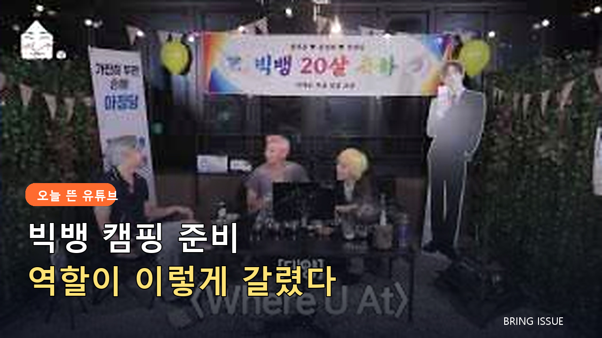

## 🎬 시작부터 엇갈린 캠핑 계획

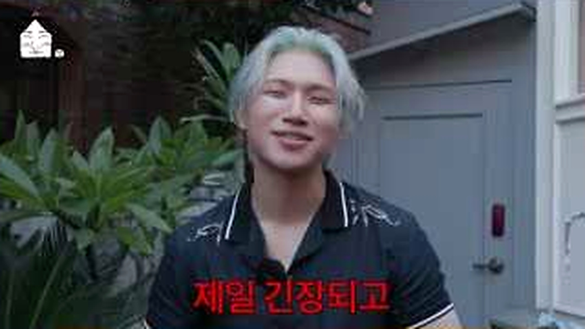

<b>그림 설명</b> 대성이 야외 공간에 먼저 서서 오늘 할 일을 설명합니다. 가벼운 오프닝인데도 직접 판을 벌이는 사람의 긴장이 얼굴에 남아 있습니다.

브링이슈 해설: 첫 컷은 글의 기준점을 잡습니다. 이번 글에서 계속 볼 장면은 '캠핑 준비 속에서 자연스럽게 갈린 멤버들의 역할'입니다. 인물과 공간을 먼저 익혀두면 뒤의 변화가 훨씬 잘 보입니다.

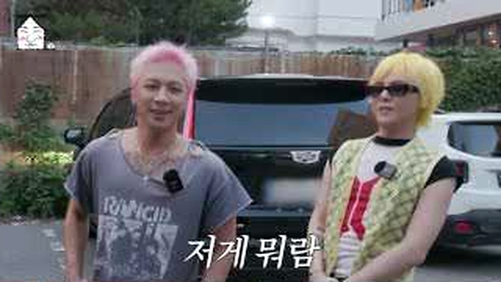

<b>그림 설명</b> 태양과 멤버들이 하나둘 모이자 말의 속도가 빨라집니다. 반가움과 장난이 동시에 터져서 정해진 진행보다 관계가 먼저 보입니다.

브링이슈 해설: 여기서부터 이야기가 움직입니다. 화면은 '캠핑 준비 속에서 자연스럽게 갈린 멤버들의 역할'라는 주제를 설명문보다 실제 상황으로 먼저 보여줍니다.

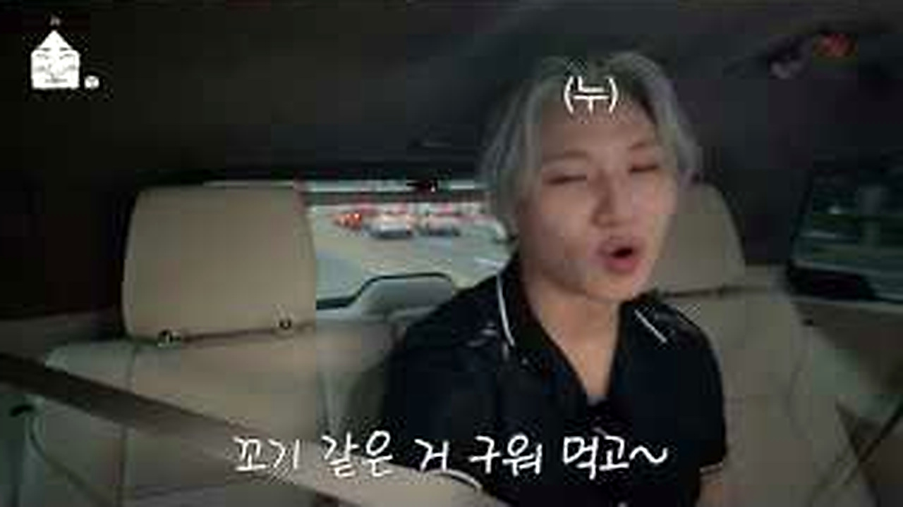

<b>그림 설명</b> 테이블에 둘러앉아 먹을 것과 준비물을 고르는 장면입니다. 사소한 메뉴 하나에도 각자 고집이 달라 웃음이 생깁니다.

브링이슈 해설: 첫 선택이 나오자 각자의 기준이 보입니다. 사소해 보여도 뒤의 반응을 이해하려면 놓치기 어려운 장면입니다.

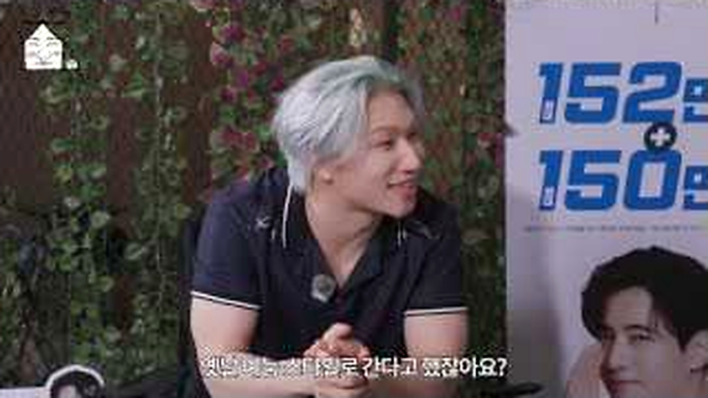

<b>그림 설명</b> 화면 속 자료를 보며 옛날 예능 방식을 떠올립니다. 추억을 꺼내도 과장된 감상보다 바로 농담으로 넘기는 분위기가 빅뱅답습니다.

브링이슈 해설: 반응은 준비된 멘트보다 빠릅니다. 이 표정과 동작 덕분에 영상이 홍보물보다 생활 기록에 가까워집니다.

## 👀 준비할수록 선명해진 역할

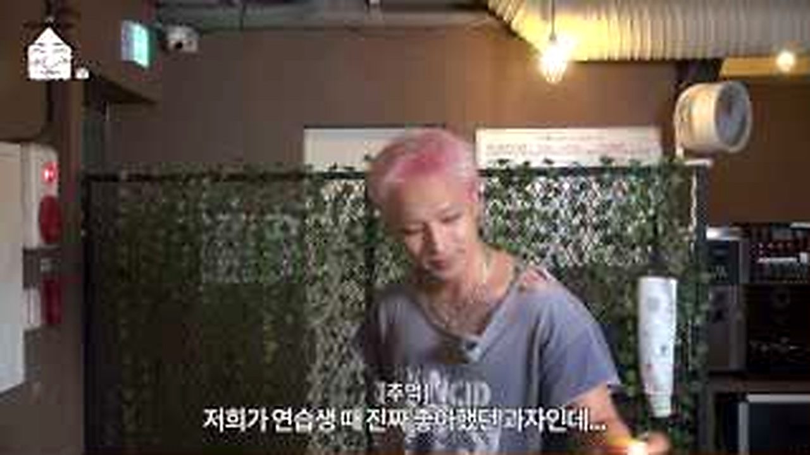

<b>그림 설명</b> 대성이 밖에서 준비 상황을 확인합니다. 계획한 사람과 실제 움직이는 사람 사이의 간격이 여기서 슬슬 드러납니다.

브링이슈 해설: 중간 질문이 앞의 흐름을 다시 세웁니다. 시청자도 같은 지점에서 '정말 그런가?' 하고 한 번 멈추게 됩니다.

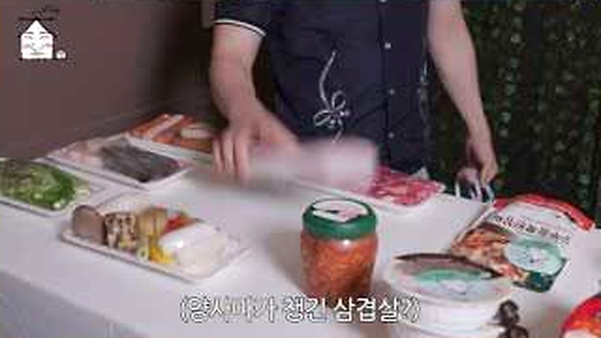

<b>그림 설명</b> 실내에서 태양이 자기 몫을 챙기는 모습입니다. 말보다 손이 먼저 움직여서 멤버별 역할 차이가 더 분명해집니다.

브링이슈 해설: 여섯 번째 장면에서는 말보다 행동이 빠릅니다. 앞에서 쌓인 흐름이 실제 선택으로 바뀌는 순간이라 글에서도 중심에 두었습니다.

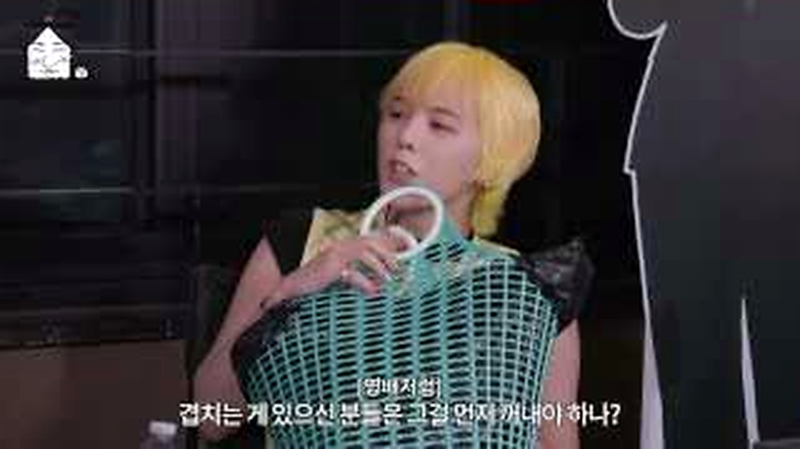

<b>그림 설명</b> 잠시 쉬며 이야기를 나누는 장면에서는 무대 위 이미지가 거의 사라집니다. 오래 본 친구들끼리의 편한 표정에 가깝습니다.

브링이슈 해설: 반전 직전에는 작은 어긋남이 쌓입니다. 처음 예상했던 결론이 그대로 가지 않을 것이라는 신호가 보입니다.

## 💬 20주년이라 더 남았던 장면

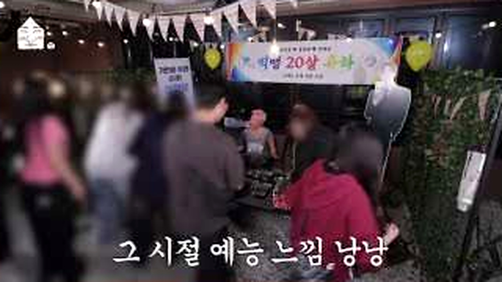

<b>그림 설명</b> 여러 사람이 모인 현장에서 캠핑이 작은 행사가 됩니다. 준비 과정의 우왕좌왕이 결과적으로 가장 큰 볼거리가 됐습니다.

브링이슈 해설: 여덟 번째 장면에서 제목의 답이 나옵니다. 놀라움만 키우지 않고 앞선 조건과 연결해서 봐야 과장이 줄어듭니다.

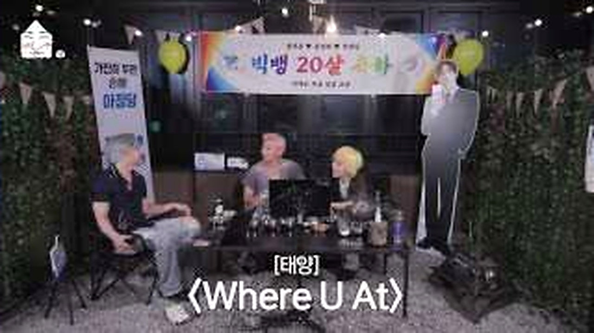

<b>그림 설명</b> 20주년을 알리는 무대 장면입니다. 앞의 장난스러운 흐름 뒤에 이 컷이 놓이니 시간이 갑자기 실감납니다.

브링이슈 해설: 일이 지나간 뒤의 표정은 결과를 정리해줍니다. 성공이나 실패 한 단어보다 사람이 무엇을 느꼈는지가 남습니다.

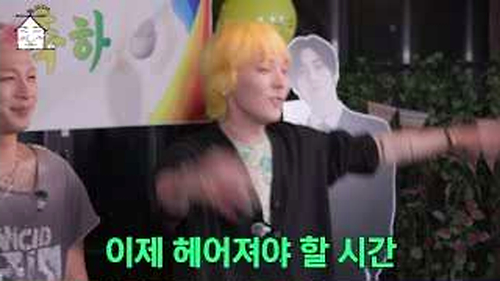

<b>그림 설명</b> 마지막에는 축하와 감사가 남습니다. 거창한 결론보다 다시 같이 모였다는 사실 자체가 영상의 답처럼 느껴집니다.

브링이슈 해설: 마지막 장면은 억지 교훈을 붙이지 않습니다. 앞의 흐름을 본 사람이 자기 경험을 떠올릴 만큼만 여백을 남깁니다.

<u>한 줄 정리: 캠핑 준비 속에서 자연스럽게 갈린 멤버들의 역할</u>

<b>에디터의 시선</b>

저는 이 영상에서 완벽한 캠핑 정보보다 역할이 갈리는 순간을 더 오래 봤습니다. 캠핑 의자나 랜턴 같은 물건을 고를 때도 누가 무엇을 챙기는지가 관계를 보여주기 때문입니다. <u>상품보다 사람이 먼저 보이는 글</u>로 정리해야 영상의 재미가 살아납니다.

<u>여러분이 이 캠핑에 함께 간다면 요리, 장보기, 불 피우기 중 어떤 역할을 맡고 싶으신가요?</u>

---

원본 채널: 집대성
원본 영상 제목: [SUB] 우리 캠핑 갈고야 | 집대성 ep.120 빅뱅 (BIGBANG)
원본 링크: https://www.youtube.com/watch?v=C8bnSlLCh8g

이 글은 원본 영상을 대체하지 않는 리뷰·해설 콘텐츠입니다. 장면 저작권은 원저작자와 해당 채널에 있으며, 영상의 맥락을 확인하려면 원본을 함께 봐주세요.

#빅뱅 #집대성 #대성 #태양 #빅뱅캠핑 #유튜브리뷰 #연예이슈 #20주년 #오늘뜬유튜브 #브링이슈
