# 고깃집 막내 알바를 해보니, 손님 눈에는 안 보였던 반복 노동의 정체는 무엇이었나

고깃집 일은 주문을 받고 고기를 나르는 장면만 떠올리기 쉽습니다.
김지유가 막내 알바로 들어가자 화면에는 불판, 테이블, 동선처럼 손님이 잘 보지 않는 일이 계속 잡힙니다.
한 번 닦고 끝나는 줄 알았던 일이 다시 돌아오는 순간 <u>서비스업의 진짜 속도</u>가 보였습니다.

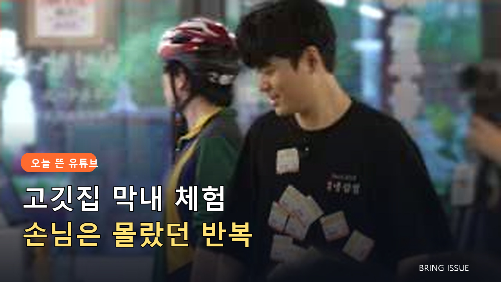

## 🔥 유니폼을 입자 달라진 표정

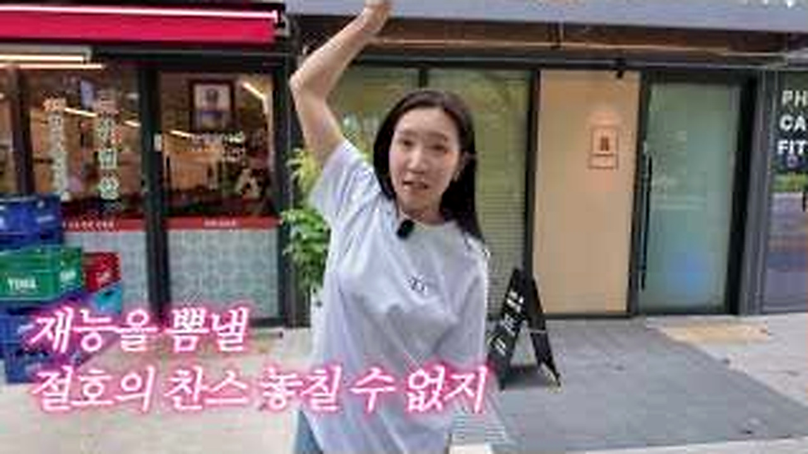

<b>그림 설명</b> 가게 앞에서 일을 돕겠다고 말하며 시작합니다. 자신감 있는 표정이 실제 업무를 만나기 전의 기준점이 됩니다.

브링이슈 해설: 첫 컷은 글의 기준점을 잡습니다. 이번 글에서 계속 볼 장면은 '고깃집 막내가 반복해서 처리해야 하는 보이지 않는 일'입니다. 인물과 공간을 먼저 익혀두면 뒤의 변화가 훨씬 잘 보입니다.

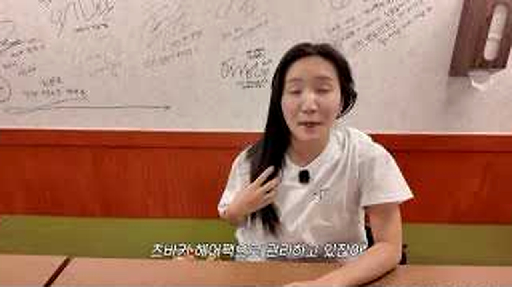

<b>그림 설명</b> 머리를 단단히 묶고 위생과 안전 준비를 합니다. 짧은 장면이지만 음식점 일이 외모보다 기본 동작에서 시작함을 보여줍니다.

브링이슈 해설: 여기서부터 이야기가 움직입니다. 화면은 '고깃집 막내가 반복해서 처리해야 하는 보이지 않는 일'라는 주제를 설명문보다 실제 상황으로 먼저 보여줍니다.

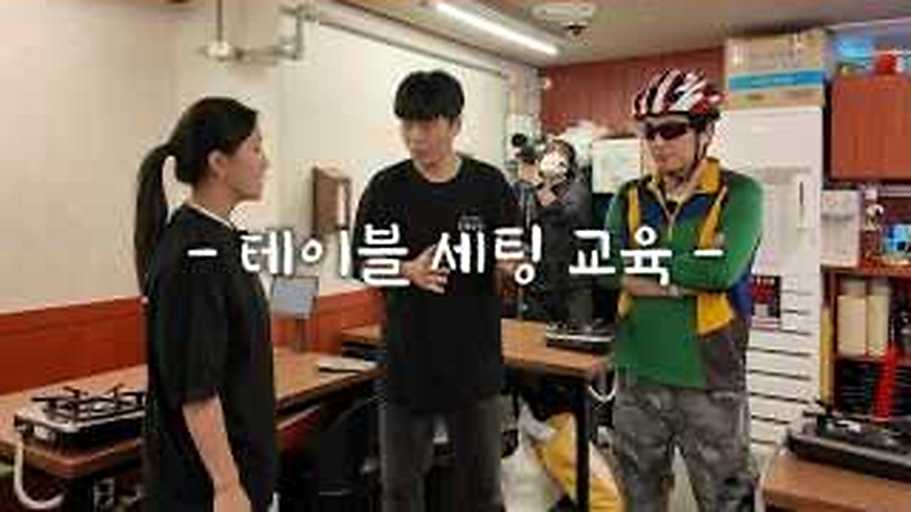

<b>그림 설명</b> 유니폼으로 갈아입고 매장에 섭니다. 옷이 바뀌자 손님이 아니라 직원의 시선으로 공간을 보기 시작합니다.

브링이슈 해설: 첫 선택이 나오자 각자의 기준이 보입니다. 사소해 보여도 뒤의 반응을 이해하려면 놓치기 어려운 장면입니다.

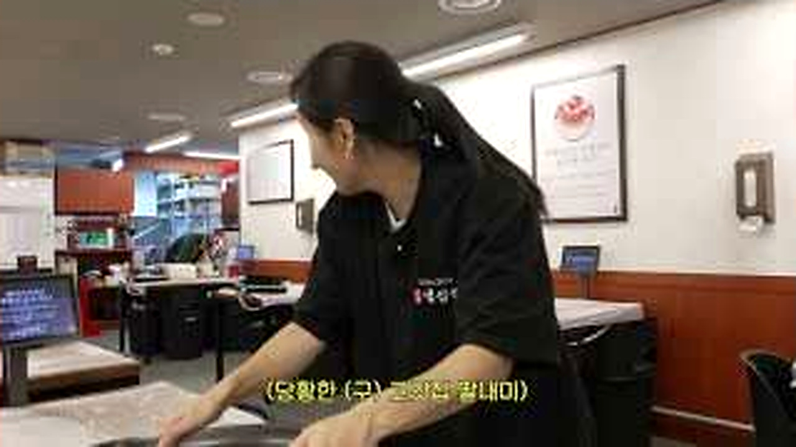

<b>그림 설명</b> 세척 공간과 불판 주변을 오가며 손을 씁니다. 화면이 화려하지 않아도 반복되는 움직임 자체가 업무량을 말해줍니다.

브링이슈 해설: 반응은 준비된 멘트보다 빠릅니다. 이 표정과 동작 덕분에 영상이 홍보물보다 생활 기록에 가까워집니다.

## 🧽 닦았는데 또 닦는 이유

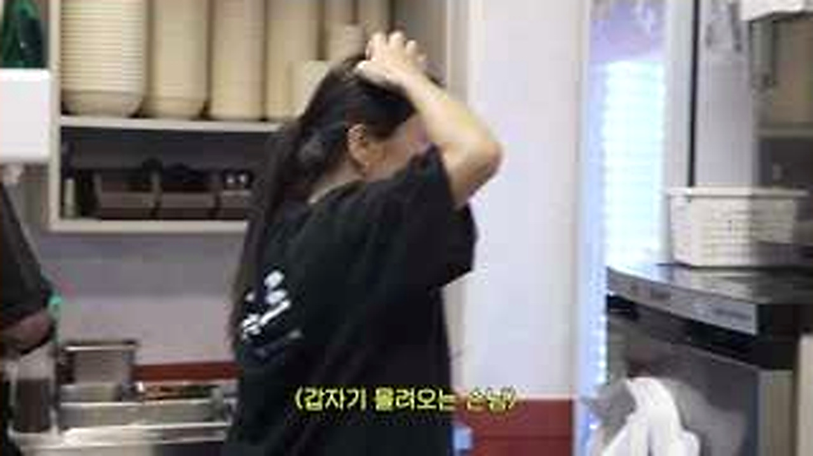

<b>그림 설명</b> 테이블 번호와 손님 수를 확인합니다. 주문 한 건 뒤에 자리, 식기, 불판 준비가 동시에 붙는 구조입니다.

브링이슈 해설: 중간 질문이 앞의 흐름을 다시 세웁니다. 시청자도 같은 지점에서 '정말 그런가?' 하고 한 번 멈추게 됩니다.

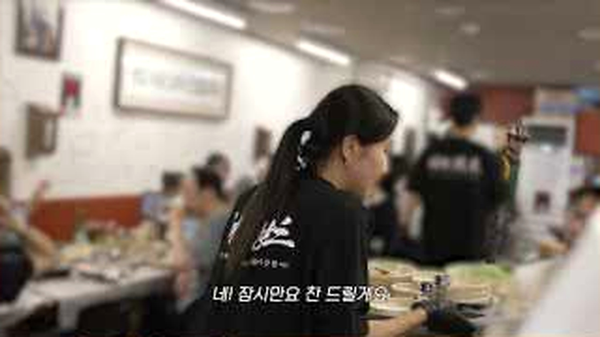

<b>그림 설명</b> 잠깐 숨을 돌리는 표정에서 체력이 빠진 게 보입니다. 재미를 위해 들어왔지만 속도는 봐주지 않습니다.

브링이슈 해설: 여섯 번째 장면에서는 말보다 행동이 빠릅니다. 앞에서 쌓인 흐름이 실제 선택으로 바뀌는 순간이라 글에서도 중심에 두었습니다.

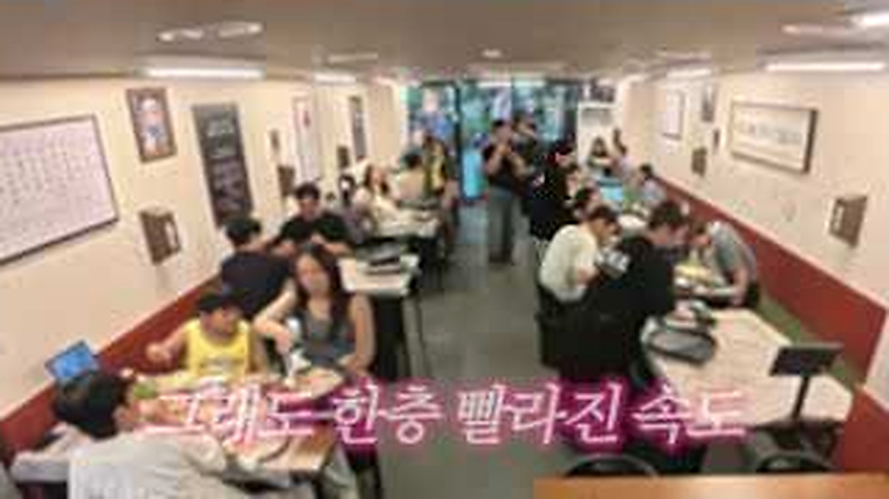

<b>그림 설명</b> 껍데기와 불판을 계속 살피는 장면입니다. 조리 상태를 놓치면 서비스와 안전이 한꺼번에 흔들릴 수 있습니다.

브링이슈 해설: 반전 직전에는 작은 어긋남이 쌓입니다. 처음 예상했던 결론이 그대로 가지 않을 것이라는 신호가 보입니다.

## 🍽️ 손님 뒤에서 이어지는 일

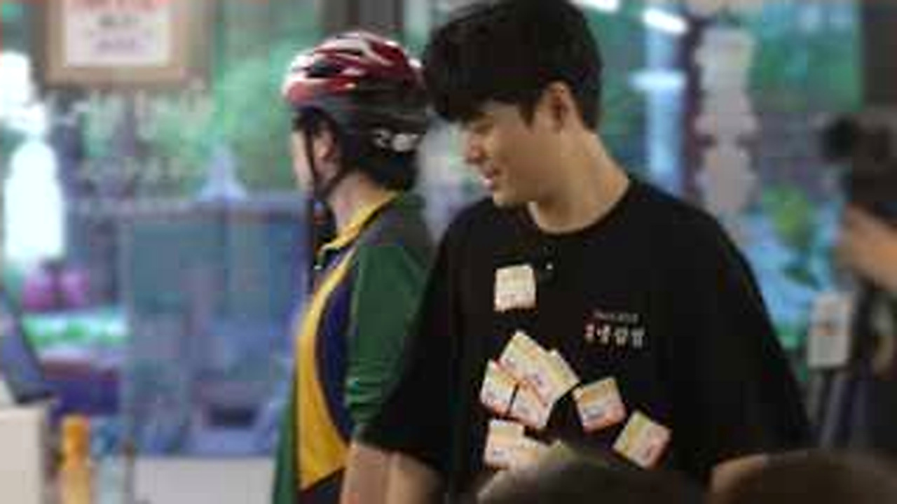

<b>그림 설명</b> 닦아둔 자리에 다시 해야 할 일이 생깁니다. '왜 또 하지?'라는 반응이 막내가 업무 흐름을 이해하는 전환점입니다.

브링이슈 해설: 여덟 번째 장면에서 제목의 답이 나옵니다. 놀라움만 키우지 않고 앞선 조건과 연결해서 봐야 과장이 줄어듭니다.

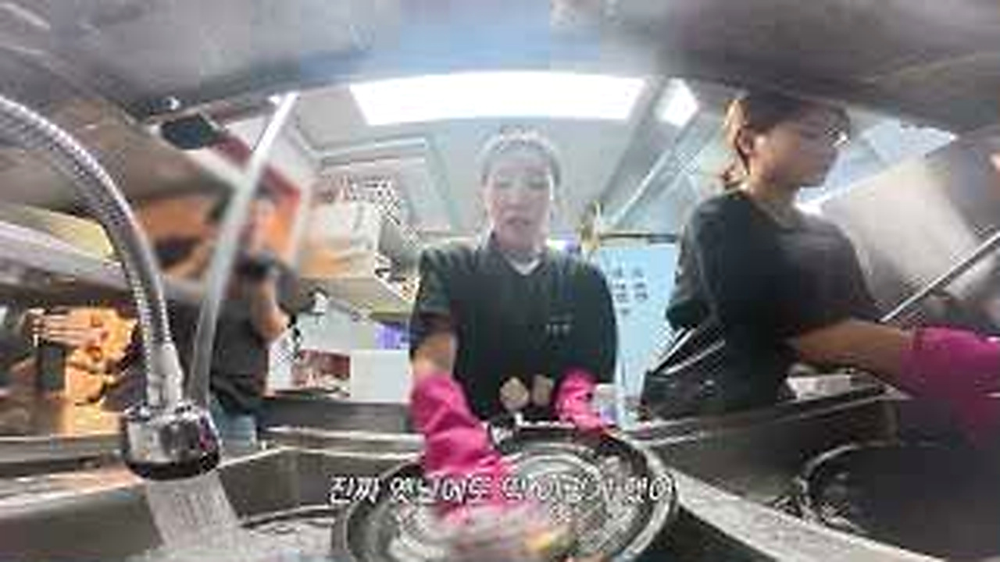

<b>그림 설명</b> 직접 해보고 싶었다는 말 뒤로 피곤한 얼굴이 따라옵니다. 경험 전의 호기심과 실제 노동 사이가 솔직하게 드러납니다.

브링이슈 해설: 일이 지나간 뒤의 표정은 결과를 정리해줍니다. 성공이나 실패 한 단어보다 사람이 무엇을 느꼈는지가 남습니다.

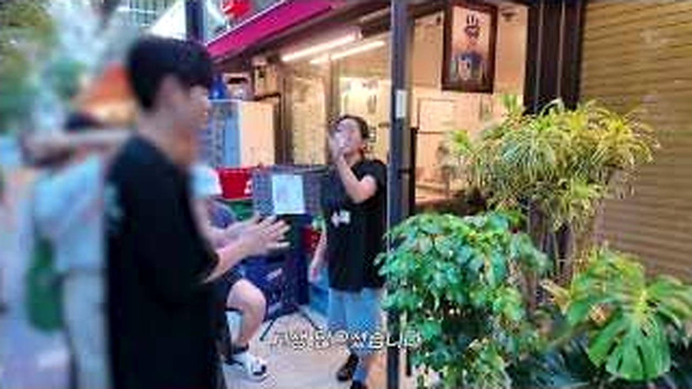

<b>그림 설명</b> 가게 밖으로 나온 뒤 처음과 다른 말투로 하루를 정리합니다. 힘들었다는 말보다 반복의 이유를 알게 된 표정이 남습니다.

브링이슈 해설: 마지막 장면은 억지 교훈을 붙이지 않습니다. 앞의 흐름을 본 사람이 자기 경험을 떠올릴 만큼만 여백을 남깁니다.

<u>한 줄 정리: 고깃집 막내가 반복해서 처리해야 하는 보이지 않는 일</u>

<b>에디터의 시선</b>

이 글에서 주방 장갑이나 냄새 제거제를 소개한다면 '알바 필수템'이라고 단정할 수는 없습니다. 매장마다 지급 기준과 위생 규정이 다르기 때문입니다. <u>정보성 제안은 개인 구매보다 작업 조건 확인</u>에 초점을 맞췄습니다.

<u>식당에서 일해본 분이라면 손님이 가장 잘 모르는 일이 무엇이었는지 궁금합니다.</u>

---

원본 채널: 천상여자 김지유
원본 영상 제목: 불판을 또 닦아요..?🔥 고깃집 막내 알바생으로 잠입한 37세 천상여자 | 김지유의 알바
원본 링크: https://www.youtube.com/watch?v=IPWva69hO7w

이 글은 원본 영상을 대체하지 않는 리뷰·해설 콘텐츠입니다. 장면 저작권은 원저작자와 해당 채널에 있으며, 영상의 맥락을 확인하려면 원본을 함께 봐주세요.

#김지유 #고깃집알바 #알바체험 #서비스업 #불판세척 #주방일 #유튜브리뷰 #오늘뜬유튜브 #직업체험 #브링이슈
