# 잠깐 만난 가족과 다시 헤어지는 날, 준비보다 먼저 무너진 실제 반응들 기록

가족을 만나는 날보다 헤어지는 날의 시간은 이상하게 빨리 갑니다.
리쥬라이크 영상은 짐을 챙기고 아이를 달래는 평범한 장면 사이에 갑자기 멈추는 표정을 담았습니다.
억지로 감정을 키우지 않아도 <u>짧은 만남이 남긴 빈자리</u>가 충분히 전해집니다.

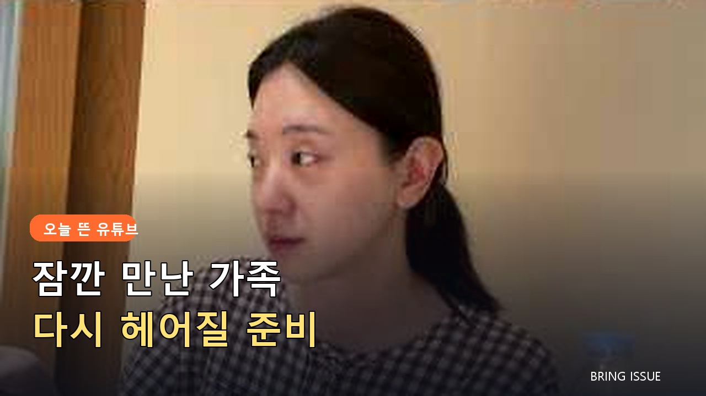

## 👨‍👩‍👧 함께라서 평범했던 시간

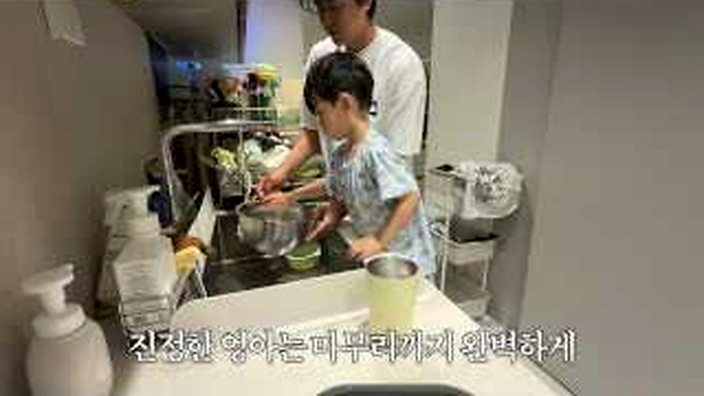

<b>그림 설명</b> 부엌에서 가족이 함께 움직입니다. 특별한 행사보다 같이 밥을 준비하는 시간이 만남의 온도를 보여줍니다.

브링이슈 해설: 첫 컷은 글의 기준점을 잡습니다. 이번 글에서 계속 볼 장면은 '짧은 가족 만남 뒤 다시 헤어져야 했던 준비와 반응'입니다. 인물과 공간을 먼저 익혀두면 뒤의 변화가 훨씬 잘 보입니다.

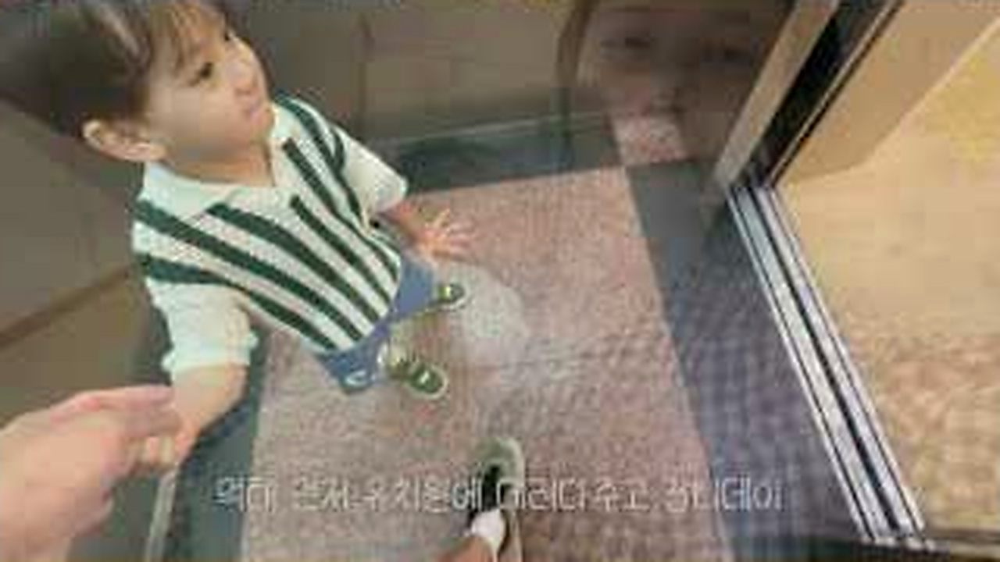

<b>그림 설명</b> 아이를 안고 인사를 나누는 장면입니다. 어른이 웃으며 넘기려 해도 아이의 시선은 오래 머뭅니다.

브링이슈 해설: 여기서부터 이야기가 움직입니다. 화면은 '짧은 가족 만남 뒤 다시 헤어져야 했던 준비와 반응'라는 주제를 설명문보다 실제 상황으로 먼저 보여줍니다.

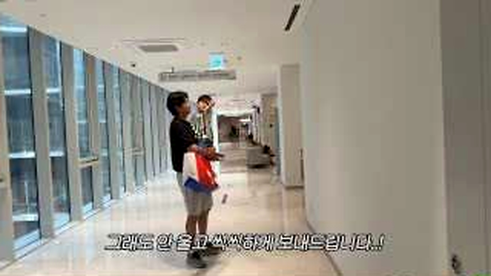

<b>그림 설명</b> 현관과 복도에서 정말 가야 하는지 다시 확인합니다. 짐보다 발이 먼저 멈추는 순간입니다.

브링이슈 해설: 첫 선택이 나오자 각자의 기준이 보입니다. 사소해 보여도 뒤의 반응을 이해하려면 놓치기 어려운 장면입니다.

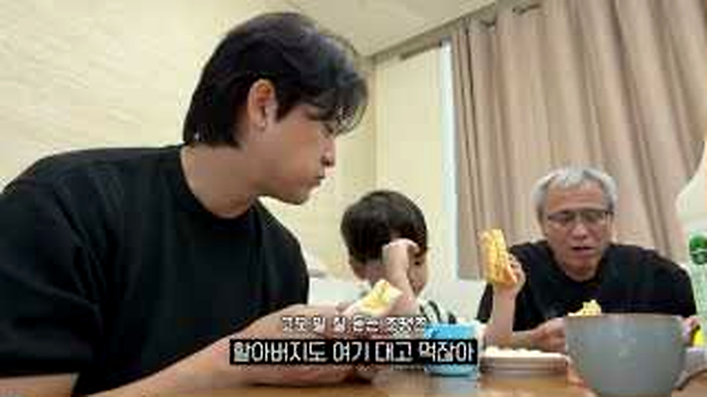

<b>그림 설명</b> 식탁에 둘러앉은 가족의 모습이 이어집니다. 헤어짐을 앞두면 평범한 식사도 기록해두고 싶은 장면이 됩니다.

브링이슈 해설: 반응은 준비된 멘트보다 빠릅니다. 이 표정과 동작 덕분에 영상이 홍보물보다 생활 기록에 가까워집니다.

## 🥺 헤어짐을 알아챈 아이의 반응

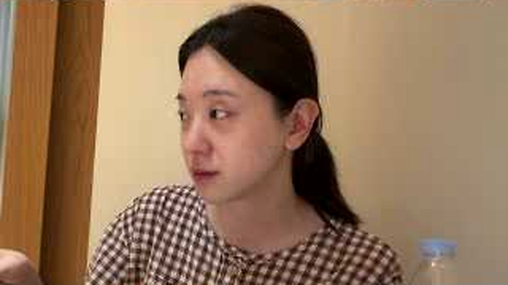

<b>그림 설명</b> 눈물이 고인 얼굴이 화면을 채웁니다. 말을 길게 붙이지 않아도 상황을 알아챈 사람의 표정이 분명합니다.

브링이슈 해설: 중간 질문이 앞의 흐름을 다시 세웁니다. 시청자도 같은 지점에서 '정말 그런가?' 하고 한 번 멈추게 됩니다.

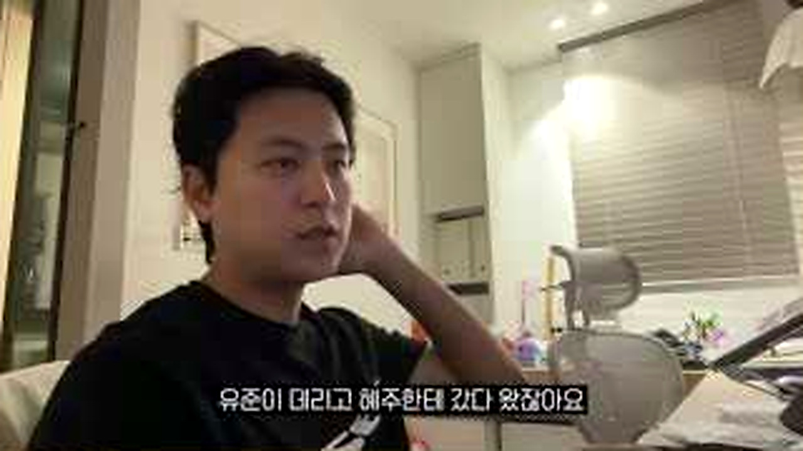

<b>그림 설명</b> 아이를 달래다가 울음이 잠깐 멈춘 순간입니다. 해결됐다기보다 다음 감정으로 넘어가기 전의 숨 고르기 같습니다.

브링이슈 해설: 여섯 번째 장면에서는 말보다 행동이 빠릅니다. 앞에서 쌓인 흐름이 실제 선택으로 바뀌는 순간이라 글에서도 중심에 두었습니다.

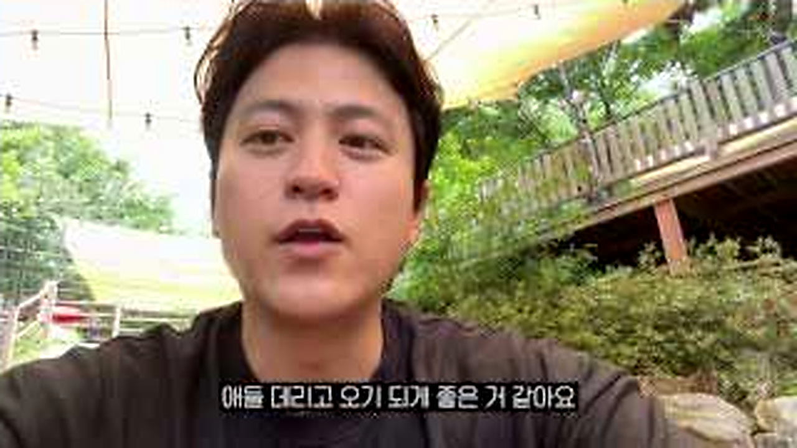

<b>그림 설명</b> 밖에서 그늘을 만들고 아이가 편하게 움직이도록 챙깁니다. 헤어짐 뒤에도 돌봄의 일은 그대로 이어집니다.

브링이슈 해설: 반전 직전에는 작은 어긋남이 쌓입니다. 처음 예상했던 결론이 그대로 가지 않을 것이라는 신호가 보입니다.

## 🧳 다시 일상으로 돌아가는 준비

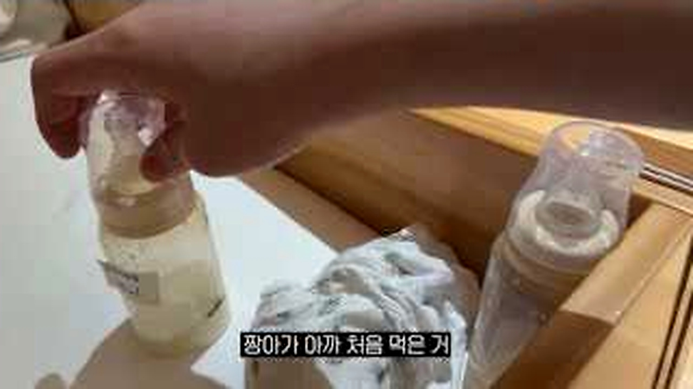

<b>그림 설명</b> 아이의 말과 반응을 받아주며 분위기를 바꿉니다. 어른의 슬픔보다 아이의 리듬에 맞추려는 선택입니다.

브링이슈 해설: 여덟 번째 장면에서 제목의 답이 나옵니다. 놀라움만 키우지 않고 앞선 조건과 연결해서 봐야 과장이 줄어듭니다.

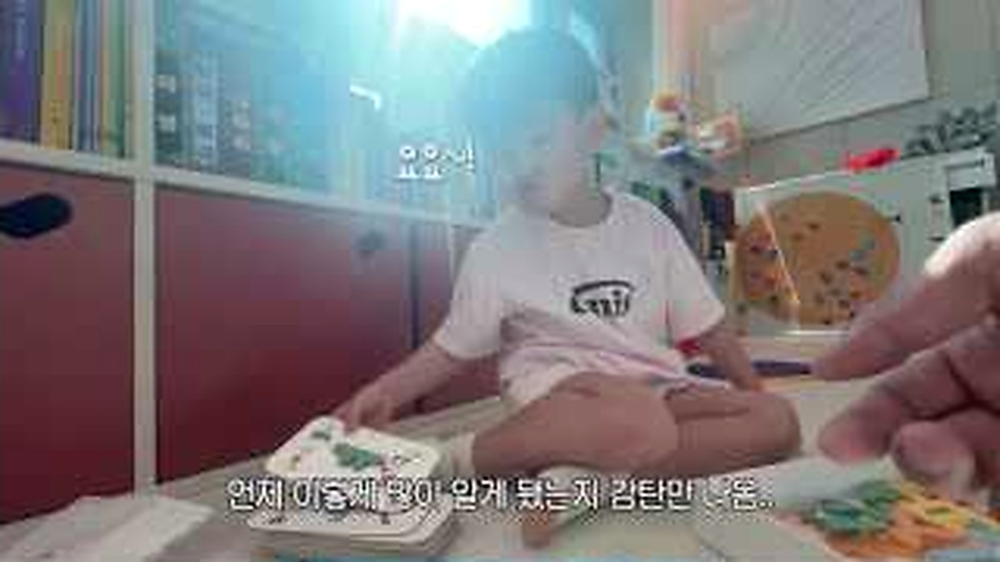

<b>그림 설명</b> 작은 용품과 약을 챙기며 다시 이동 준비를 합니다. 감정적인 날에도 빠뜨릴 수 없는 현실적인 목록입니다.

브링이슈 해설: 일이 지나간 뒤의 표정은 결과를 정리해줍니다. 성공이나 실패 한 단어보다 사람이 무엇을 느꼈는지가 남습니다.

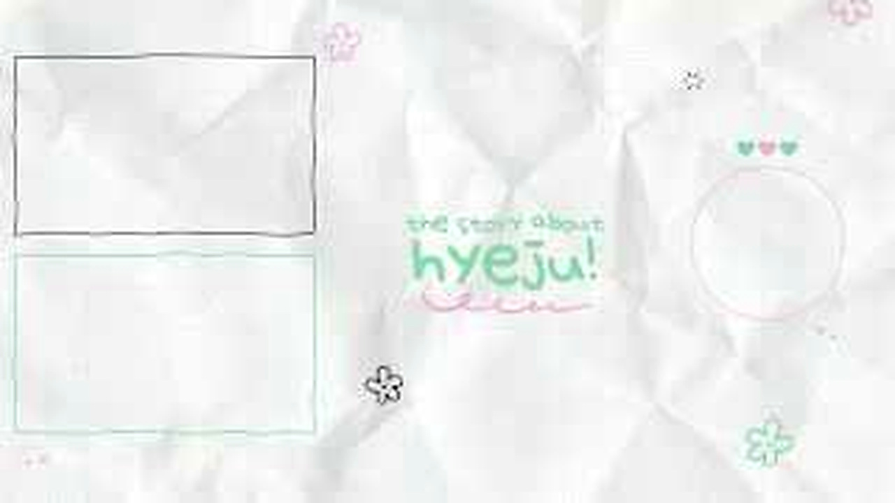

<b>그림 설명</b> 기저귀와 생활용품을 정리한 화면으로 마무리됩니다. 가족 브이로그답게 결론도 결국 다음 하루를 준비하는 일입니다.

브링이슈 해설: 마지막 장면은 억지 교훈을 붙이지 않습니다. 앞의 흐름을 본 사람이 자기 경험을 떠올릴 만큼만 여백을 남깁니다.

<u>한 줄 정리: 짧은 가족 만남 뒤 다시 헤어져야 했던 준비와 반응</u>

<b>에디터의 시선</b>

여행 파우치나 기내용 육아용품은 짐을 줄이는 데 도움을 줄 수 있지만, 가족마다 꼭 필요한 물건이 다릅니다. 영상의 감정에 상품을 바로 붙이지 않고 마지막 준비 장면에서만 정보성 제안으로 분리했습니다. <u>헤어짐의 감정과 구매 문단은 거리를 두는 편</u>이 맞습니다.

<u>가족과 헤어지는 날, 꼭 사진으로 남겨두고 싶은 평범한 순간이 있으신가요?</u>

---

원본 채널: 리쥬라이크 LIJULIKE
원본 영상 제목: [VLOG] 잠깐봤는데 또 헤어져야 한다구요..?🥺
원본 링크: https://www.youtube.com/watch?v=RzYOAwZ2rrE

이 글은 원본 영상을 대체하지 않는 리뷰·해설 콘텐츠입니다. 장면 저작권은 원저작자와 해당 채널에 있으며, 영상의 맥락을 확인하려면 원본을 함께 봐주세요.

#리쥬라이크 #가족브이로그 #육아브이로그 #가족이별 #여행준비 #육아용품 #일상기록 #유튜브리뷰 #오늘뜬유튜브 #브링이슈
