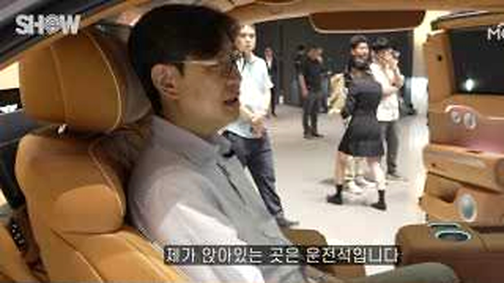
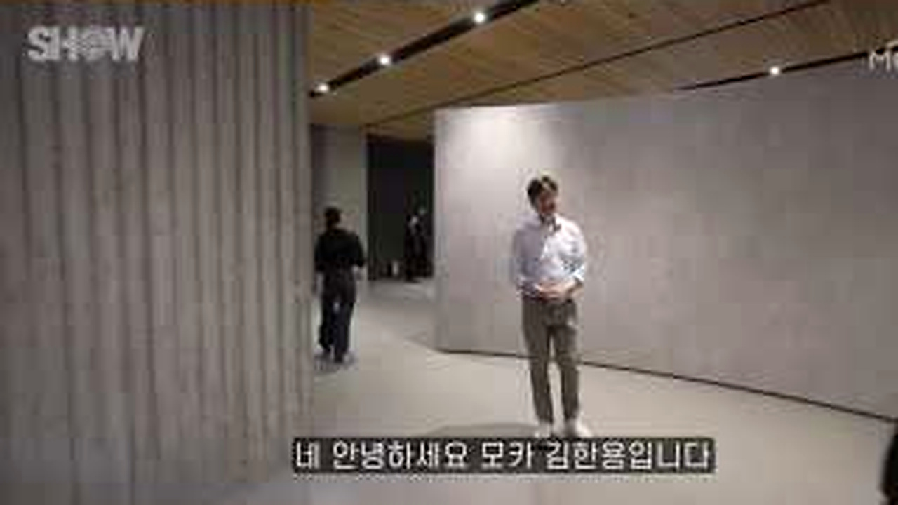
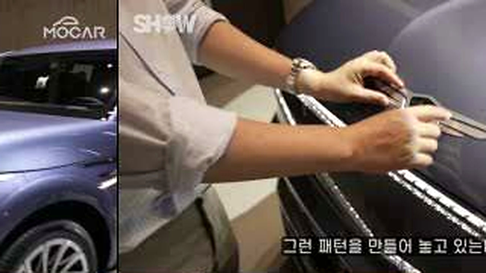
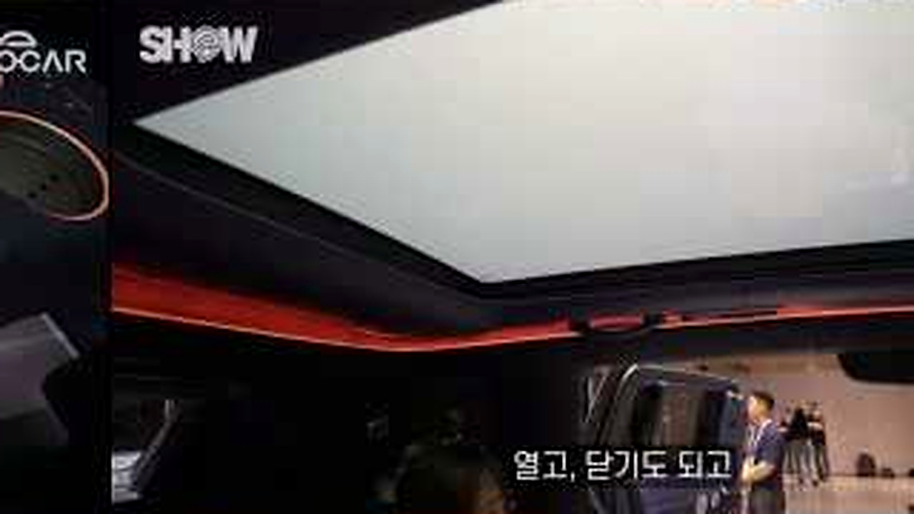
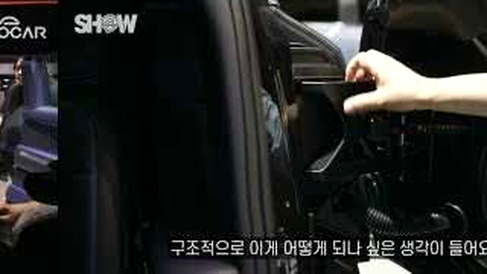
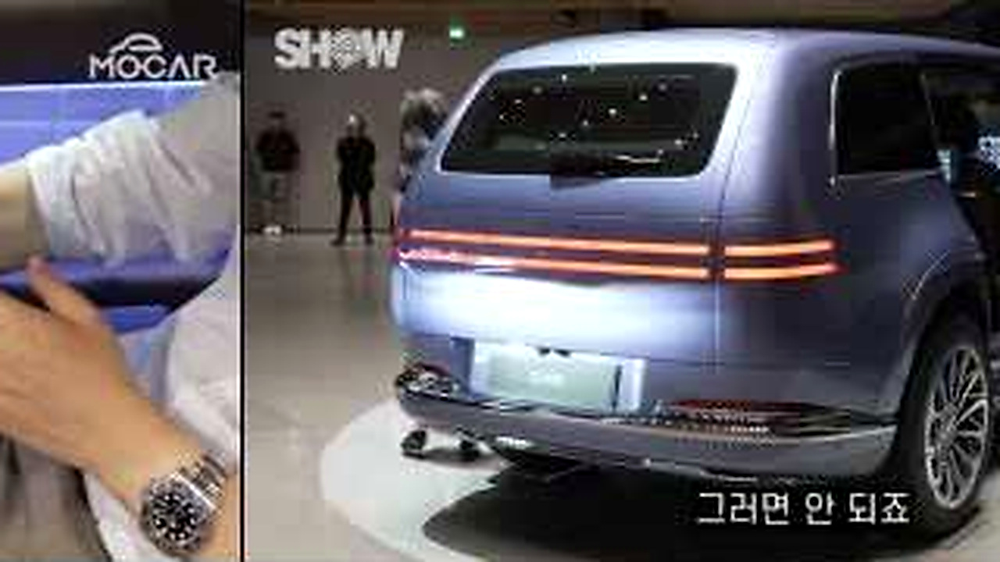
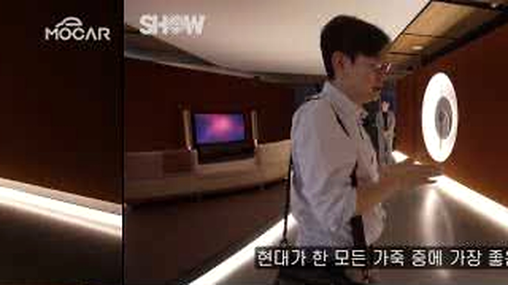

# 제네시스 GV90 세계 최초 공개, 외관보다 현장에서 더 반응이 컸던 기능

대형 전기 SUV 공개라면 먼저 크기와 디자인을 보게 됩니다.
김한용의 MOCAR 영상은 차 문을 열고 실내를 만지며 사진으로는 전달되지 않는 기능을 확인합니다.
제가 오래 본 장면도 전면 디자인보다 <u>사람이 직접 손을 댄 순간</u>들이었습니다.

## 🚙 첫인상보다 궁금했던 실내

<b>그림 설명</b> 운전석에 앉은 시점으로 영상이 시작됩니다. 차 밖의 웅장함보다 실제 탑승자의 눈높이를 먼저 잡습니다.

브링이슈 해설: 첫 컷은 글의 기준점을 잡습니다. 이번 글에서 계속 볼 장면은 'GV90 공개 현장에서 외관보다 반응이 컸던 실내 기능'입니다. 인물과 공간을 먼저 익혀두면 뒤의 변화가 훨씬 잘 보입니다.

<b>그림 설명</b> 공개 현장에서 차량을 처음 마주하는 장면입니다. 주변 사람의 크기와 비교하니 차체 비율이 사진보다 쉽게 읽힙니다.

브링이슈 해설: 여기서부터 이야기가 움직입니다. 화면은 'GV90 공개 현장에서 외관보다 반응이 컸던 실내 기능'라는 주제를 설명문보다 실제 상황으로 먼저 보여줍니다.

<b>그림 설명</b> 넓은 실내와 거울처럼 반사되는 소재를 가까이 봅니다. 고급감이라는 표현을 재질과 조명으로 확인합니다.

브링이슈 해설: 첫 선택이 나오자 각자의 기준이 보입니다. 사소해 보여도 뒤의 반응을 이해하려면 놓치기 어려운 장면입니다.

<b>그림 설명</b> 문과 손잡이 부근을 직접 조작합니다. 설명서보다 손의 움직임이 사용 방식을 더 빠르게 이해시킵니다.

브링이슈 해설: 반응은 준비된 멘트보다 빠릅니다. 이 표정과 동작 덕분에 영상이 홍보물보다 생활 기록에 가까워집니다.

## ✨ 손으로 확인하니 달랐던 기능

<b>그림 설명</b> 천장과 유리 영역을 올려다봅니다. 개방감은 숫자로 쓰기 어려워 실제 화면의 빛과 시야가 중요합니다.

브링이슈 해설: 중간 질문이 앞의 흐름을 다시 세웁니다. 시청자도 같은 지점에서 '정말 그런가?' 하고 한 번 멈추게 됩니다.

<b>그림 설명</b> 숨겨진 부분을 다시 열어 보여줍니다. 첫눈에 보이지 않던 기능이 현장 반응을 키운 이유가 됩니다.

브링이슈 해설: 여섯 번째 장면에서는 말보다 행동이 빠릅니다. 앞에서 쌓인 흐름이 실제 선택으로 바뀌는 순간이라 글에서도 중심에 두었습니다.

<b>그림 설명</b> 실내에 앉아 수납과 좌석 주변을 살핍니다. 쇼카의 화려함이 일상에서 편할지는 여기서부터 따져봐야 합니다.

브링이슈 해설: 반전 직전에는 작은 어긋남이 쌓입니다. 처음 예상했던 결론이 그대로 가지 않을 것이라는 신호가 보입니다.

## 🔋 콘셉트와 양산 사이에서 볼 것

<b>그림 설명</b> 차량 뒤쪽과 조명 그래픽이 드러납니다. 멀리서 보이는 인상과 가까이서 본 마감이 꽤 다릅니다.

브링이슈 해설: 여덟 번째 장면에서 제목의 답이 나옵니다. 놀라움만 키우지 않고 앞선 조건과 연결해서 봐야 과장이 줄어듭니다.

<b>그림 설명</b> 자석으로 붙는 부품과 작은 장치를 확인합니다. 거대한 차에서 의외로 기억에 남는 건 이런 손끝 기능입니다.

브링이슈 해설: 일이 지나간 뒤의 표정은 결과를 정리해줍니다. 성공이나 실패 한 단어보다 사람이 무엇을 느꼈는지가 남습니다.

<b>그림 설명</b> 전기차로서의 방향을 정리하며 영상이 끝납니다. 공개 모델의 감탄과 양산차에서 확인할 조건을 구분합니다.

브링이슈 해설: 마지막 장면은 억지 교훈을 붙이지 않습니다. 앞의 흐름을 본 사람이 자기 경험을 떠올릴 만큼만 여백을 남깁니다.

<u>한 줄 정리: GV90 공개 현장에서 외관보다 반응이 컸던 실내 기능</u>

<b>에디터의 시선</b>

차량용 충전기나 수납용품은 실제 전원 규격과 공간 치수가 공개된 뒤 골라야 합니다. 지금 단계에서는 'GV90 전용'이라는 표현을 믿기보다 양산 사양을 기다리는 편이 안전합니다. <u>현장 감탄과 구매 판단은 다른 시간표</u>를 가집니다.

<u>GV90에서 가장 궁금한 것은 디자인, 2열 공간, 충전 성능 중 어느 쪽인가요?</u>

---

원본 채널: 김한용의 MOCAR
원본 영상 제목: 제네시스 GV90 세계 최초 공개! 이제야 감동의 현대차가 시작됐다!
원본 링크: https://www.youtube.com/watch?v=gB7CRaVAi4U

이 글은 원본 영상을 대체하지 않는 리뷰·해설 콘텐츠입니다. 장면 저작권은 원저작자와 해당 채널에 있으며, 영상의 맥락을 확인하려면 원본을 함께 봐주세요.

#제네시스GV90 #GV90 #김한용의MOCAR #제네시스 #전기SUV #신차공개 #자동차리뷰 #유튜브리뷰 #오늘뜬유튜브 #브링이슈
