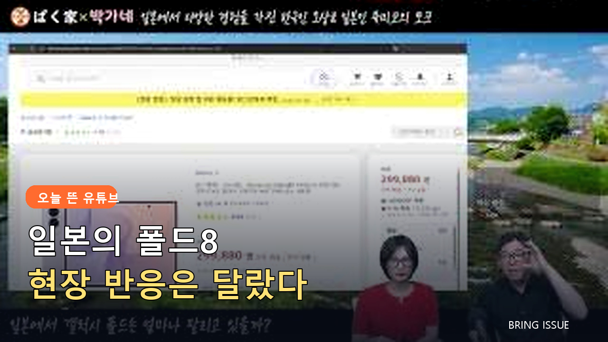
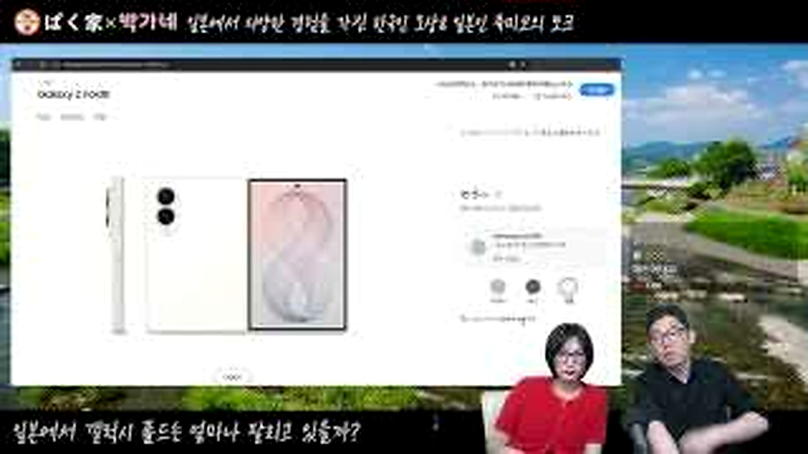
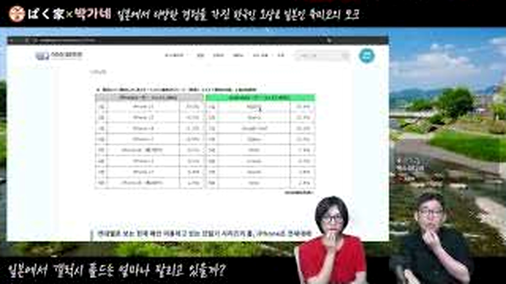

# 일본에서 갤럭시 폴드8이 잘 팔린다는데, 현장 숫자를 보니 정말 달랐던 이유

품절이라는 단어만 보면 일본에서도 폴더블폰 열풍이 시작된 것처럼 보입니다.
박가네 영상은 판매 페이지와 용량별 배송일을 직접 비교하며 그 표현을 천천히 걷어냅니다.
결론은 단순한 인기와 부진 사이가 아니라 <u>숫자를 읽는 방식</u>에 있었습니다.

## 📱 품절 기사부터 확인해보니

<b>그림 설명</b> 두 진행자가 일본에서 폴드8이 얼마나 팔리는지 질문을 던집니다. 처음부터 찬반보다 확인할 항목을 정하는 방식입니다.

브링이슈 해설: 첫 컷은 글의 기준점을 잡습니다. 이번 글에서 계속 볼 장면은 '일본 판매 페이지와 실제 조건으로 다시 본 폴드8 인기'입니다. 인물과 공간을 먼저 익혀두면 뒤의 변화가 훨씬 잘 보입니다.

<b>그림 설명</b> 직접 쓰는 이용자 관점이 더해집니다. 제품을 좋아하는 마음과 시장 판단을 분리하려는 태도가 글의 기준이 됩니다.

브링이슈 해설: 여기서부터 이야기가 움직입니다. 화면은 '일본 판매 페이지와 실제 조건으로 다시 본 폴드8 인기'라는 주제를 설명문보다 실제 상황으로 먼저 보여줍니다.

<b>그림 설명</b> 온라인 기사와 검색 화면을 띄워 품절 표현이 어디에서 시작됐는지 확인합니다. 제목만 읽을 때와 분위기가 달라집니다.

브링이슈 해설: 첫 선택이 나오자 각자의 기준이 보입니다. 사소해 보여도 뒤의 반응을 이해하려면 놓치기 어려운 장면입니다.

<b>그림 설명</b> 판매 페이지의 용량과 배송 예정일을 하나씩 비교합니다. 같은 모델이라도 옵션별 상황이 다르다는 점이 보입니다.

브링이슈 해설: 반응은 준비된 멘트보다 빠릅니다. 이 표정과 동작 덕분에 영상이 홍보물보다 생활 기록에 가까워집니다.

## 🔎 용량과 배송일을 나눠 본 결과

<b>그림 설명</b> 잘 팔린다는 문장을 그대로 받아들이지 않고 재고 규모와 판매 조건을 묻습니다. 이 질문이 영상의 중심입니다.

브링이슈 해설: 중간 질문이 앞의 흐름을 다시 세웁니다. 시청자도 같은 지점에서 '정말 그런가?' 하고 한 번 멈추게 됩니다.

<b>그림 설명</b> 일본 스마트폰 시장의 기본 구조를 설명합니다. 애플 비중과 통신사 판매 방식이 한국과 달라 단순 비교가 어렵습니다.

브링이슈 해설: 여섯 번째 장면에서는 말보다 행동이 빠릅니다. 앞에서 쌓인 흐름이 실제 선택으로 바뀌는 순간이라 글에서도 중심에 두었습니다.

<b>그림 설명</b> 256GB 모델 가격과 조건을 다시 봅니다. 숫자 하나만 떼어내면 비싸다거나 싸다는 결론으로 쉽게 기울 수 있습니다.

브링이슈 해설: 반전 직전에는 작은 어긋남이 쌓입니다. 처음 예상했던 결론이 그대로 가지 않을 것이라는 신호가 보입니다.

## 🇯🇵 일본 시장은 같은 숫자도 달랐다

<b>그림 설명</b> 진행자가 인기라는 표현을 엄밀히 고쳐 말합니다. 부정하려는 게 아니라 확인한 범위까지만 말하려는 장면입니다.

브링이슈 해설: 여덟 번째 장면에서 제목의 답이 나옵니다. 놀라움만 키우지 않고 앞선 조건과 연결해서 봐야 과장이 줄어듭니다.

<b>그림 설명</b> 처음 예상과 실제 확인 결과 사이의 차이를 정리합니다. 영상의 재미는 과장된 반박보다 차분한 수정에 있습니다.

브링이슈 해설: 일이 지나간 뒤의 표정은 결과를 정리해줍니다. 성공이나 실패 한 단어보다 사람이 무엇을 느꼈는지가 남습니다.

<b>그림 설명</b> 마지막에는 일본에서 체감하는 브랜드 인지도와 판매량을 구분합니다. 현장 느낌도 숫자와 함께 봐야 한다는 결론입니다.

브링이슈 해설: 마지막 장면은 억지 교훈을 붙이지 않습니다. 앞의 흐름을 본 사람이 자기 경험을 떠올릴 만큼만 여백을 남깁니다.

<u>한 줄 정리: 일본 판매 페이지와 실제 조건으로 다시 본 폴드8 인기</u>

<b>에디터의 시선</b>

폴더블 케이스나 보호필름을 소개하려면 먼저 국내 판매 모델과 일본 판매 모델의 규격이 같은지 확인해야 합니다. 글에서는 구매를 재촉하기보다 용량, 보험, 수리 조건을 표로 확인하는 순서를 제안했습니다. <u>품절은 곧 대중적 인기라는 뜻이 아닐 수 있습니다.</u>

<u>여러분은 스마트폰 인기 기사를 볼 때 판매량, 품절, 검색량 중 어떤 숫자를 가장 믿으시나요?</u>

---

원본 채널: ぱく家(박가네)
원본 영상 제목: 일본에서 갤럭시 폴드8은 얼마나 인기일까?
원본 링크: https://www.youtube.com/watch?v=6JOhl0WhRxw

이 글은 원본 영상을 대체하지 않는 리뷰·해설 콘텐츠입니다. 장면 저작권은 원저작자와 해당 채널에 있으며, 영상의 맥락을 확인하려면 원본을 함께 봐주세요.

#갤럭시폴드8 #일본스마트폰 #박가네 #폴더블폰 #삼성전자 #스마트폰이슈 #유튜브리뷰 #오늘뜬유튜브 #IT이슈 #브링이슈
