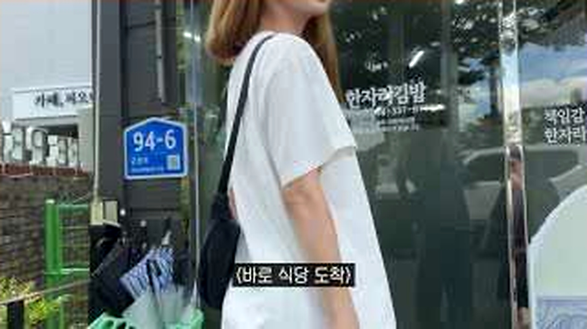
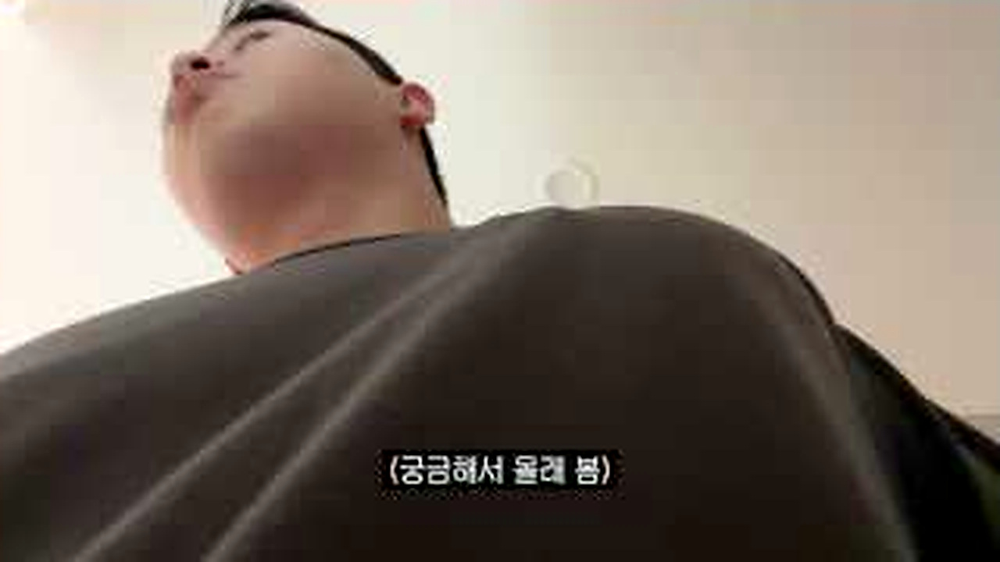
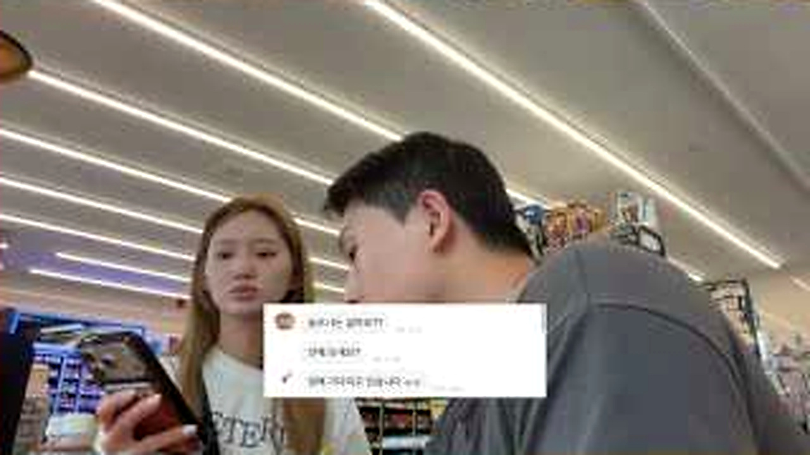
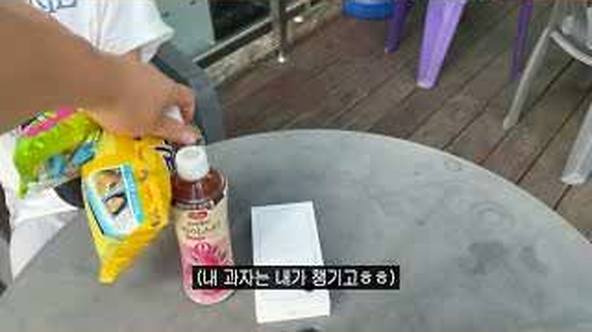
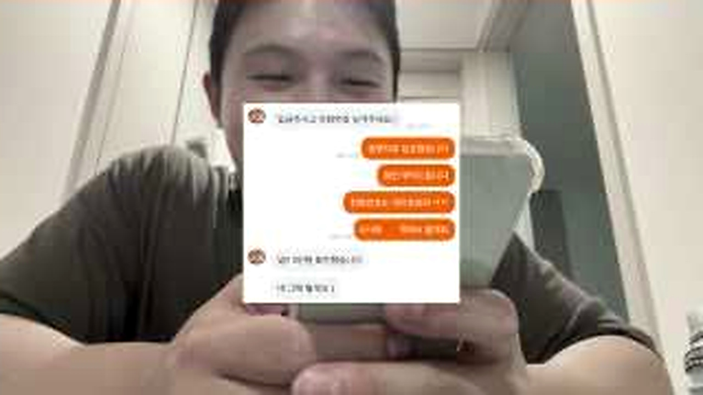

# 당근거래가 처음인 아내를 속여봤더니, 장난보다 더 예상 밖이었던 그 순간의 반응

처음 하는 중고거래는 상대의 한마디에도 괜히 긴장하게 됩니다.
원민커플은 그 긴장을 이용해 장난을 준비했지만 현장에서는 계획한 사람도 자꾸 흔들립니다.
웃기려고 시작한 상황이 <u>낯선 거래에서 경계해야 할 지점</u>까지 보여줬습니다.

## 🥕 경계심을 낮추려 만든 계획

<b>그림 설명</b> 남편이 카메라를 향해 장난 계획을 설명합니다. 자신만만한 표정이 뒤에서 흔들릴 장면을 더 웃기게 만듭니다.

브링이슈 해설: 첫 컷은 글의 기준점을 잡습니다. 이번 글에서 계속 볼 장면은 '첫 중고거래를 둘러싼 장난과 예상 밖 반응'입니다. 인물과 공간을 먼저 익혀두면 뒤의 변화가 훨씬 잘 보입니다.

<b>그림 설명</b> 부부가 함께 움직이며 평소처럼 대화합니다. 상대가 의심하지 않도록 일상을 유지하는 과정부터 장난이 시작됩니다.

브링이슈 해설: 여기서부터 이야기가 움직입니다. 화면은 '첫 중고거래를 둘러싼 장난과 예상 밖 반응'라는 주제를 설명문보다 실제 상황으로 먼저 보여줍니다.

<b>그림 설명</b> 거래 장소로 걸어가며 상대의 경계심을 낮출 방법을 고민합니다. 실제 중고거래에서도 장소 선택이 중요하다는 생각이 듭니다.

브링이슈 해설: 첫 선택이 나오자 각자의 기준이 보입니다. 사소해 보여도 뒤의 반응을 이해하려면 놓치기 어려운 장면입니다.

<b>그림 설명</b> 아내가 상황을 납득하지 못한 채 표정을 굳힙니다. 장난을 아는 시청자와 모르는 당사자의 온도 차가 큽니다.

브링이슈 해설: 반응은 준비된 멘트보다 빠릅니다. 이 표정과 동작 덕분에 영상이 홍보물보다 생활 기록에 가까워집니다.

## 📱 메시지 한 줄에 달라진 분위기

<b>그림 설명</b> 휴대전화 메시지와 거래 조건을 다시 확인합니다. 말로 들을 때보다 글로 남은 내용이 판단의 근거가 됩니다.

브링이슈 해설: 중간 질문이 앞의 흐름을 다시 세웁니다. 시청자도 같은 지점에서 '정말 그런가?' 하고 한 번 멈추게 됩니다.

<b>그림 설명</b> 남편도 계획대로 흘러가지 않자 표정이 바뀝니다. 장난은 상대 반응을 통제할 수 없다는 게 여기서 드러납니다.

브링이슈 해설: 여섯 번째 장면에서는 말보다 행동이 빠릅니다. 앞에서 쌓인 흐름이 실제 선택으로 바뀌는 순간이라 글에서도 중심에 두었습니다.

<b>그림 설명</b> 아내가 직접 연락해보려 하면서 분위기가 급해집니다. 피해가 생길 수 있다는 생각이 들자 행동이 빨라집니다.

브링이슈 해설: 반전 직전에는 작은 어긋남이 쌓입니다. 처음 예상했던 결론이 그대로 가지 않을 것이라는 신호가 보입니다.

## 😂 장난이 밝혀진 뒤의 표정

<b>그림 설명</b> 거래를 계속할지 그만둘지 고민합니다. 웃긴 장면이면서도 낯선 사람과 거래할 때 멈출 기준을 생각하게 합니다.

브링이슈 해설: 여덟 번째 장면에서 제목의 답이 나옵니다. 놀라움만 키우지 않고 앞선 조건과 연결해서 봐야 과장이 줄어듭니다.

<b>그림 설명</b> 화면 속 대화와 손에 든 물건을 맞춰봅니다. 장난의 단서가 하나씩 연결되며 반전 직전의 긴장이 풀립니다.

브링이슈 해설: 일이 지나간 뒤의 표정은 결과를 정리해줍니다. 성공이나 실패 한 단어보다 사람이 무엇을 느꼈는지가 남습니다.

<b>그림 설명</b> 사실을 알게 된 아내가 웃고 어이없어합니다. 화려한 반전보다 둘 사이의 익숙한 반응이 영상의 마지막 재미입니다.

브링이슈 해설: 마지막 장면은 억지 교훈을 붙이지 않습니다. 앞의 흐름을 본 사람이 자기 경험을 떠올릴 만큼만 여백을 남깁니다.

<u>한 줄 정리: 첫 중고거래를 둘러싼 장난과 예상 밖 반응</u>

<b>에디터의 시선</b>

중고거래 글에는 보안용품 판매보다 안전수칙이 먼저 와야 합니다. 공개된 장소에서 만나고, 상품 상태와 대화 기록을 확인하며, 이상하면 거래를 멈추는 기준이 필요합니다. <u>웃긴 장난과 실제 거래 안전은 분리해서 읽어야 합니다.</u>

<u>처음 중고거래를 할 때 가장 긴장됐던 순간이나 꼭 확인하는 항목이 있으신가요?</u>

---

원본 채널: 원민커플
원본 영상 제목: 당근거래 처음하는 와이프 상대로 사기쳐봤습니다ㅋㅋㅋㅋㅋ
원본 링크: https://www.youtube.com/watch?v=JuK_D77HWpg

이 글은 원본 영상을 대체하지 않는 리뷰·해설 콘텐츠입니다. 장면 저작권은 원저작자와 해당 채널에 있으며, 영상의 맥락을 확인하려면 원본을 함께 봐주세요.

#원민커플 #당근거래 #중고거래 #몰래카메라 #커플유튜브 #중고거래안전 #유튜브리뷰 #오늘뜬유튜브 #생활정보 #브링이슈
