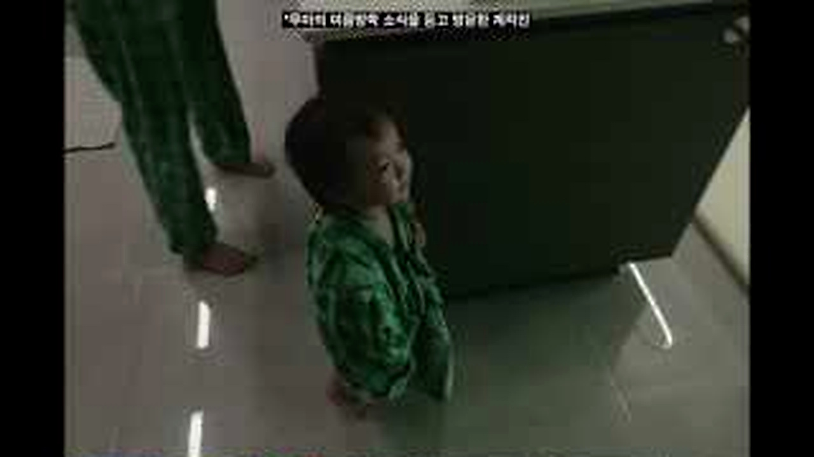
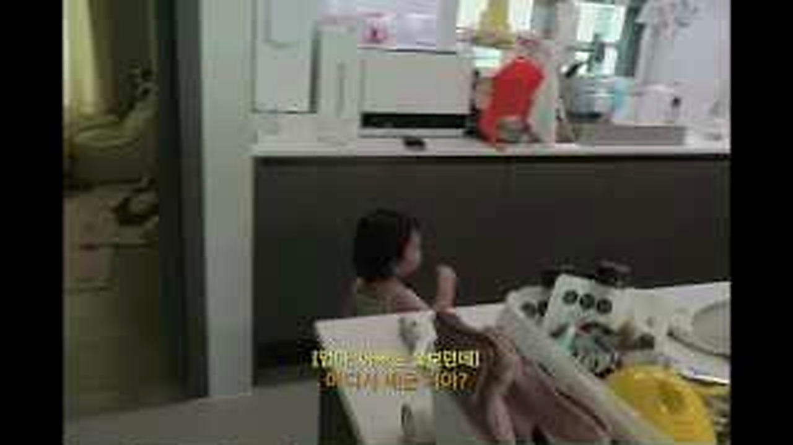
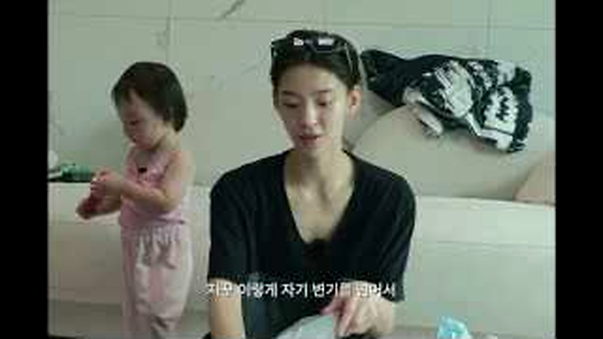
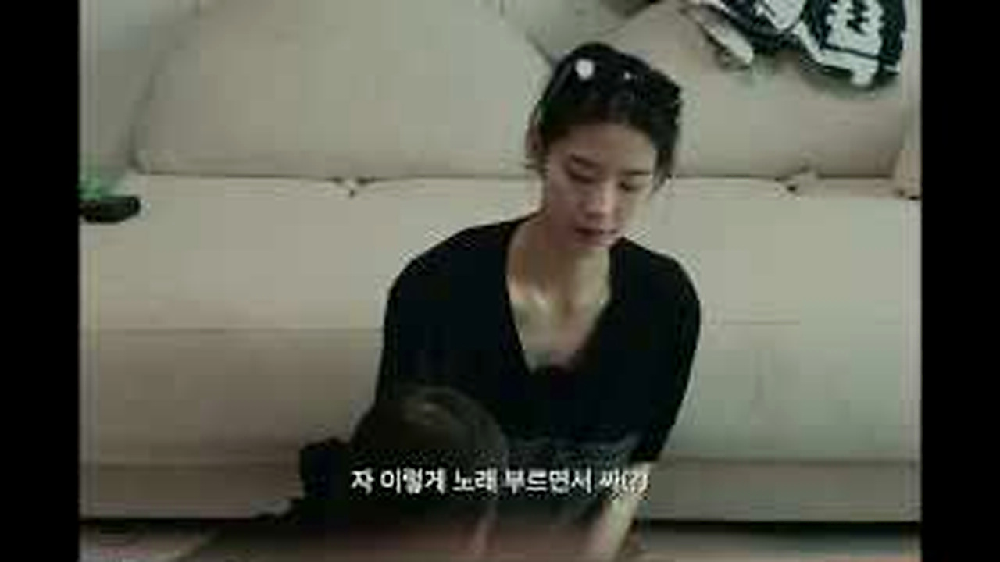
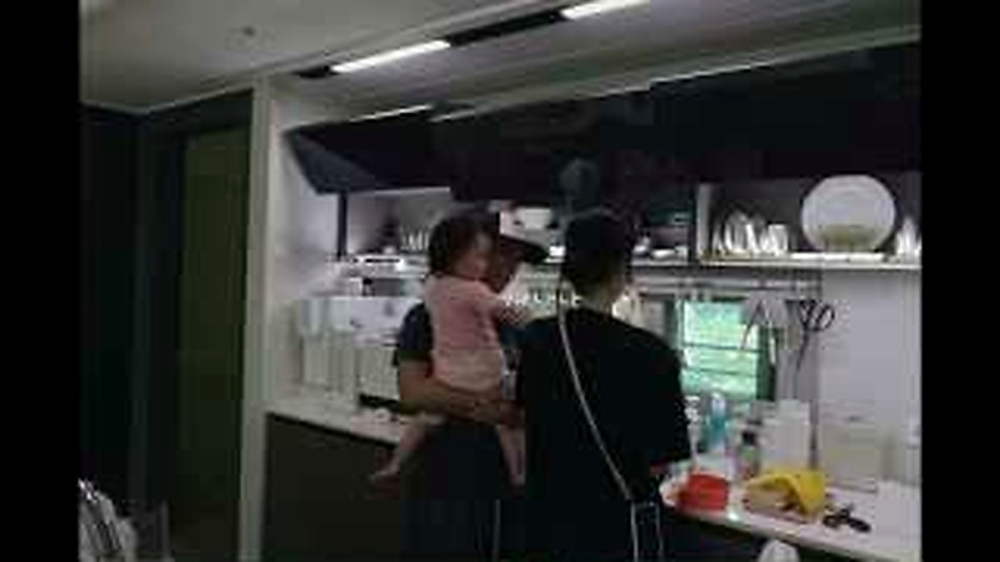
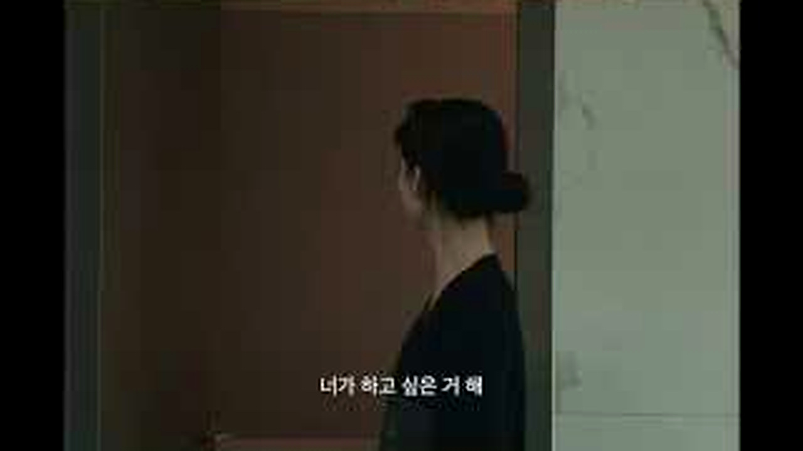
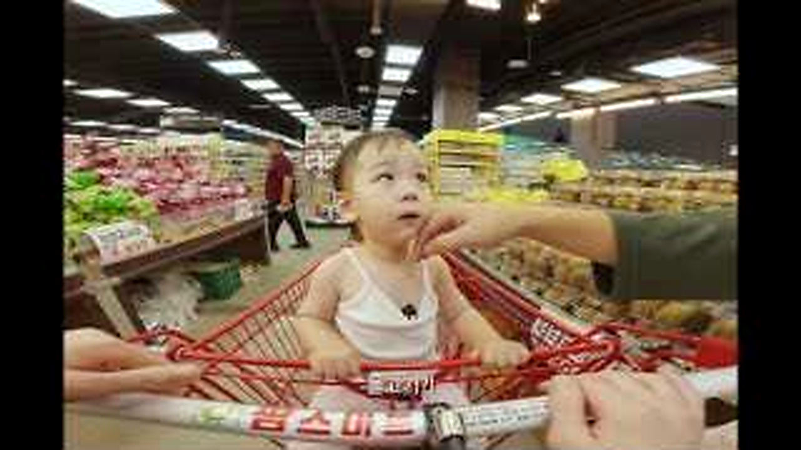
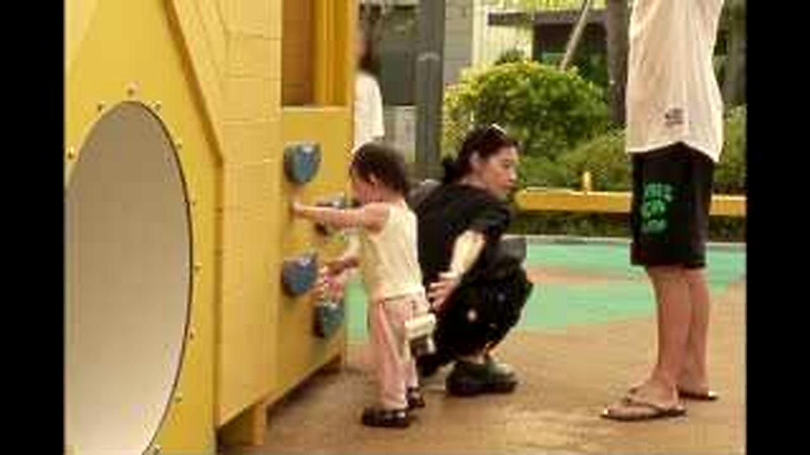

# 폭염 속 아이와 하루를 보내보니, 계획보다 먼저 달라진 현실적인 선택들 기록

폭염에는 외출 한 번도 작은 일정표가 됩니다.
아이와 함께라면 시원한 곳을 찾는 문제부터 먹을 것, 이동 시간까지 전부 다시 계산해야 합니다.
영상은 멋진 여름 나기보다 <u>그날그날 바뀌는 육아의 현실</u>을 숨기지 않습니다.

## 🌡️ 더위가 바꾼 하루의 시작

<b>그림 설명</b> 어두운 실내에서 아이의 상태를 먼저 살피며 하루가 시작됩니다. 날씨가 심할수록 부모의 일정은 아이 표정에서 출발합니다.

브링이슈 해설: 첫 컷은 글의 기준점을 잡습니다. 이번 글에서 계속 볼 장면은 '폭염 속 육아에서 계획보다 먼저 바뀌는 선택'입니다. 인물과 공간을 먼저 익혀두면 뒤의 변화가 훨씬 잘 보입니다.

<b>그림 설명</b> 외출 준비물과 봉투가 늘어선 장면입니다. 잠깐 나가는 일도 챙길 것이 많아지는 여름 육아의 무게가 보입니다.

브링이슈 해설: 여기서부터 이야기가 움직입니다. 화면은 '폭염 속 육아에서 계획보다 먼저 바뀌는 선택'라는 주제를 설명문보다 실제 상황으로 먼저 보여줍니다.

<b>그림 설명</b> 머리를 묶고 움직일 준비를 하는 모습입니다. 시원하게 버티려는 작은 행동이 오히려 날씨를 더 실감나게 합니다.

브링이슈 해설: 첫 선택이 나오자 각자의 기준이 보입니다. 사소해 보여도 뒤의 반응을 이해하려면 놓치기 어려운 장면입니다.

<b>그림 설명</b> 아이가 자기 방식대로 움직이자 어른의 계획이 잠시 멈춥니다. 영상이 재미있는 이유는 이런 틈을 억지로 정리하지 않기 때문입니다.

브링이슈 해설: 반응은 준비된 멘트보다 빠릅니다. 이 표정과 동작 덕분에 영상이 홍보물보다 생활 기록에 가까워집니다.

## 🛒 계획보다 빠른 현실 판단

<b>그림 설명</b> 표정을 살피며 다음 행동을 정하는 순간입니다. 무엇이 정답인지보다 지금 아이가 괜찮은지가 판단 기준이 됩니다.

브링이슈 해설: 중간 질문이 앞의 흐름을 다시 세웁니다. 시청자도 같은 지점에서 '정말 그런가?' 하고 한 번 멈추게 됩니다.

<b>그림 설명</b> 장을 보며 먹을 것을 고릅니다. 더운 날에는 거창한 메뉴보다 바로 먹을 수 있고 부담이 적은 선택으로 기울게 됩니다.

브링이슈 해설: 여섯 번째 장면에서는 말보다 행동이 빠릅니다. 앞에서 쌓인 흐름이 실제 선택으로 바뀌는 순간이라 글에서도 중심에 두었습니다.

<b>그림 설명</b> 매장 안에서 아이와 물건을 함께 보는 장면입니다. 시원한 실내가 잠깐의 휴식 공간이 되는 것도 현실적입니다.

브링이슈 해설: 반전 직전에는 작은 어긋남이 쌓입니다. 처음 예상했던 결론이 그대로 가지 않을 것이라는 신호가 보입니다.

## 👶 결국 남는 건 아이의 리듬

<b>그림 설명</b> 아이의 가까운 표정이 화면을 채웁니다. 어른이 세운 계획보다 컨디션 변화가 훨씬 빠르다는 걸 보여줍니다.

브링이슈 해설: 여덟 번째 장면에서 제목의 답이 나옵니다. 놀라움만 키우지 않고 앞선 조건과 연결해서 봐야 과장이 줄어듭니다.

<b>그림 설명</b> 이동하는 복도에서 다시 속도를 맞춥니다. 별일 없어 보이지만 이런 이동 하나가 폭염에는 꽤 큰 일입니다.

브링이슈 해설: 일이 지나간 뒤의 표정은 결과를 정리해줍니다. 성공이나 실패 한 단어보다 사람이 무엇을 느꼈는지가 남습니다.

<b>그림 설명</b> 마지막 자막은 하루를 하나의 미션처럼 정리합니다. 잘 해냈다는 결론보다 무사히 지나왔다는 안도가 더 가깝습니다.

브링이슈 해설: 마지막 장면은 억지 교훈을 붙이지 않습니다. 앞의 흐름을 본 사람이 자기 경험을 떠올릴 만큼만 여백을 남깁니다.

<u>한 줄 정리: 폭염 속 육아에서 계획보다 먼저 바뀌는 선택</u>

<b>에디터의 시선</b>

이 영상에 제품을 연결한다면 휴대용 선풍기나 쿨링용품을 무턱대고 나열하면 안 됩니다. 실제 장면에서 필요가 생긴 순간만 짚고, 아이 연령과 사용 환경을 먼저 확인하도록 안내하는 편이 맞습니다. <u>육아용품은 편의보다 안전 조건이 먼저</u>입니다.

<u>더운 날 아이와 외출할 때 가장 먼저 포기하거나 바꾸게 되는 계획은 무엇인가요?</u>

---

원본 채널: 양홍원의 육아일기
원본 영상 제목: 폭염에서 살아남기
원본 링크: https://www.youtube.com/watch?v=ko3IP-WTB2Q

이 글은 원본 영상을 대체하지 않는 리뷰·해설 콘텐츠입니다. 장면 저작권은 원저작자와 해당 채널에 있으며, 영상의 맥락을 확인하려면 원본을 함께 봐주세요.

#폭염육아 #육아브이로그 #여름육아 #아이와외출 #쿨링용품 #유튜브리뷰 #오늘뜬유튜브 #생활이슈 #육아일상 #브링이슈
