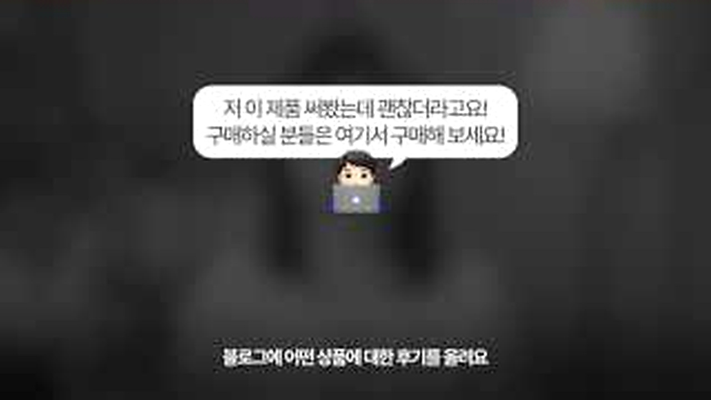
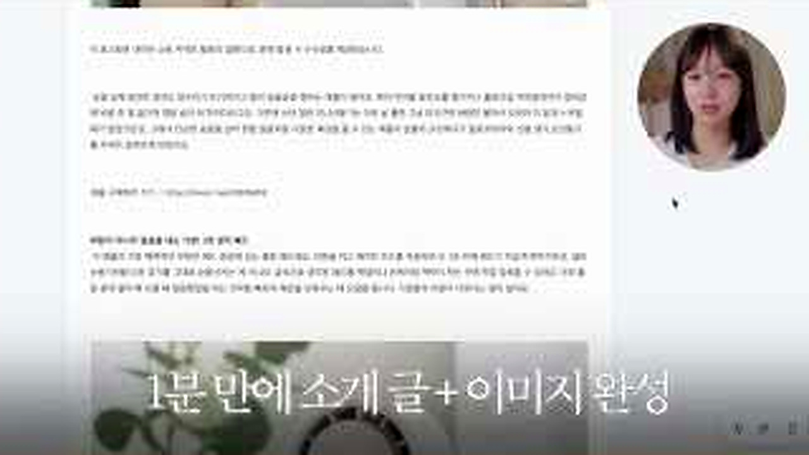
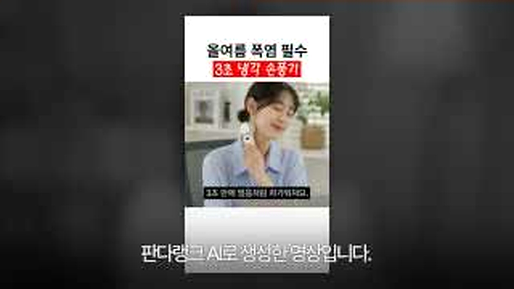
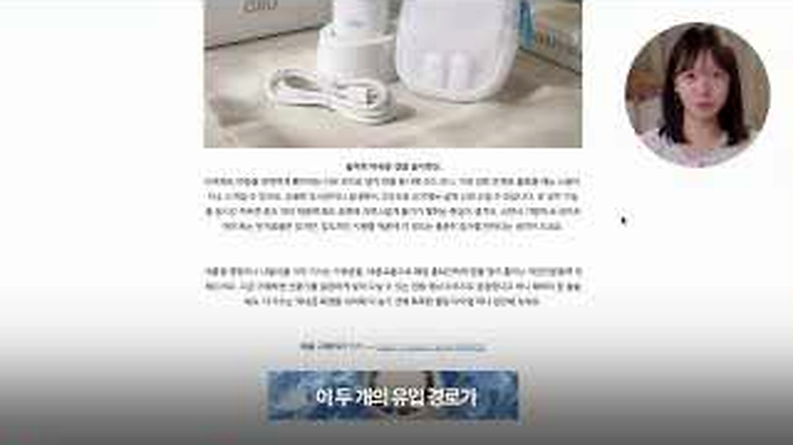
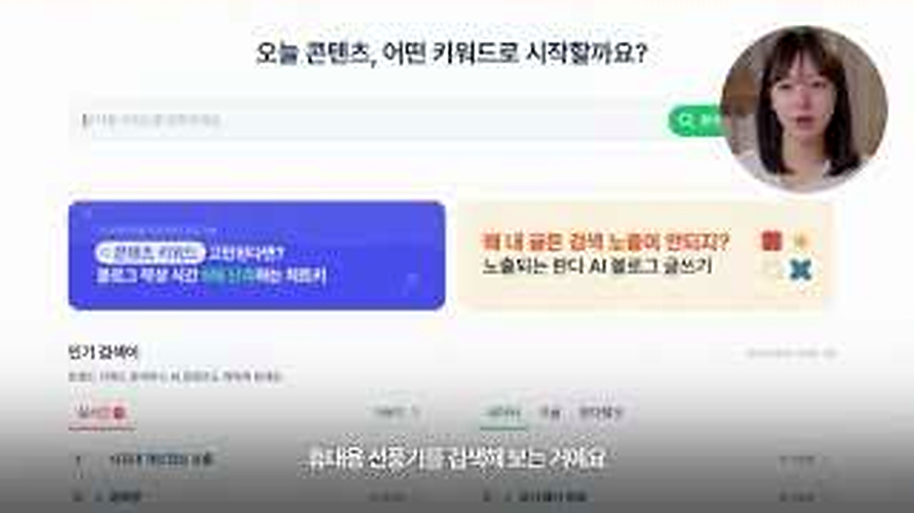

# 퇴근 후 하루 10분 블로그 수익, 영상 속 방법을 그대로 하면 빠지는 함정

하루 10분이라는 말은 퇴근한 사람의 손을 멈추게 합니다.
옌마드 영상은 상품을 고르고 AI로 글과 이미지를 만드는 흐름을 빠르게 보여줍니다.
다만 화면을 끝까지 보면 <u>자동화보다 먼저 필요한 판단</u>이 무엇인지도 함께 드러납니다.

## 💰 상품을 먼저 고르는 방식

<b>그림 설명</b> 진행자가 수익형 블로그의 구조를 먼저 설명합니다. 글쓰기보다 어떤 상품과 독자를 연결할지 정하는 데서 시작합니다.

브링이슈 해설: 첫 컷은 글의 기준점을 잡습니다. 이번 글에서 계속 볼 장면은 '하루 10분 블로그 수익 주장 안에서 실제로 필요한 작업'입니다. 인물과 공간을 먼저 익혀두면 뒤의 변화가 훨씬 잘 보입니다.

<b>그림 설명</b> 글 안의 링크를 통해 구매 페이지로 이동하는 흐름을 보여줍니다. 클릭이 생겨도 구매로 이어지는 이유는 따로 봐야 합니다.

브링이슈 해설: 여기서부터 이야기가 움직입니다. 화면은 '하루 10분 블로그 수익 주장 안에서 실제로 필요한 작업'라는 주제를 설명문보다 실제 상황으로 먼저 보여줍니다.

<b>그림 설명</b> 초보자에게 블로그 방식을 추천하는 장면입니다. 진입은 쉬워 보여도 계정 신뢰와 주제 일관성은 시간이 필요합니다.

브링이슈 해설: 첫 선택이 나오자 각자의 기준이 보입니다. 사소해 보여도 뒤의 반응을 이해하려면 놓치기 어려운 장면입니다.

<b>그림 설명</b> AI가 제품 소개글과 이미지를 만드는 과정을 시연합니다. 초안 속도는 빨라지지만 사실 확인까지 대신해주지는 않습니다.

브링이슈 해설: 반응은 준비된 멘트보다 빠릅니다. 이 표정과 동작 덕분에 영상이 홍보물보다 생활 기록에 가까워집니다.

## 🤖 AI가 줄여주는 일과 못 줄이는 일

<b>그림 설명</b> 휴대용 선풍기 같은 구체적인 상품을 예로 듭니다. 기능, 가격, 사용 대상이 명확할수록 글의 질문도 선명해집니다.

브링이슈 해설: 중간 질문이 앞의 흐름을 다시 세웁니다. 시청자도 같은 지점에서 '정말 그런가?' 하고 한 번 멈추게 됩니다.

<b>그림 설명</b> 구매 버튼과 페이지 이동을 보여줍니다. 수익은 글 발행 수보다 독자가 다음 행동을 이해하는지에 더 가깝습니다.

브링이슈 해설: 여섯 번째 장면에서는 말보다 행동이 빠릅니다. 앞에서 쌓인 흐름이 실제 선택으로 바뀌는 순간이라 글에서도 중심에 두었습니다.

<b>그림 설명</b> 판매하고 싶은 상품을 먼저 정하고 키워드를 찾습니다. 인기만 좇으면 기존 블로그 독자와 맞지 않을 수 있습니다.

브링이슈 해설: 반전 직전에는 작은 어긋남이 쌓입니다. 처음 예상했던 결론이 그대로 가지 않을 것이라는 신호가 보입니다.

## 📝 결국 수익을 가르는 운영 습관

<b>그림 설명</b> 기존 말투를 AI에 반영하는 방법을 설명합니다. 말투 복제보다 경험과 검증 정보가 빠지지 않는지가 더 중요합니다.

브링이슈 해설: 여덟 번째 장면에서 제목의 답이 나옵니다. 놀라움만 키우지 않고 앞선 조건과 연결해서 봐야 과장이 줄어듭니다.

<b>그림 설명</b> 글을 올려도 돈이 되지 않는 경우를 짚습니다. 검색 의도와 상품이 어긋나면 방문자가 많아도 전환은 낮습니다.

브링이슈 해설: 일이 지나간 뒤의 표정은 결과를 정리해줍니다. 성공이나 실패 한 단어보다 사람이 무엇을 느꼈는지가 남습니다.

<b>그림 설명</b> 여러 조건이 맞아야 기회가 생긴다고 마무리합니다. 하루 10분은 작업 시간의 일부일 뿐, 준비 시간 전체는 아닙니다.

브링이슈 해설: 마지막 장면은 억지 교훈을 붙이지 않습니다. 앞의 흐름을 본 사람이 자기 경험을 떠올릴 만큼만 여백을 남깁니다.

<u>한 줄 정리: 하루 10분 블로그 수익 주장 안에서 실제로 필요한 작업</u>

<b>에디터의 시선</b>

AI 프롬프트나 블로그 템플릿은 반복 작업을 줄이는 도구입니다. 하지만 실제 사용하지 않은 제품을 쓴 것처럼 말하거나 광고 표기를 빼면 신뢰가 무너집니다. <u>자동화할 것은 형식이고 남겨둘 것은 판단과 검증</u>입니다.

<u>블로그 수익화를 시도한다면 글쓰기, 상품 선택, 키워드 조사 중 어디에서 가장 막힐 것 같으신가요?</u>

---

원본 채널: 옌마드Yenmad
원본 영상 제목: 퇴근하고 하루 10분, 블로그로 돈버는 방법 총정리💰
원본 링크: https://www.youtube.com/watch?v=BWVGEhf17P8

이 글은 원본 영상을 대체하지 않는 리뷰·해설 콘텐츠입니다. 장면 저작권은 원저작자와 해당 채널에 있으며, 영상의 맥락을 확인하려면 원본을 함께 봐주세요.

#블로그수익 #수익형블로그 #옌마드 #AI블로그 #제휴마케팅 #블로그자동화 #콘텐츠수익화 #유튜브리뷰 #오늘뜬유튜브 #브링이슈
