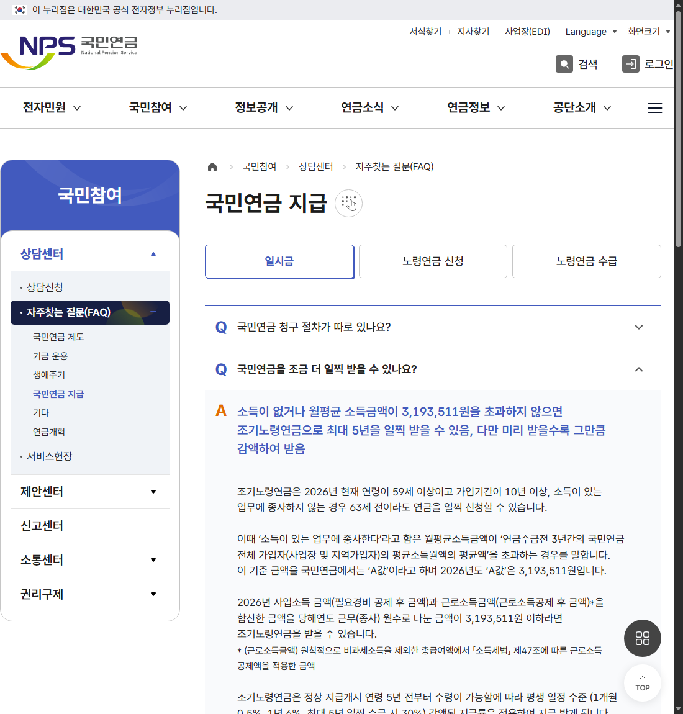
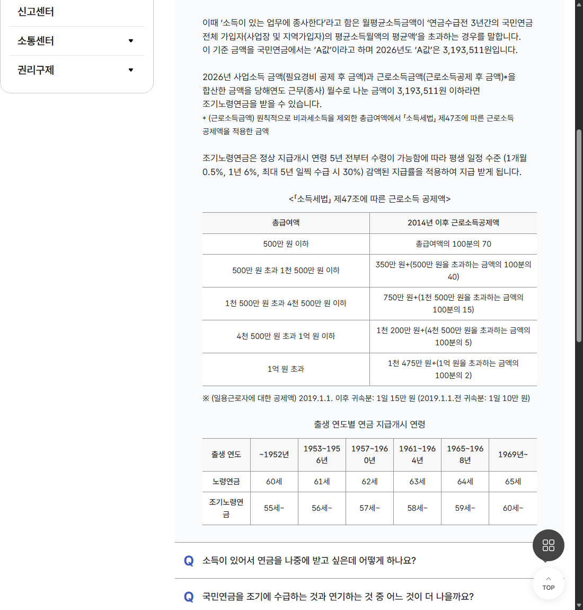

# 2026 조기노령연금 소득기준, 월급 319만 원만 보면 안 됩니다

국민연금을 일찍 받고 싶은데 일을 계속하고 있다면 가장 먼저 떠오르는 질문이 있습니다.

“월급이 얼마까지면 조기노령연금을 받을 수 있을까?”

2026년 국민연금공단이 안내한 기준 금액은 월 **3,193,511원**입니다. 하지만 이 숫자를 통장에 찍히는 월급이나 세전 총급여와 바로 비교하면 안 됩니다.

<mark>사업소득금액과 근로소득금액을 합산해 실제 근무 월수로 나눈 ‘월평균소득금액’이 2026년 A값을 초과하는지 확인해야 합니다.</mark>

소득기준만 맞는다고 끝나는 것도 아닙니다. 가입기간과 출생연도별 신청 나이, 평생 줄어드는 연금액까지 함께 봐야 합니다.

---

## 💰 2026년 A값은 3,193,511원

국민연금에서 말하는 A값은 연금수급 전 3년간 국민연금 전체 가입자의 평균소득월액을 평균한 금액입니다.

국민연금공단 공식 FAQ는 2026년도 A값을 **3,193,511원**이라고 안내합니다.

월평균소득금액이 이 금액을 초과하면 ‘소득이 있는 업무에 종사’하는 것으로 판단하는 기준이 됩니다.

여기서 표현을 주의해서 봐야 합니다. 기준은 319만 원대의 **총급여**가 아니라 세법상 계산을 거친 근로소득금액과 필요경비를 뺀 사업소득금액입니다.

_국민연금공단 공식 FAQ 화면입니다. 2026년 A값과 월평균소득금액 계산 기준을 직접 확인할 수 있습니다._

<u>급여명세서의 월 지급액만 보고 신청 가능 여부를 단정하지 마세요.</u>

---

## 🧮 월평균소득금액은 어떻게 볼까?

공단 안내는 2026년 사업소득금액과 근로소득금액을 합산한 뒤, 그해 실제로 근무하거나 사업에 종사한 월수로 나누도록 설명합니다.

**(사업소득금액 + 근로소득금액) ÷ 당해연도 근무·종사 월수**

사업소득은 매출 전체가 아니라 필요경비를 공제한 금액입니다.

근로소득도 원칙적으로 비과세소득을 제외한 총급여에서 소득세법상 근로소득공제를 적용한 금액입니다.

예를 들어 세전 월급이 320만 원이라는 이유만으로 곧바로 기준 초과라고 판단할 수 없는 이유입니다. 반대로 근로소득 외 사업소득이 있다면 두 금액을 함께 봐야 합니다.

<mark>‘월급’이 아니라 세법상 근로·사업소득금액과 실제 종사 월수를 기준으로 계산합니다.</mark>

## 📌 소득기준 외에 필요한 조건

조기노령연금은 정상 노령연금보다 최대 5년 일찍 받는 제도입니다.

공단 공식 FAQ는 가입기간이 10년 이상이고, 출생연도에 따른 조기 지급개시연령에 도달했으며, 소득이 있는 업무에 종사하지 않는 경우 신청할 수 있다고 설명합니다.

출생연도별 정상 노령연금과 조기노령연금 개시연령은 다음처럼 달라집니다.

- 1961~1964년생: 노령연금 63세, 조기노령연금 58세부터
- 1965~1968년생: 노령연금 64세, 조기노령연금 59세부터
- 1969년 이후 출생: 노령연금 65세, 조기노령연금 60세부터

따라서 다른 사람의 신청 나이를 그대로 적용하지 말고 자신의 출생연도와 가입기간을 먼저 확인해야 합니다.

---

## 📉 5년 일찍 받으면 평생 30%가 줄어듭니다

조기노령연금은 먼저 받는 대신 지급률이 낮아집니다.

국민연금공단 안내 기준은 다음과 같습니다.

- 1개월 일찍 수령: 0.5% 감액
- 1년 일찍 수령: 6% 감액
- 5년 일찍 수령: 30% 감액

이 감액은 조기수령 기간에만 적용됐다가 정상 연령에 회복되는 방식이 아니라, **평생 적용되는 지급률**입니다.

_공단 공식 화면에서 1개월 0.5%, 1년 6%, 최대 30% 감액과 출생연도별 지급개시연령을 함께 확인할 수 있습니다._

<mark>당장 받을 수 있는지보다 줄어든 금액을 평생 받아도 생활비 계획에 문제가 없는지 먼저 계산해야 합니다.</mark>

## ⚖️ 조기수령을 판단할 때 함께 볼 것

조기노령연금은 누구에게나 유리하거나 불리하다고 단정할 수 없습니다.

📌 현재 필요한 생활비

📌 앞으로의 근로·사업소득

📌 건강 상태와 예상 은퇴 시점

📌 다른 연금과 금융자산

📌 조기수령 시 월 감액 규모

📌 정상 개시연령까지 기다릴 수 있는 기간

특히 재취업이나 개인사업 계획이 있다면 올해만 소득이 낮은지, 앞으로도 A값 이하로 유지될지까지 생각해야 합니다.

<u>결정 전 국민연금공단의 예상연금 조회에서 조기수령액과 정상수령액을 같은 기준으로 비교하세요.</u>

---

## ✅ 신청 전 확인 순서

1. 국민연금 가입기간이 10년 이상인지 확인합니다.
2. 출생연도별 조기 지급개시연령을 확인합니다.
3. 근로소득금액과 사업소득금액을 구분합니다.
4. 실제 근무·종사 월수로 월평균소득금액을 계산합니다.
5. 2026년 A값 3,193,511원과 비교합니다.
6. 몇 개월 일찍 받을지에 따른 평생 감액률을 계산합니다.
7. 국민연금공단에서 본인 예상금액과 신청 가능 여부를 최종 확인합니다.

조기노령연금은 단순히 “지금 받을 수 있느냐”의 문제가 아닙니다. 앞으로 받게 될 월 연금액과 현재 생활비 사이의 선택입니다.

부부가 함께 노후계획을 세우고 있다면 이 글을 저장해두고 각자의 가입기간과 예상연금액부터 따로 확인해보세요. 😊

※ 이 글은 국민연금공단의 2026년 공식 안내를 정리한 일반 정보입니다. 개인별 소득 산정과 수급 여부는 국민연금공단의 확인 결과를 우선하세요.

## 공식 참고자료

확인 기준일: 2026-08-26

- [국민연금공단, 국민연금을 조금 더 일찍 받을 수 있나요?](https://www.nps.or.kr/pnsinfo/ntpsklg/getOHAF0100M0.do)

## 태그

#2026조기노령연금 #조기노령연금소득기준 #조기노령연금A값 #조기노령연금감액 #국민연금조기수령 #국민연금소득기준 #노령연금 #은퇴준비 #노후생활 #브링이슈
