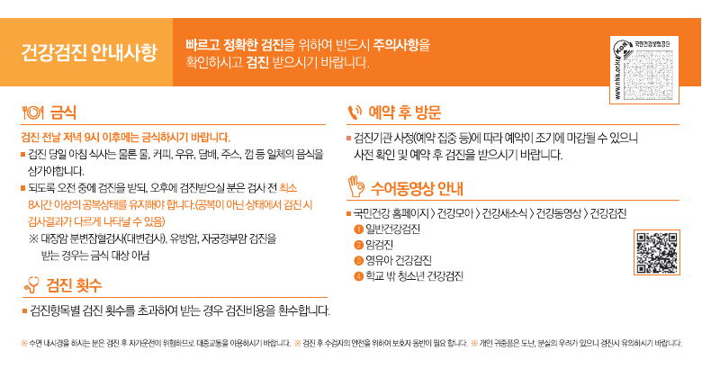

# 건강검진 전 금식, 물과 커피도 마시면 안 될까?

건강검진을 앞두면 가장 헷갈리는 게 물입니다.

음식은 참아도 물 한 잔이나 설탕 없는 블랙커피 정도는 괜찮을 것 같지만, 국민건강보험공단 안내 기준은 생각보다 분명합니다.

<mark>검진 전날 저녁 9시 이후에는 금식하고, 검진 당일 아침에는 물·커피·우유·담배·주스·껌도 삼가는 것이 기본</mark>입니다.

다만 검사 종류와 예약 시간, 복용 중인 약에 따라 준비가 달라질 수 있습니다. 공단의 공통 기준을 먼저 확인한 뒤 예약한 검진기관의 안내를 한 번 더 보는 것이 안전합니다.

---

## 🕘 전날 몇 시부터 금식해야 할까?

국민건강보험공단 건강검진 안내문에는 **검진 전날 저녁 9시 이후 금식**이라고 적혀 있습니다.

저녁 식사는 너무 늦지 않게 가볍게 마치고, 밤 9시부터는 음식을 먹지 않는 방식으로 준비하면 됩니다.

야식뿐 아니라 음료나 사탕처럼 무심코 먹기 쉬운 것도 함께 멈추는 편이 좋습니다.

<u>검진 예약 문자를 받았다면 날짜만 보지 말고, 금식 시작 시간도 휴대전화 알림에 함께 적어두세요.</u>

_국민건강보험공단 건강검진 안내문입니다. 전날 밤 9시 이후 금식과 검진 당일 피해야 할 항목이 한 화면에 정리돼 있습니다._

---

## ☕ 물과 블랙커피도 안 될까?

공단 안내문은 검진 당일 아침에 피해야 할 항목으로 다음을 적고 있습니다.

- 물
- 커피
- 우유
- 담배
- 주스
- 껌
- 그 밖의 음식

따라서 설탕이나 우유를 넣지 않은 블랙커피라도 마시지 않는 쪽이 기준에 맞습니다.

목이 마르다고 물을 여러 잔 마신 뒤 접수대에서 말하지 않는 것보다, 실수로 마셨다면 섭취한 시간과 양을 검진기관에 먼저 알리는 것이 낫습니다.

<mark>‘조금이니 괜찮겠지’라고 스스로 판단하지 말고, 검진기관에 알려 검사 진행 여부를 확인하세요.</mark>

## 🚭 담배와 껌도 금식에 들어갑니다

음식만 안 먹으면 된다고 생각하기 쉽지만 공단 안내에는 담배와 껌도 포함돼 있습니다.

검진을 기다리며 흡연하거나 입이 심심해 껌을 씹는 행동도 피해야 합니다.

특히 여러 검사를 한 번에 받는 종합검진은 검사마다 준비 조건이 다를 수 있으므로, 전날 받은 안내문을 다시 확인하세요.

---

## 🌤️ 오후 검진은 몇 시간 굶어야 할까?

공단 안내 기준으로 오후에 건강검진을 받는 사람은 **검사 전 최소 8시간 이상 공복 상태**를 유지해야 합니다.

예를 들어 오후 2시 검진이라고 해서 오전에 평소처럼 식사해도 된다는 뜻은 아닙니다. 예약 시간에서 최소 8시간을 거꾸로 계산하고, 검진기관이 더 긴 금식시간을 안내했다면 그 기준을 따라야 합니다.

<u>오후 검진도 마지막 음식 섭취 시간을 메모해두면 접수할 때 정확하게 답하기 쉽습니다.</u>

## 💊 혈압약이나 당뇨약은 어떻게 할까?

이 부분은 인터넷 글 하나로 일괄 판단하면 안 됩니다.

복용 중인 약, 질환, 검사 종류에 따라 안내가 달라질 수 있기 때문입니다. 특히 당뇨약과 인슐린, 항응고제·항혈소판제, 수면내시경과 관련된 약은 예약한 검진기관이나 처방 의료진에게 미리 확인하세요.

전화를 걸 때는 약 이름을 정확히 알 수 있도록 처방전이나 약 봉투를 옆에 두는 것이 좋습니다.

## 🔎 모든 건강검진이 금식 대상일까?

공단 안내문에는 **대장암 분변잠혈검사, 유방암 검진, 자궁경부암 검진은 금식 대상이 아니라고** 적혀 있습니다.

다만 같은 날 혈액검사나 위내시경 등 다른 검사를 함께 받는다면 금식이 필요할 수 있습니다.

검사 하나만 보고 판단하지 말고, 그날 예약된 전체 검사 목록을 기준으로 준비해야 합니다.

<mark>금식 여부는 ‘검진을 받느냐’가 아니라 ‘어떤 검사를 함께 받느냐’에 따라 달라질 수 있습니다.</mark>

---

## ✅ 전날 밤 체크리스트

📌 저녁 식사는 늦지 않게 가볍게 마치기

📌 밤 9시 이후 음식과 음료 중단하기

📌 당일 물·커피·우유·담배·주스·껌 피하기

📌 복용약은 검진기관 지침 다시 확인하기

📌 실수로 먹거나 마셨다면 시간과 양 알리기

📌 오후 검진은 최소 8시간 공복 계산하기

건강검진을 제대로 받으려면 무작정 오래 굶는 것보다, 검사에 맞는 준비 시간을 정확히 지키는 것이 중요합니다.

가족도 함께 검진을 앞두고 있다면 이 글을 저장해두고, 전날 밤 9시 전에 서로 한 번 알려주세요. 😊

※ 이 글은 국민건강보험공단의 공통 건강검진 안내를 정리한 자료입니다. 개인의 질환, 복용약, 내시경 준비사항은 예약한 검진기관과 의료진의 안내를 우선하세요.

## 공식 참고자료

확인 기준일: 2026-08-26

- [국민건강보험공단, 2025년 건강검진 안내문](https://www.nhis.or.kr/static/html/wbma/c/wbhaca04700_2025_1.pdf)

## 태그

#건강검진전금식 #건강검진물 #건강검진커피 #건강검진금식시간 #오후건강검진 #건강검진주의사항 #국가건강검진 #건강검진준비 #생활건강 #브링이슈
