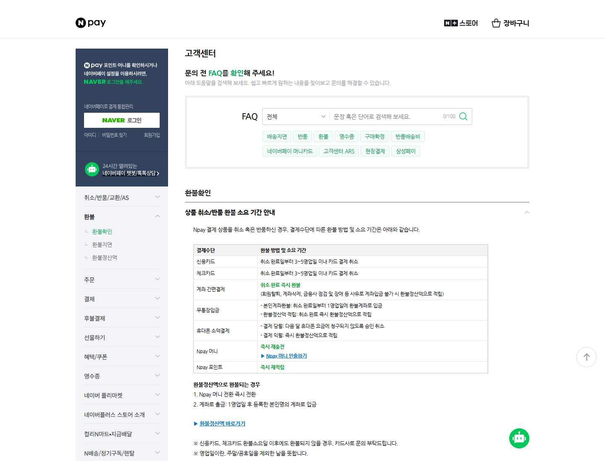

# 네이버페이 환불 기간, 취소 완료인데 돈이 안 보인다면

네이버페이 주문을 취소했는데 카드 앱이나 통장에 돈이 돌아오지 않으면 ‘취소가 제대로 된 게 맞나’ 걱정됩니다.

여기서 먼저 확인할 것은 주문 화면의 **취소 완료 여부**와 처음 사용한 **결제수단**입니다.

<mark>네이버페이는 취소가 끝난 뒤에도 카드·계좌·무통장입금·Npay 머니에 따라 환불이 보이는 시점이 다릅니다.</mark>

취소 완료 표시만 보고 모든 결제가 즉시 현금으로 입금된다고 생각하면 정상 처리 중인 환불도 지연으로 오해하기 쉽습니다.

---

## 💳 신용카드와 체크카드는 3~5영업일

네이버페이 공식 고객센터는 신용카드와 체크카드의 경우 **취소 완료일부터 3~5영업일 이내 카드 결제 취소**로 안내합니다.

여기서 영업일은 토요일·일요일과 공휴일을 제외한 날입니다. 금요일 저녁이나 연휴 직전에 취소됐다면 실제 확인일까지 체감 시간이 더 길 수 있습니다.

또 카드 환불은 통장으로 돈이 새로 입금되는 방식만 있는 것이 아닙니다. 결제 승인 자체가 취소되거나, 이미 청구된 금액이 다음 카드 대금에서 차감되는 등 카드사 처리 시점에 따라 보이는 형태가 달라질 수 있습니다.

<u>네이버페이 주문 화면에서 취소 완료일을 확인한 뒤, 그 날짜를 기준으로 3~5영업일을 계산하세요.</u>

## 📋 공식 환불 표를 직접 확인해보세요

네이버페이 고객센터의 ‘상품 취소/반품 환불 소요 기간 안내’에는 결제수단별 기준이 표로 정리돼 있습니다.

_네이버페이 공식 고객센터 화면입니다. 카드, 계좌 간편결제, 무통장입금, 휴대폰 소액결제, Npay 머니와 포인트의 처리 방식이 구분돼 있습니다._

---

## 🏦 계좌 간편결제와 무통장입금은 다릅니다

계좌 간편결제는 공식 안내상 **취소 완료 후 즉시 환불**입니다.

반면 무통장입금은 환불 방법에 따라 다시 나뉩니다.

- 본인계좌환불: 취소 완료일부터 1영업일에 환불계좌로 입금
- 환불정산액 적립: 취소 완료 후 즉시 환불정산액으로 적립

무통장입금으로 결제했다면 환불계좌를 정확히 입력했는지, 현금이 아니라 환불정산액으로 적립된 것은 아닌지 함께 확인해야 합니다.

<mark>계좌로 입금된 내역만 찾지 말고 네이버페이의 환불정산액도 확인하세요.</mark>

## 🟢 Npay 머니와 포인트는 어디로 돌아올까?

공식 안내에 따르면 Npay 머니는 즉시 재충전되고, Npay 포인트는 즉시 재적립됩니다.

따라서 이 결제수단을 사용했다면 은행 통장의 입금 내역보다 네이버페이 머니·포인트 잔액과 적립 내역을 먼저 보는 편이 빠릅니다.

머니와 포인트를 섞어 결제했거나 카드와 함께 복합 결제했다면 각각의 결제수단으로 나뉘어 돌아올 수 있으므로 한 화면만 보고 판단하지 마세요.

## 📱 휴대폰 소액결제는 결제한 달이 중요합니다

네이버페이 공식 표는 휴대폰 소액결제를 결제 당월과 결제 익월로 구분합니다.

결제한 달에 취소하면 다음 달 휴대폰 요금에 청구되지 않도록 승인 취소가 진행되고, 다음 달로 넘어간 뒤 취소하면 환불정산액으로 적립되는 방식으로 안내합니다.

통신요금 명세서와 네이버페이 환불정산액을 함께 확인해야 하는 이유입니다.

<u>휴대폰 결제는 주문일·취소일이 같은 달인지 먼저 확인하세요.</u>

---

## 🔎 취소 완료가 아니라면 환불 시계도 시작되지 않습니다

반품 상품은 판매자에게 도착하고 검수가 끝난 뒤 취소가 완료되는 경우가 있습니다.

반품 신청만 해놓고 카드 취소가 늦다고 기다리기 전에 주문 상세에서 현재 상태를 확인하세요.

📌 취소 요청 또는 반품 수거 중인지

📌 판매자가 반품 상품을 확인했는지

📌 주문 상태가 실제로 취소 완료인지

📌 처음 사용한 결제수단이 무엇인지

📌 환불정산액이나 포인트로 돌아온 금액은 없는지

<mark>‘반품 신청일’이 아니라 ‘취소 완료일’부터 결제수단별 기간을 계산해야 합니다.</mark>

## ⚠️ 기간이 지났는데도 확인되지 않는다면

신용·체크카드 취소가 공식 안내 기간 뒤에도 확인되지 않는다면 먼저 카드사에 승인 취소 내역을 문의하세요.

네이버페이 고객센터 화면에도 카드 환불 소요일 이후 환불되지 않으면 카드사로 문의하도록 안내돼 있습니다.

문의할 때는 주문번호 전체를 공개 게시판에 올리지 말고 로그인한 공식 고객센터나 카드사 공식 채널을 이용하세요.

환불을 빨리 처리해준다며 원격제어 앱 설치나 인증번호 전달을 요구하는 연락에는 응하지 마세요.

---

## ✅ 환불 확인 순서

1. 주문 상세에서 취소 완료 여부를 확인합니다.
2. 최초 결제수단을 확인합니다.
3. 취소 완료일부터 영업일을 계산합니다.
4. 카드 승인내역, 통장, Npay 머니·포인트, 환불정산액을 각각 확인합니다.
5. 안내 기간이 지났다면 카드사나 네이버페이 공식 고객센터에 문의합니다.

환불이 늦어 보일 때는 새로 문의하기 전에 이 다섯 가지를 먼저 확인해보세요. 결제수단만 정확히 찾아도 돈이 어디로 돌아왔는지 훨씬 빨리 알 수 있습니다. 😊

※ 실제 처리 시점은 카드사·금융회사와 주문 상태에 따라 달라질 수 있으므로 조회 시점의 공식 안내를 우선하세요.

## 공식 참고자료

확인 기준일: 2026-08-26

- [네이버페이 고객센터, 상품 취소·반품 환불 소요 기간 안내](https://help.pay.naver.com/faq/content.help?faqId=11779)

## 태그

#네이버페이환불기간 #네이버페이환불 #네이버페이카드취소 #네이버페이취소 #카드환불기간 #무통장입금환불 #Npay머니 #환불지연 #생활정보 #브링이슈
