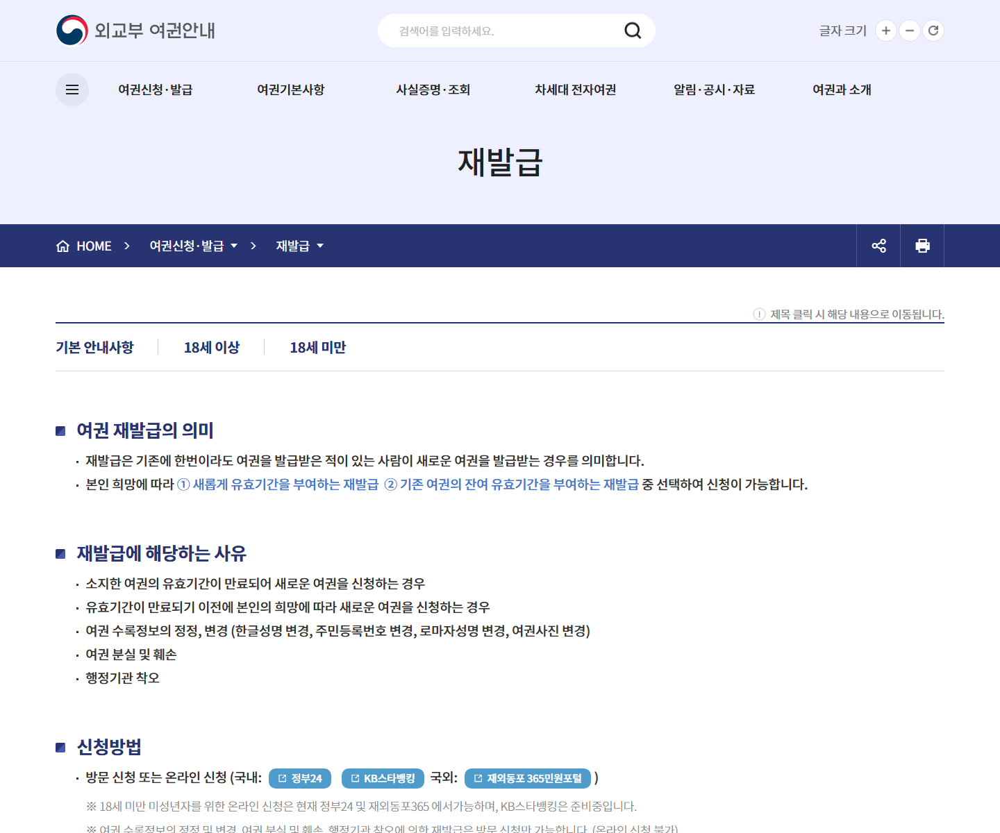
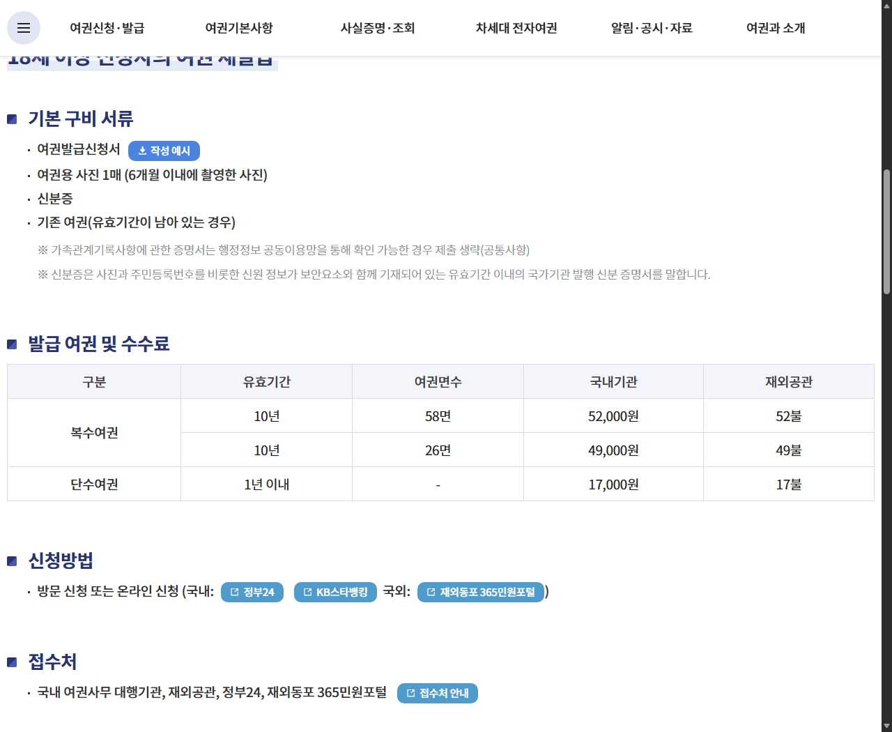

# 여권 재발급 준비물, 온라인 신청 전에 확인할 것

여권 만료일을 확인하고 나서야 여행 준비가 급해지는 경우가 많습니다.

사진만 챙기면 될 것 같지만, 재발급 사유에 따라 온라인 신청이 안 되기도 하고 기존 여권을 가져가야 하는 경우도 있습니다.

<mark>가장 먼저 볼 것은 만료일이 아니라 ‘왜 재발급하는지’입니다.</mark>

신청 방법부터 준비서류와 수수료까지, 외교부 여권안내의 실제 화면을 기준으로 정리했습니다.

---

## 🛂 온라인 신청이 가능한 경우부터 확인하세요

외교부는 여권 재발급을 기존에 한 번이라도 여권을 발급받은 사람이 새 여권을 받는 경우로 설명합니다.

유효기간 만료나 만료 전 새 여권 신청이라면 국내에서는 정부24와 KB스타뱅킹, 해외에서는 재외동포365민원포털을 이용할 수 있습니다.

하지만 모든 재발급을 온라인으로 처리할 수 있는 것은 아닙니다.

- 여권 수록정보를 정정하거나 변경하는 경우
- 여권을 분실하거나 훼손한 경우
- 행정기관 착오로 다시 발급하는 경우

이 사유는 방문 신청만 가능하다고 외교부가 안내합니다.

<u>정부24를 열기 전에 본인의 재발급 사유가 온라인 대상인지 먼저 확인하세요.</u>

_외교부 여권안내의 재발급 공식 화면입니다. 재발급 사유와 국내·국외 온라인 신청 경로를 확인할 수 있습니다._

## 📄 18세 이상 기본 준비물은 네 가지입니다

성인 일반 재발급의 기본 구비서류는 다음과 같습니다.

- 여권발급신청서
- 6개월 이내 촬영한 여권용 사진 1매
- 유효한 신분증
- 유효기간이 남은 기존 여권

기존 여권의 유효기간이 남아 있다면 반드시 챙겨야 합니다.

온라인 신청은 신청서를 직접 작성해 들고 가는 방식과 다르지만, 수령할 때는 본인이 지정한 기관을 방문해야 합니다. 실제 화면에서 요구하는 본인인증과 사진 파일 조건도 신청 직전에 다시 확인하는 편이 안전합니다.

<mark>사진은 최근 6개월 이내 촬영본이어야 하며, 단순히 증명사진 파일이면 모두 인정되는 것은 아닙니다.</mark>

---

## 💳 여권 면수에 따라 수수료가 달라집니다

외교부 공식 표에서 18세 이상 복수여권의 국내 수수료는 58면 52,000원, 26면 49,000원입니다.

유효기간 1년 이내 단수여권은 17,000원으로 안내됩니다.

여행을 자주 하지 않는다면 26면을, 출입국 횟수가 많다면 58면을 검토할 수 있습니다. 다만 면수만 다를 뿐 성인 복수여권의 유효기간은 표에서 모두 10년으로 표시됩니다.

_외교부 여권안내의 성인 기본서류와 수수료 표입니다. 신청방법과 접수처도 같은 화면에서 확인할 수 있습니다._

<u>수수료만 비교하지 말고 필요한 면수와 여권 종류를 함께 선택하세요.</u>

## 📷 사진 때문에 다시 준비하지 않으려면

여권 사진은 신청일 전 6개월 이내 촬영한 사진이어야 합니다.

온라인 신청에서는 파일 자체가 규격을 충족해야 하므로, 휴대전화로 다시 촬영한 인화사진이나 과도하게 보정한 파일은 피하는 편이 좋습니다.

사진관에 맡길 때는 ‘여권 온라인 재발급용 파일도 필요하다’고 말하고 인화본과 파일을 함께 받으면 방문과 온라인 신청 양쪽에 대비할 수 있습니다.

안경, 머리카락, 배경, 얼굴 크기처럼 세부 기준은 달라질 수 있으므로 신청 당일 외교부 여권사진 규격 안내를 다시 확인하세요.

---

## 🏢 방문 신청이 더 나은 경우도 있습니다

분실이나 훼손처럼 온라인으로 처리할 수 없는 사유라면 처음부터 가까운 여권사무 대행기관을 확인해야 합니다.

온라인 입력이 익숙하지 않거나 사진 파일 규격이 불안한 경우에도 방문 신청이 오히려 빠를 수 있습니다. 현장에서 서류 누락을 바로 확인할 수 있기 때문입니다.

다만 여권은 원칙적으로 본인이 직접 신청해야 합니다. 미성년자, 질병·장애 등 예외적인 대리 신청은 별도 요건이 있으므로 성인 일반 재발급 기준을 그대로 적용하면 안 됩니다.

<mark>미성년자 여권은 법정대리인 동의서 등 별도 서류가 필요합니다.</mark>

## ⏰ 출국 직전에 신청하면 위험한 이유

접수했다고 바로 여권번호가 생기는 것은 아닙니다.

발급 소요기간은 신청 기관과 시기에 따라 달라질 수 있고, 새 여권을 받은 뒤 항공권이나 비자 정보도 다시 확인해야 합니다.

이미 항공권을 샀다면 예약 정보의 영문 이름이 새 여권과 같은지 확인하세요. 일부 항공사와 국가의 입국 조건은 출국일 기준 여권 잔여 유효기간을 요구하기도 합니다.

<u>여행 예약 전에는 목적지의 여권 잔여 유효기간과 비자 조건을 외교부 해외안전여행 또는 해당 국가 공관에서 확인하세요.</u>

---

## ✅ 신청 전 마지막 확인 순서

1. 기존 여권의 유효기간과 훼손 여부를 확인합니다.
2. 만료·정보 변경·분실 중 재발급 사유를 구분합니다.
3. 온라인 신청이 가능한 사유인지 확인합니다.
4. 6개월 이내 여권용 사진을 준비합니다.
5. 신분증과 유효기간이 남은 기존 여권을 챙깁니다.
6. 26면·58면과 단수·복수여권을 선택합니다.
7. 수령기관과 운영시간을 확인합니다.
8. 새 여권 수령 뒤 항공권·비자 정보를 다시 확인합니다.

온라인 신청이 편리해도 분실·훼손 등 방문 대상까지 해결해주는 것은 아닙니다.

여행 날짜가 정해졌다면 이 글을 저장해두고, 여권의 만료일과 재발급 사유부터 확인해보세요. 😊

※ 신청 대상과 수수료는 변경될 수 있으므로 실제 접수 직전 외교부 여권안내와 신청 화면을 우선하세요.

## 공식 참고자료

확인 기준일: 2026-08-26

- [외교부 여권안내, 여권 재발급](https://www.passport.go.kr/home/kor/contents.do?menuPos=6)
- [외교부 여권안내, 여권사진 규격](https://www.passport.go.kr/home/kor/contents.do?menuPos=11)

## 태그

#여권재발급준비물 #여권온라인재발급 #여권재발급수수료 #여권재발급사진 #정부24여권 #여권만료 #해외여행준비 #여권신청 #여권발급 #브링이슈
