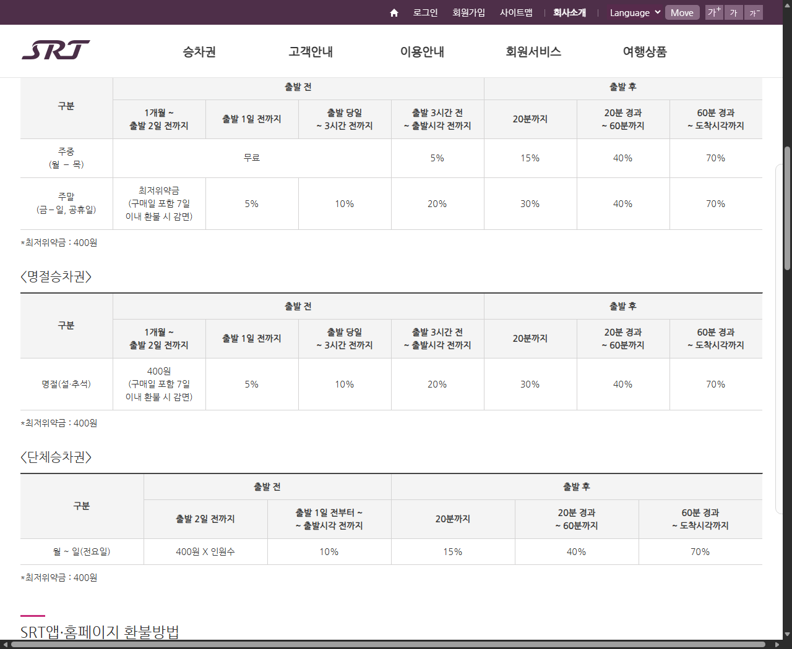
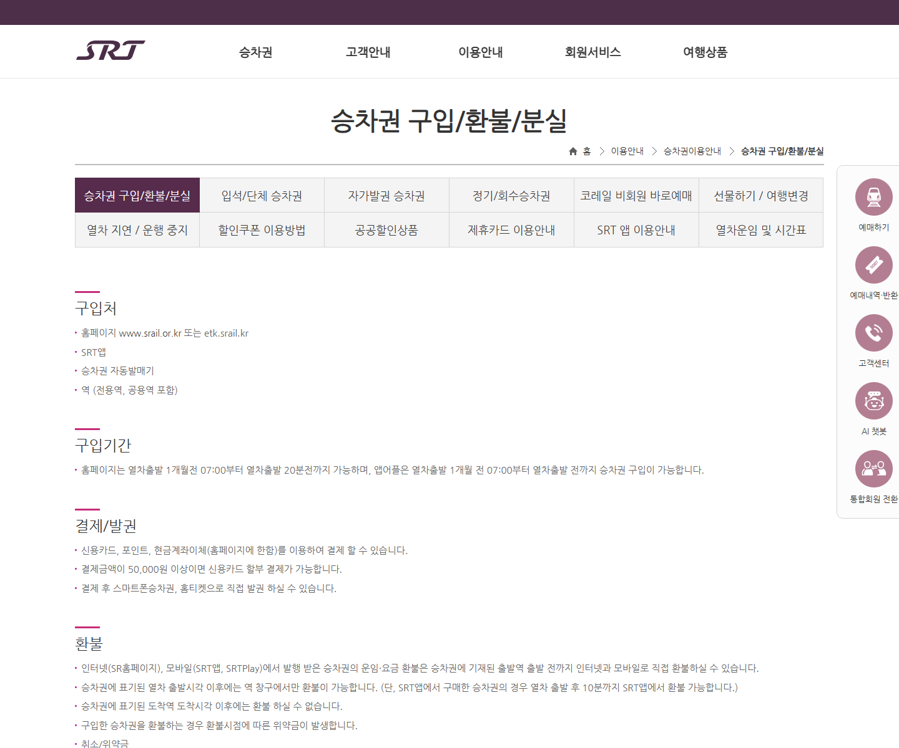

# SRT 취소 수수료, 주말 표는 출발 전에도 달라집니다

SRT 승차권을 취소하려고 보면 출발 전인데도 위약금이 표시될 때가 있습니다.

월요일에 타는 표와 토요일에 타는 표의 기준이 다르고, 출발 3시간 전인지 지난 뒤인지에 따라서도 금액이 달라지기 때문입니다.

<mark>주중 일반승차권은 출발 3시간 전까지 무료지만, 주말·공휴일 승차권은 더 이른 시점부터 최저위약금이나 5%·10%가 적용될 수 있습니다.</mark>

취소 버튼을 누르기 전에 탑승일과 남은 시간을 먼저 확인하면 예상하지 못한 공제를 피하기 쉽습니다.

---

## 🚆 주중 승차권은 출발 3시간 전까지 무료

SR 공식 기준에서 주중은 월요일부터 목요일까지입니다.

주중 일반승차권은 출발 3시간 전까지 위약금이 없고, 출발 3시간 전부터 출발시각 전까지는 운임의 5%가 적용됩니다.

예를 들어 목요일 오후 3시 열차라면 정오 전까지 취소하는 경우와 오후 1시에 취소하는 경우의 위약금이 다를 수 있습니다.

<u>‘출발 당일’만 보지 말고 정확히 3시간이 남았는지 확인하세요.</u>

## 📅 금·토·일과 공휴일은 더 일찍 위약금이 생깁니다

주말 기준은 금요일부터 일요일, 그리고 공휴일입니다.

일반승차권의 출발 전 위약금은 다음과 같습니다.

- 출발 1개월 전~2일 전: 최저위약금 400원
- 출발 1일 전: 5%
- 출발 당일~3시간 전: 10%
- 출발 3시간 전~출발시각 전: 20%

구매일을 포함해 7일 이내 환불하면 첫 구간의 최저위약금이 감면된다는 안내도 함께 표시돼 있습니다.

<mark>금요일 열차도 주말 기준에 포함됩니다.</mark>

## 📊 공식 위약금 표를 확인하세요

SR 승차권 이용안내에는 일반승차권과 명절·단체승차권이 별도 표로 나옵니다.

_SR 공식 위약금 표입니다. 주중·주말·명절의 출발 전후 공제율을 시간대별로 비교할 수 있습니다._

명절승차권은 일반 주말 승차권과 비슷하게 400원, 5%, 10%, 20% 순으로 출발 전 위약금이 올라갑니다.

단체승차권은 인원수에 따라 최저위약금이 계산되므로 개인 승차권 표를 그대로 적용하면 안 됩니다.

---

## ⏱️ 열차가 출발했다면 공제율이 크게 올라갑니다

출발 뒤에는 일반·주말·명절승차권 모두 시간대별 위약금이 다음처럼 안내됩니다.

- 출발 후 20분까지: 30%
- 20분 경과~60분까지: 40%
- 60분 경과~도착시각까지: 70%

도착역 도착시각을 지나면 환불할 수 없습니다.

<mark>열차를 놓쳤다면 기다리지 말고 가능한 환불 경로를 즉시 확인해야 합니다.</mark>

## 📱 앱에서 산 표는 출발 후 10분까지 예외가 있습니다

일반적인 안내는 열차 출발 뒤 역 창구에서만 환불할 수 있다는 것입니다.

다만 SRT앱으로 발권한 승차권은 **열차 출발 후 10분까지 SRT앱에서 환불 가능**하다고 SR FAQ가 안내합니다.

그 시간이 지나면 도착역 도착시각 전까지 역 창구에서 환불해야 합니다.

SRT 홈페이지나 앱에서 산 승차권은 출발 전까지 온라인 또는 역 창구에서 환불할 수 있습니다. 카카오T·네이버지도·토스 등 다른 플랫폼에서 구입했다면 출발 전에는 해당 구매 플랫폼에서 취소해야 합니다.

<u>어디에서 샀는지 모르면 결제 문자보다 승차권이 실제로 표시되는 앱부터 확인하세요.</u>

_SR 공식 승차권 환불 안내 화면입니다. 인터넷·모바일과 역 창구에서 가능한 환불 시점을 구분해 설명합니다._

---

## 🎫 역에서 산 종이 승차권은 원본이 중요합니다

역 창구나 자동발매기에서 구입한 승차권은 역에 방문해 환불하는 것이 기본입니다.

출발 전에 역에 갈 수 없다면 인터넷이나 전화로 환불을 접수할 수 있지만, 출발일부터 1년 이내에 승차권 원본을 역 창구에 제출해야 최종 환불을 받을 수 있다고 SR이 안내합니다.

환불 접수만 하고 종이 승차권을 버리면 곤란한 이유입니다.

<u>현장 발권 승차권은 환불이 끝날 때까지 원본을 보관하세요.</u>

## 🔎 카드 취소가 바로 보이지 않을 때

승차권 환불 처리와 카드사의 승인 취소 반영은 같은 순간에 화면에 보이지 않을 수 있습니다.

먼저 SRT 예매내역에서 환불이 정상 접수됐는지 확인하고, 카드 앱의 승인 취소 내역을 확인하세요.

SR 공식 위약금 표는 차감되는 운임 비율을 설명하는 자료입니다. 실제 카드 한도 복원이나 청구 취소 시점은 카드사와 결제 상태에 따라 달라질 수 있으므로 일정 시간이 지나도 보이지 않는다면 카드사 공식 고객센터에 문의하세요.

---

## ✅ 취소 전 확인 순서

1. 탑승일이 주중인지 주말·공휴일인지 확인합니다.
2. 출발시각까지 몇 시간이 남았는지 계산합니다.
3. 일반·명절·단체승차권 중 종류를 확인합니다.
4. SRT앱·홈페이지·역·외부 플랫폼 중 구매처를 확인합니다.
5. 화면에 표시된 위약금을 확인한 뒤 최종 환불을 누릅니다.
6. 종이 승차권은 최종 환불 전까지 보관합니다.
7. 환불 접수 결과와 카드 승인 취소를 각각 확인합니다.

가족 표를 한꺼번에 예매했다면 일부 인원만 취소할 것인지 전체를 취소할 것인지도 마지막 화면에서 다시 확인하세요.

여행 일정이 자주 바뀐다면 이 글을 저장해두고, 취소가 필요해진 순간 출발 3시간부터 먼저 계산해보세요. 😊

※ 위약금 기준은 변경될 수 있으므로 실제 환불 직전 SR 공식 화면에 표시되는 금액을 우선하세요.

## 공식 참고자료

확인 기준일: 2026-08-26

- [SR, 승차권 구입·환불·분실 및 위약금 안내](https://etk.srail.kr/cms/archive.do?pageId=TK0402010000)
- [SR FAQ, 승차권을 환불하고 싶어요](https://etk.srail.kr/cms/article/view.do?pageId=TK0504000000&postNo=96)

## 태그

#SRT취소수수료 #SRT환불 #SRT위약금 #SRT출발후환불 #SRT주말취소 #SRT명절승차권 #기차표환불 #열차취소 #여행정보 #브링이슈
