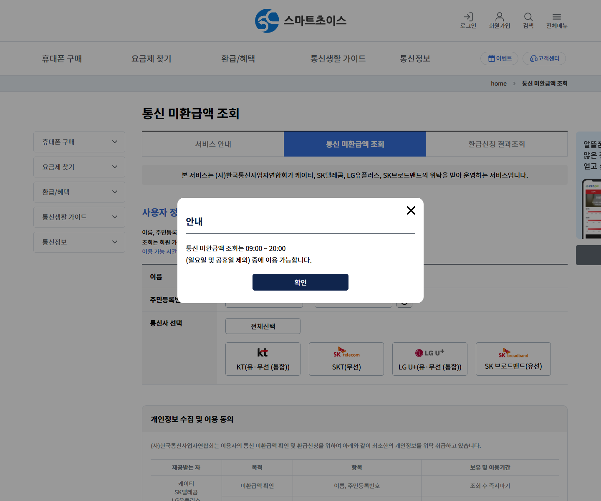

# 통신 미환급액 조회, 휴대폰 바꿨다면 한 번 확인하세요

휴대전화 번호를 옮기거나 인터넷을 해지할 때 요금을 모두 정산했다고 생각하기 쉽습니다.

그런데 해지 뒤 할인 조건이 다시 반영되거나 자동이체가 겹치면서 과납요금이 생기고, 예전에 맡긴 보증금이 남는 경우가 있습니다.

이 돈을 통신 미환급액이라고 합니다.

<mark>KT·SK텔레콤·LG유플러스·SK브로드밴드의 미환급액은 스마트초이스 공식 서비스에서 한 번에 조회할 수 있습니다.</mark>

오래전에 번호이동을 했다면 금액이 있을 거라고 단정할 수는 없지만, 공식 조회를 한 번 해볼 가치는 있습니다.

---

## 💰 통신 미환급액은 왜 생길까?

스마트초이스는 유선전화·이동전화 서비스를 해지하거나 번호이동한 뒤 발생한 미환급액을 온라인으로 조회하고 신청할 수 있는 공익서비스입니다.

대표적인 발생 이유는 다음과 같습니다.

- 해지 후 할인 조건이 반영되며 생긴 과납요금
- 해지요금을 냈는데 자동이체가 다시 진행된 이중납부
- 가입 당시 맡긴 보증금 가운데 돌려받지 못한 금액
- 단말기 할부보증보험료의 남은 금액

미환급액은 새 통신사에서 주는 지원금이나 요금할인과는 다른 돈입니다. 예전에 이용한 통신사의 해지 정산 과정에서 남은 금액을 말합니다.

## 🔎 공식 조회 화면은 이렇게 생겼습니다

스마트초이스 공식 화면에서 **환급/혜택 → 통신 미환급액 조회** 메뉴로 들어가면 됩니다.

_스마트초이스 공식 조회 화면입니다. 운영기관과 대상 통신사, 오전 9시~오후 8시 이용 안내를 직접 확인할 수 있습니다._

화면에는 KT, SK텔레콤, LG유플러스, SK브로드밴드가 표시됩니다. SKT·KT·LGU+를 선택해 조회하면 각 통신사 망을 이용하는 알뜰폰 사업자의 미환급액도 함께 조회된다고 안내합니다.

<u>포털 광고나 문자 링크보다 스마트초이스 공식 주소를 직접 열어 접속하세요.</u>

---

## 🕘 조회 가능한 시간이 정해져 있습니다

통신 미환급액 조회는 아무 시간에나 되는 서비스가 아닙니다.

공식 화면의 이용 가능 시간은 **오전 9시부터 오후 8시까지**이며, 일요일과 공휴일은 제외됩니다.

밤늦게 조회 버튼이 작동하지 않는다면 개인정보를 잘못 입력했다고 생각하기 전에 이용 시간을 먼저 확인하세요.

<mark>평일 또는 토요일 오전 9시~오후 8시에 조회하는 것이 가장 간단합니다.</mark>

## 👤 조회와 환급 신청은 절차가 다릅니다

미환급액 조회는 회원가입이나 로그인 없이 이름과 주민등록번호로 이용할 수 있습니다.

다만 조회 결과 돌려받을 금액이 있다면 회원가입과 로그인 후 환급을 신청해야 합니다.

환급금은 신청인 본인의 실명계좌로만 받을 수 있습니다. 가족 계좌나 다른 사람 명의 계좌를 입력하면 정상적으로 진행되지 않을 수 있습니다.

공식 FAQ는 환급 신청 이후 통신사별로 **2~7일 이내** 지급된다고 안내합니다. 최종 확인 과정에서 미납금액 등이 확인되면 신청 때 본 금액과 실제 입금액이 달라질 수 있습니다.

## 📋 조회 전에 준비할 것

📌 본인 이름과 주민등록번호

📌 조회할 통신사

📌 환급 신청 시 본인 명의 은행계좌

📌 신청 결과를 확인할 로그인 정보

조회 화면에서 주민등록번호를 입력해야 하므로 카페나 공용 PC보다는 본인이 관리하는 기기에서 진행하세요.

입력 화면이나 결과 화면에는 개인정보가 포함될 수 있습니다. 화면을 캡처해 가족 단체방이나 공개 게시판에 그대로 올리지 마세요.

---

## ⚠️ 전화로 개인정보를 요구한다면 멈추세요

스마트초이스 공식 화면은 통신 미환급액 환급과 관련해 **전화 또는 팩스로 고객의 어떠한 개인정보도 요구하지 않는다**고 안내합니다.

미환급금을 대신 받아준다며 주민등록번호, 계좌 비밀번호, 인증번호를 전화로 요구하거나 수수료부터 보내라고 한다면 진행을 멈추세요.

<u>환급 신청은 스마트초이스 또는 해당 통신사의 공식 홈페이지·고객센터에서 본인이 직접 진행하세요.</u>

## 🏠 인터넷 미환급금은 모두 보일까?

공식 FAQ에 따르면 유선전화와 이동전화의 해지·번호이동 후 미환급액을 조회할 수 있습니다.

다만 초고속 인터넷 등의 미환급액은 사업자에 따라 제공되거나 제공되지 않을 수 있어, 결과에 나타나지 않는다면 이용했던 통신사에 직접 확인해야 합니다.

전화번호별로 세부 금액을 확인하고 싶을 때도 해당 이동통신사업자 문의가 필요합니다. 스마트초이스 조회 결과는 주민등록번호를 기준으로 통신사별 금액이 합산되어 표시될 수 있기 때문입니다.

<mark>스마트초이스 조회 결과가 없더라도 모든 통신상품의 미환급금이 없다고 단정해서는 안 됩니다.</mark>

---

## ✅ 조회·신청 순서

1. 스마트초이스 공식 홈페이지를 직접 엽니다.
2. 통신 미환급액 조회 메뉴로 들어갑니다.
3. 이용 가능 시간인지 확인합니다.
4. 이름과 주민등록번호를 입력하고 통신사를 선택합니다.
5. 개인정보 수집·이용 내용을 읽고 조회합니다.
6. 환급액이 있다면 회원가입·로그인 후 본인 계좌로 신청합니다.
7. 신청 결과와 실제 입금액을 확인합니다.

번호이동을 자주 했거나 가족 명의 통신서비스를 정리한 경험이 있다면 한 번씩 따로 조회해보세요.

부모님 휴대전화를 함께 확인할 때도 개인정보를 대신 받아 적어 전송하기보다 옆에서 공식 화면을 열어드리는 편이 안전합니다. 😊

※ 실제 조회 범위와 환급액, 지급일은 통신사 최종 확인 결과에 따라 달라질 수 있습니다.

## 공식 참고자료

확인 기준일: 2026-08-26

- [스마트초이스, 통신 미환급액 조회](https://www.smartchoice.or.kr/smc/service/refund.do)
- [스마트초이스, 통신요금 미환급 FAQ](https://www.smartchoice.or.kr/smc/support/faq.do?tab=C)

## 태그

#통신미환급액조회 #통신비환급 #스마트초이스 #휴대폰해지환급 #번호이동환급 #통신요금미환급 #알뜰폰미환급 #인터넷해지 #생활정보 #브링이슈
