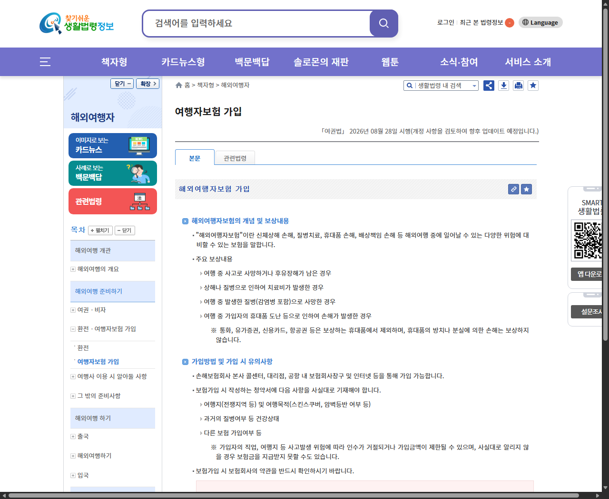
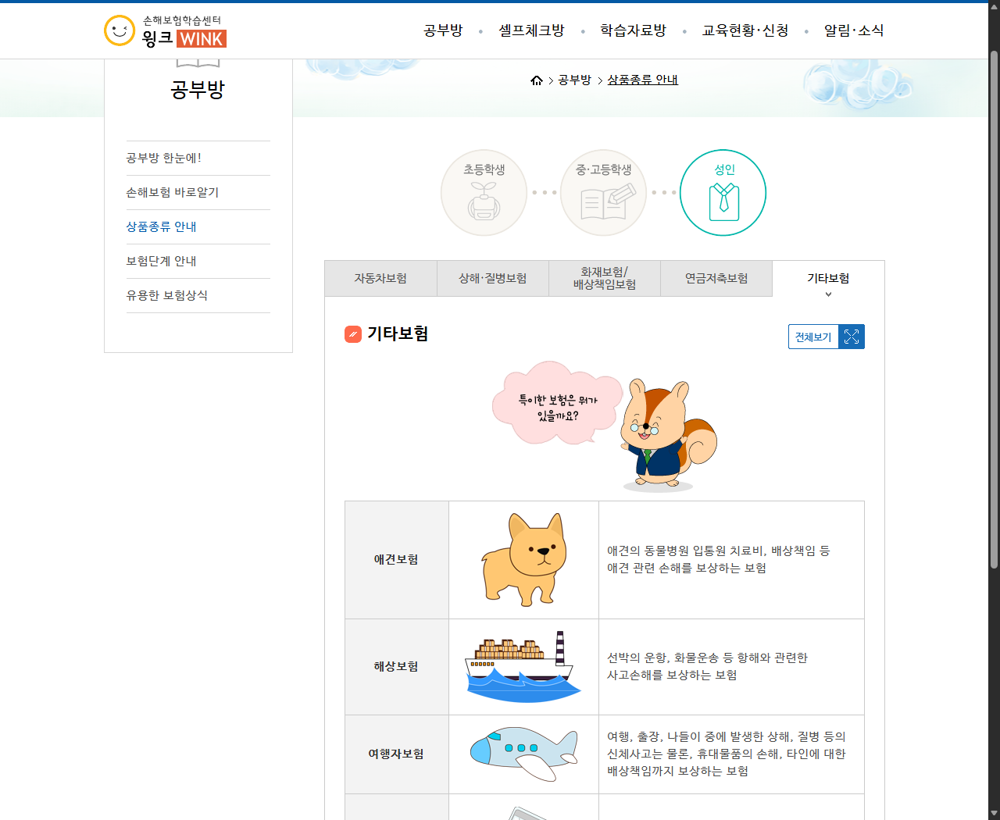

# 여행자보험 비교, 휴대품손해보다 먼저 볼 항목

해외여행자보험을 비교하면 가장 먼저 보험료와 휴대품 보장금액이 눈에 들어옵니다.

하지만 여행 중 큰 비용이 생길 수 있는 부분은 현지 치료비이고, 휴대품도 ‘잃어버린 경우’와 ‘도난당한 경우’의 판단이 다를 수 있습니다.

<mark>가격보다 먼저 상해·질병 의료비, 휴대품 제외사항, 배상책임을 같은 순서로 비교해야 합니다.</mark>

특정 상품을 고르는 글이 아니라, 정부와 손해보험협회 실제 안내를 바탕으로 가입 전 확인표를 정리했습니다.

---

## 🏥 첫 번째는 해외 상해·질병 의료비입니다

찾기쉬운 생활법령정보는 해외여행자보험이 여행 중 신체상해, 질병치료, 휴대품 손해, 배상책임 등의 위험에 대비하는 보험이라고 설명합니다.

보장표를 볼 때는 사망·후유장해 금액만 보지 말고 해외에서 발생한 상해와 질병 치료비 항목을 따로 확인해야 합니다.

평소 복용약이 있거나 장거리 여행을 간다면 기존 질환과 관련한 면책, 통원·입원 구분, 자기부담금이 있는지 상품설명서와 약관에서 확인하세요.

<u>비교 화면에서 ‘해외의료비’ 항목을 펼쳐 한도와 제외사항을 먼저 읽으세요.</u>

_찾기쉬운 생활법령정보의 여행자보험 안내 화면입니다. 주요 보상과 휴대품 제외사항, 가입 시 알려야 할 내용을 함께 볼 수 있습니다._

## 🧳 휴대품은 분실과 도난을 구분해야 합니다

휴대품손해 한도가 크다고 모든 물건이 보상되는 것은 아닙니다.

공식 안내에 따르면 통화, 유가증권, 신용카드, 항공권 등은 보상하는 휴대품에서 제외됩니다. 휴대품을 방치했거나 단순히 잃어버린 경우의 손해도 보상하지 않는다고 설명합니다.

따라서 휴대전화나 가방을 잃어버렸다고 해서 항상 보상된다고 단정하면 안 됩니다.

상품마다 한 품목당 한도, 자기부담금, 도난 입증에 필요한 서류가 다를 수 있으므로 전체 가입금액만 비교해서는 부족합니다.

<mark>‘휴대품 100만원’ 같은 총액보다 품목당 한도와 분실 제외 문구를 먼저 보세요.</mark>

---

## 🙋 다른 사람에게 준 손해도 확인하세요

여행 중 숙소 비품을 망가뜨리거나 다른 사람에게 손해를 입힌 경우에는 배상책임 항목이 관계될 수 있습니다.

손해보험협회 학습센터도 여행자보험이 여행·출장·나들이 중 상해와 질병뿐 아니라 휴대물품 손해, 타인에 대한 배상책임을 보상하는 보험이라고 소개합니다.

_손해보험협회 학습센터의 여행자보험 안내 화면입니다. 여행자보험의 기본 보장 범위를 한눈에 확인할 수 있습니다._

다만 렌터카 사고, 고의 손해, 업무 중 사고처럼 약관에서 제외되는 상황이 있을 수 있습니다.

<u>여행 중 렌터카나 위험 활동 계획이 있다면 일반 배상책임만 믿지 말고 별도 보장 여부를 확인하세요.</u>

## 🧗 여행 목적을 사실대로 알려야 합니다

보험 가입 청약서에는 여행지와 여행목적, 과거 질병 등 건강상태, 다른 보험 가입 여부를 사실대로 적어야 합니다.

스킨스쿠버나 암벽등반처럼 위험도가 높은 활동을 계획하면서 일반 관광으로만 적으면 나중에 문제가 될 수 있습니다.

공식 안내는 직업과 여행지 등 사고 위험에 따라 가입이 거절되거나 가입금액이 제한될 수 있고, 사실대로 알리지 않으면 보험금을 받지 못할 수도 있다고 설명합니다.

<mark>일정표에 레저 활동이 있다면 결제 전에 상담 창구나 약관에서 보장 여부를 확인해야 합니다.</mark>

---

## 🧾 사고가 나면 현지 기록부터 남기세요

보험금 청구에 필요한 서류는 사고 종류와 보험사 약관에 따라 달라집니다.

병원 진료라면 진료비 영수증과 진단 관련 서류를, 도난이라면 현지 신고 사실을 확인할 수 있는 자료를 확보하는 것이 기본적인 준비가 됩니다.

손상된 물품이나 사고 장소는 사진을 남기고, 보험사의 해외 연락처와 청구 방법도 출국 전에 저장해두세요.

서류를 임의로 버리지 말고 귀국 후 보험사 공식 청구 안내와 대조하는 편이 안전합니다.

<u>사고 직후 보험사에 연락해 필요한 서류를 확인하고 원본과 사진을 함께 보관하세요.</u>

## 💰 보험료가 비슷할 때 비교하는 순서

보험료가 몇 천 원 차이 난다면 다음 항목을 같은 조건으로 놓고 비교해보세요.

1. 여행기간과 출발·도착 시간이 정확한지 확인합니다.
2. 해외 상해·질병 의료비 한도를 비교합니다.
3. 기존 질환과 위험 활동의 제외사항을 확인합니다.
4. 배상책임 한도와 자기부담금을 봅니다.
5. 휴대품의 품목당 한도와 제외 물품을 확인합니다.
6. 항공기 지연·수하물 지연 특약의 조건을 확인합니다.
7. 현지 사고 접수와 귀국 후 청구 방법을 저장합니다.

항공권이나 카드 혜택에 보험이 포함돼 있더라도 자동 가입 여부와 실제 보장기간, 한도를 확인해야 합니다. 이름이 같은 특약이라도 상품별 약관은 다를 수 있습니다.

---

## ✅ 출국 전 최종 체크리스트

- 여행 국가와 기간을 정확히 입력했는가
- 동행 가족 모두 피보험자로 등록됐는가
- 상해·질병 의료비 한도를 확인했는가
- 휴대품 분실과 방치가 제외된다는 점을 확인했는가
- 위험한 레저 활동 계획을 알렸는가
- 다른 보험 가입 여부를 사실대로 입력했는가
- 자기부담금과 품목당 한도를 확인했는가
- 긴급 연락처와 청구 방법을 저장했는가

여행자보험은 가장 싼 상품을 찾는 것보다, 내가 걱정하는 사고가 실제 보장 범위에 들어가는지 확인하는 일이 먼저입니다.

다음 여행을 준비할 때 이 글을 저장해두고, 상품 두세 개를 같은 순서로 비교해보세요. 😊

※ 실제 보상 여부와 금액은 가입한 상품의 약관, 특약, 사고 사실과 제출 서류에 따라 달라집니다. 가입 직전 상품설명서와 약관을 우선하세요.

## 공식 참고자료

확인 기준일: 2026-08-26

- [찾기쉬운 생활법령정보, 해외여행자보험 가입](https://www.easylaw.go.kr/CSP/CnpClsMain.laf?ccfNo=2&cciNo=2&cnpClsNo=2&csmSeq=894)
- [손해보험협회 손해보험학습센터, 여행자보험](https://edu.knia.or.kr/edu/product3_5.do)

## 태그

#여행자보험비교 #해외여행자보험 #여행자보험휴대품손해 #여행자보험의료비 #여행자보험가입 #해외여행준비 #여행자보험보장 #여행자보험약관 #여행준비물 #브링이슈
