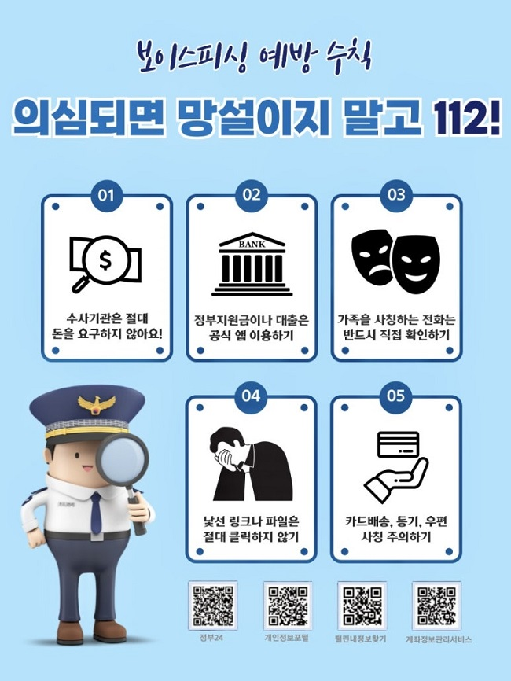

# 보이스피싱 송금했다면, 계좌 지급정지부터 해야 합니다

보이스피싱이라는 걸 알아차린 순간에는 머리가 하얘집니다.

경찰에 먼저 전화해야 하는지, 은행 앱을 열어야 하는지, 상대방에게 돈을 돌려달라고 해야 하는지 판단하기 어렵습니다.

하지만 이때 가장 중요한 건 범인을 설득하는 일이 아닙니다.

<mark>추가 송금을 멈추고, 112와 송금한 금융회사에 즉시 연락해 계좌 지급정지를 요청하는 것</mark>입니다.

시간이 지난 뒤 이 글을 읽고 있더라도 포기하지 마세요. 피해금 반환을 장담할 수는 없지만, 신고와 지급정지 요청을 늦출 이유도 없습니다.

---

## 🚨 지금 바로 해야 할 일

아직 통화 중이라면 상대방의 지시에 따라 앱을 설치하거나 인증번호를 알려주지 마세요.

이미 송금했다면 다음 순서대로 움직이면 됩니다.

1. 추가 송금과 상대방과의 연락을 멈춥니다.
2. **112에 전화해 보이스피싱 송금 피해라고 알립니다.**
3. 돈을 보낸 은행이나 금융회사 고객센터에 전화해 지급정지를 요청합니다.
4. 이체확인증, 통화기록, 문자와 메신저 대화, 상대 계좌번호를 보관합니다.
5. 경찰과 금융회사가 안내하는 피해구제 절차를 이어갑니다.

<u>상대방에게 돈을 돌려달라고 연락하며 시간을 보내기보다 112와 금융회사에 먼저 연락하세요.</u>

경찰청도 현금 이체 피해를 당했다면 지체 없이 112와 해당 금융회사에 신고해 지급정지를 신청하라고 안내하고 있습니다.

_경찰청 공식 보이스피싱 예방 수칙입니다. 수사기관의 금전 요구, 가족 사칭, 낯선 링크와 파일, 카드 배송 사칭을 함께 경고하고 있습니다._

---

## 📞 경찰과 은행, 어디부터 연락할까?

둘 다 필요합니다. 어느 한쪽만 연락하고 끝내면 안 됩니다.

112에는 범죄 피해 사실을 신고하고, 송금한 금융회사에는 해당 거래와 상대 계좌에 대한 지급정지를 요청합니다.

전화가 연결되면 길게 설명하려고 애쓰지 않아도 됩니다. 아래 네 가지를 먼저 말하면 상황을 전달하기 쉽습니다.

- “보이스피싱 피해로 돈을 송금했습니다.”
- 송금한 시각과 금액
- 돈을 보낸 금융회사와 계좌
- 상대방 계좌번호 또는 거래내역

은행 앱에 이체확인증 저장 기능이 있다면 파일로 보관하고, 어렵다면 거래내역이 보이도록 화면을 캡처해두세요.

다만 블로그나 커뮤니티에 도움을 요청한다며 **계좌번호 전체, 전화번호, 주민등록번호, 거래번호를 공개해서는 안 됩니다.**

<mark>신고에 필요한 자료는 삭제하지 말고 보관하되, 공개 공간에는 올리지 않는 것이 원칙입니다.</mark>

## 🧾 증거는 무엇을 남겨야 할까?

상대방이 보낸 문자를 지우거나 채팅방을 나가기 전에 먼저 자료를 확보하세요.

📌 이체확인증 또는 거래내역

📌 상대방 전화번호와 계좌번호

📌 문자·카카오톡·텔레그램 등 대화 내용

📌 통화기록과 통화한 시간

📌 설치하라고 보낸 앱 이름과 링크

📌 신분증 사진이나 인증번호를 전달했는지 여부

휴대전화가 원격제어 중이라고 의심되거나 악성 앱을 설치했다면, 그 휴대전화로 금융회사 번호를 검색하거나 전화를 거는 것도 조심해야 합니다. 가능하면 다른 사람의 안전한 휴대전화로 112와 금융회사 공식 고객센터에 연락하세요.

<u>연락처는 문자에 적힌 번호가 아니라 금융회사 공식 홈페이지·카드 뒷면·공식 앱에서 다시 확인하세요.</u>

---

## ⚠️ 이런 말이 나오면 한 번 더 멈추세요

경찰청 공식 예방 자료에는 반복해서 등장하는 유형이 있습니다.

수사기관이라며 안전계좌로 돈을 옮기라고 하거나, 정부지원금·저금리 대출을 빌미로 비공식 앱을 설치하게 하는 방식입니다.

가족을 사칭해 급하게 돈을 보내달라고 하거나, 택배·카드 배송·등기우편을 핑계로 링크를 누르게 하는 수법도 있습니다.

수사기관은 전화로 돈을 요구하지 않습니다. 가족이 급전을 요구한다면 상대방이 알려준 번호가 아니라 평소 알고 있던 번호로 직접 확인하세요.

낯선 링크나 파일을 이미 눌렀다면 비밀번호 변경부터 서두르기보다, 먼저 다른 안전한 기기에서 경찰과 금융회사에 피해 사실을 알리고 안내를 받는 편이 낫습니다.

## 🔎 지급정지를 요청하면 돈이 바로 돌아올까?

지급정지는 피해금을 되찾기 위한 중요한 첫 조치지만, 신고했다고 해서 돈이 바로 반환되는 것은 아닙니다.

상대 계좌에 남아 있는 금액, 돈이 다른 계좌로 이동했는지, 금융회사의 확인과 피해구제 절차가 어떻게 진행되는지에 따라 결과가 달라질 수 있습니다.

그래서 “반드시 돌려받는다”거나 “몇 시간이 지나면 소용없다”는 식으로 단정하면 안 됩니다.

<mark>늦었다고 스스로 판단하지 말고, 확인한 즉시 신고와 지급정지 요청을 시작하는 것이 가장 현실적인 대응입니다.</mark>

금융감독원 상담이 필요한 경우 경찰청 안내 자료에 나온 **1332**를 이용할 수 있습니다. 다만 긴급한 송금 피해 신고는 112와 송금 금융회사 연락을 먼저 진행하세요.

---

## ✅ 가족에게도 이 순서만은 공유하세요

보이스피싱은 피해자가 당황한 틈을 이용합니다. 긴 설명보다 아래 순서를 가족 단체방에 저장해두는 편이 실제 상황에서 도움이 됩니다.

**추가 송금 중단 → 112 신고 → 송금 금융회사 지급정지 요청 → 거래·대화 자료 보관 → 안내받은 피해구제 절차 진행**

부모님이 스마트폰 사용에 익숙하지 않다면 “이상한 전화가 오면 혼자 해결하려 하지 말고 끊은 뒤 가족에게 다시 전화하기”도 함께 약속해두세요.

그리고 한 번 피해를 입은 뒤 ‘돈을 찾아주겠다’며 수수료를 요구하는 연락도 다시 의심해야 합니다. 급한 마음을 이용한 2차 피해일 수 있습니다.

이 글만으로 피해금 반환 여부를 판단할 수는 없습니다. 실제 조치는 경찰과 해당 금융회사의 최신 안내를 따라야 합니다.

지금 피해 상황이라면 이 글을 끝까지 다시 읽기보다, **112와 송금 금융회사부터 연락하세요.**

## 공식 참고자료

확인 기준일: 2026-08-26

- [경찰청, 보이스피싱 의심되면 망설이지 말고 112](https://www.police.go.kr/user/bbs/BD_selectBbs.do?q_bbsCode=1007&q_bbscttSn=20250618102632054)
- [경찰청, 보이스피싱 피해 발생 시 대응 안내](https://www.police.go.kr/user/bbs/BD_selectBbs.do?q_bbsCode=1002&q_bbscttSn=1B000001120299000)

## 태그

#보이스피싱지급정지 #보이스피싱신고 #보이스피싱피해구제 #계좌지급정지 #보이스피싱112 #금융사기대응 #송금피해 #보이스피싱대처 #생활금융 #브링이슈
