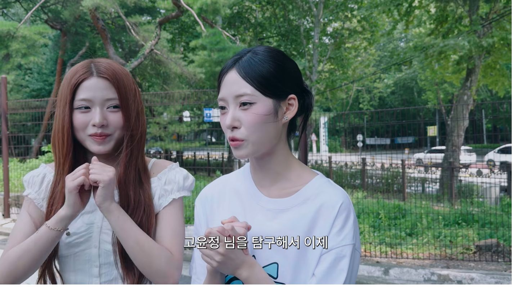
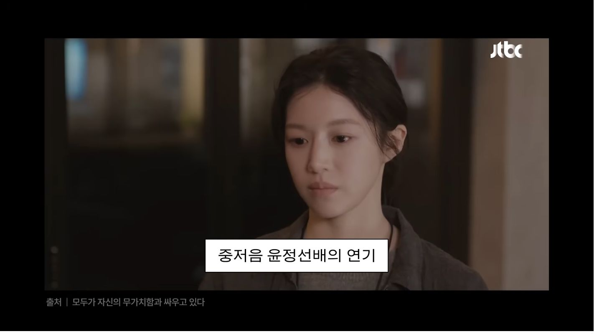
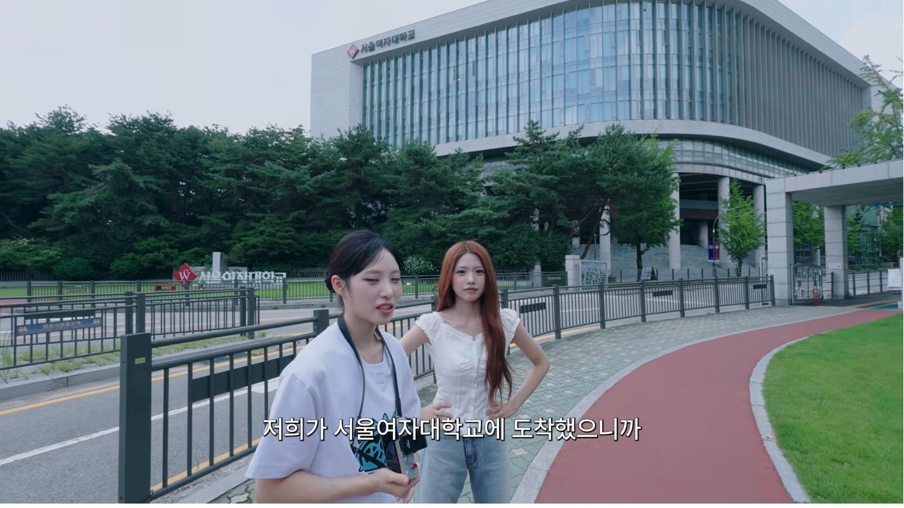
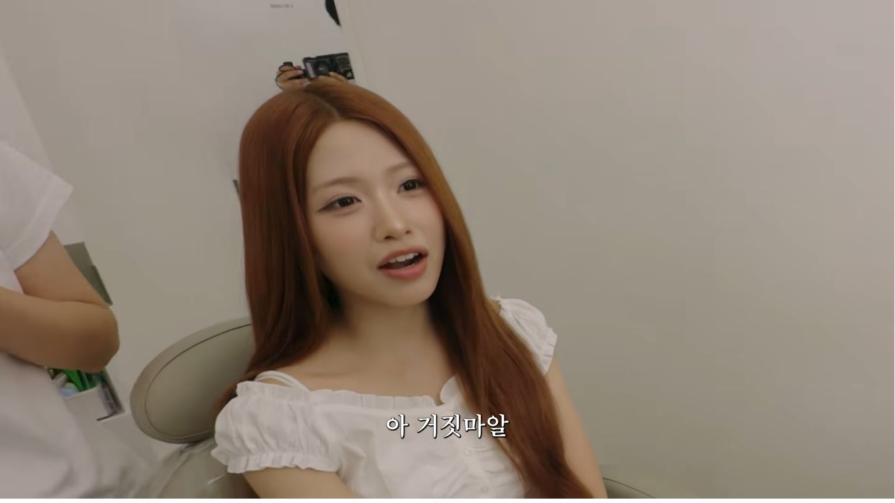
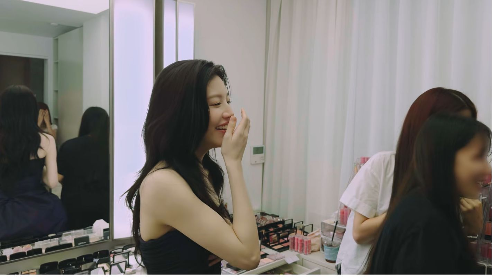
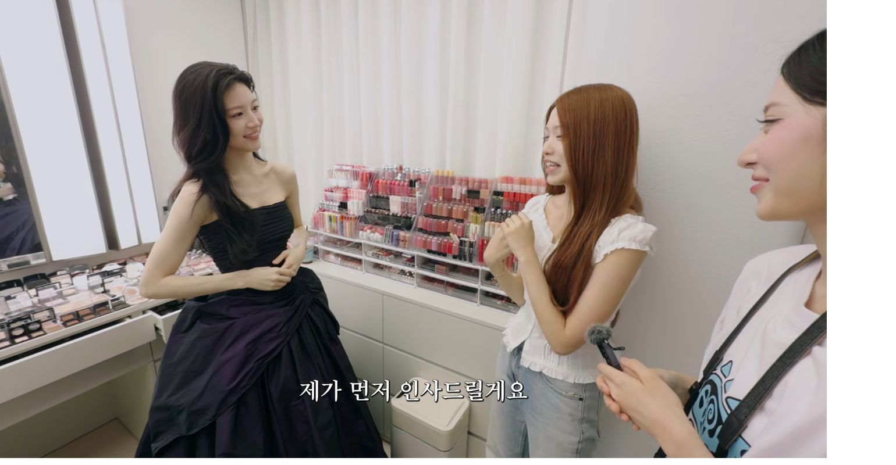
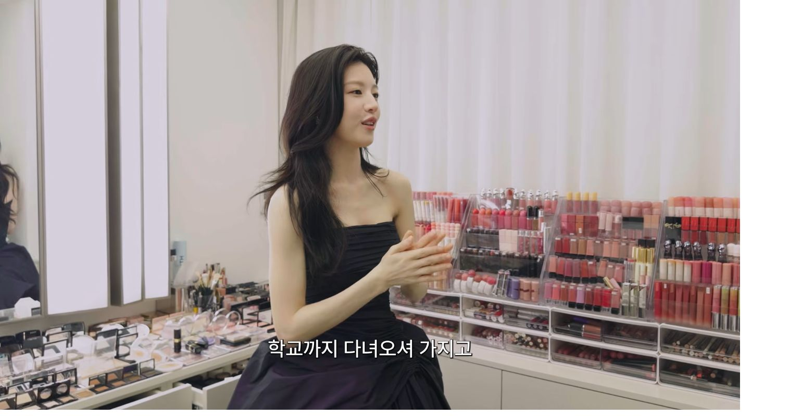

# 브링이슈 최종 발행 원고

## 발행 설정

- 카테고리: 오늘 뜬 유튜브
- 제목: 고윤정 팬이 서울여대까지 찾아간 이유, 결국 연락처까지 받았다
- 원본 영상: https://www.youtube.com/watch?v=6y_g78FQ3io
- 원본 채널: 안녕하세요원이입니다잘부탁드립니다
- 확인일: 2026-08-21
- 제휴 링크: 없음

## 네이버 게시용 본문

좋아하는 배우의 학교에 직접 가 보고,
예전 사진과 비슷한 자리에서 사진도 찍어 본다.

여기까지만 보면 흔한 팬 콘텐츠였습니다.

그런데 영상 12분쯤,
“지금 위에 계신데”라는 말이 나오면서
분위기가 완전히 바뀝니다.

팬의 성지순례로 시작한 하루는
실제 만남과 식사 제안,
그리고 연락처 교환으로 끝났습니다.

> 팬심으로 시작한 하루가 실제 다음 약속까지 이어졌습니다.

_고윤정을 좋아하는 이유를 이야기하는 장면 / 출처: 원본 영상 캡처_

### 👀 외모보다 먼저 꼽은 건 목소리였습니다

제나의 휴대전화 배경화면에는 고윤정 사진이 있었습니다.

또렷한 눈과 갸름한 얼굴형,
표정이 다양해서 좋다는 이야기도 했는데요.

가장 기억에 남는 답은 따로 있었습니다.
화려한 이미지와 달리 중음인 목소리가 좋다는 것이었습니다.

단순히 “예뻐서 좋아한다”가 아니라
화면에서 보이는 모습과 목소리의 반전까지 짚는 걸 보니
왜 팬인지 바로 이해됐습니다.

_고윤정의 목소리를 좋아한다고 설명하는 장면 / 출처: 원본 영상 캡처_

### 🎓 서울여대까지 간 이유

간단한 고윤정 퀴즈가 끝난 뒤,
두 사람은 고윤정이 미술을 전공했던 서울여대로 향합니다.

학교를 걷고,
예전 사진과 비슷한 장소를 찾아 포즈도 따라 합니다.

이 구간이 생각보다 중요했습니다.
영상이 처음부터 고윤정을 보여주지 않고
제나의 팬심을 차곡차곡 쌓아 주기 때문입니다.

_서울여대에서 고윤정의 흔적을 찾아가는 장면 / 출처: 원본 영상 캡처_

### 🔥 “지금 위에 계신데”라는 한마디

이후 찾아간 메이크업숍에서는
고윤정을 실제로 본 사람들의 이야기가 이어집니다.

그러다 갑자기,
고윤정이 지금 같은 건물에 있다는 말이 나옵니다.

제나는 처음에는 거짓말이라고 생각합니다.
문 앞에서도 쉽게 들어가지 못하고,
웃다가 생긴 팔자주름을 다시 정리해 달라고 합니다.

준비한 리액션보다
정말 당황한 사람의 반응에 가까워서
여기서부터 영상이 확 살아났습니다.

_예상하지 못한 소식에 당황한 제나 / 출처: 원본 영상 캡처_

---

### 💬 고윤정도 제나를 알고 있었습니다

문이 열리고 고윤정이 등장하자
제나는 바로 말을 잇지 못합니다.

그런데 고윤정은 제나의 영상을 본 적이 있다고 답합니다.

제나가 요즘 고윤정을 닮았다는 말을 듣는다는 이야기도 나오는데요.
고윤정은 오히려 제나가 더 어리고 예쁘다며
어색할 수 있는 첫 만남을 편하게 풀어 줍니다.

_고윤정과 제나가 실제로 처음 마주한 순간 / 출처: 원본 영상 캡처_

### ✅ 식사 제안, 그리고 연락처 교환

가장 강한 장면은 15분대에 나옵니다.

제나가 다음에 숍에서 만나면 먼저 인사하겠다고 하자,
고윤정이 다음에는 함께 밥을 먹자고 제안합니다.

그리고 말로만 끝내지 않고
그 자리에서 연락처까지 교환합니다.

_만남이 다음 약속으로 이어지는 순간 / 출처: 원본 영상 캡처_

_서로 연락처를 교환하는 장면 / 출처: 원본 영상 캡처_

> 성지순례의 결말이 ‘실물 영접’에서 끝나지 않았다는 점이 이 영상의 가장 큰 반전이었습니다.

### 📌 이 영상이 끝까지 보이게 만든 방식

처음부터 고윤정이 등장했다면
짧은 화제성으로 끝났을 수도 있습니다.

이 영상은 제나가 왜 팬인지 먼저 보여주고,
학교와 메이크업숍을 차례로 거치며
실제 만남을 천천히 준비합니다.

그래서 고윤정의 등장이
단순한 게스트 출연이 아니라
한 팬의 소원 성취처럼 느껴집니다.

고윤정이 제나를 이미 알고 있었다는 점,
다음 식사 약속과 연락처 교환까지 이어졌다는 점도
마지막까지 보게 만드는 힘이 됐고요.

개인적으로는 문 앞에서 한참 망설이던 제나의 모습이
가장 솔직하고 재미있었습니다.

여러분이라면 좋아하는 사람을 만나기 위해
어디까지 해볼 수 있나요?

원본 영상은 아래에서 확인할 수 있습니다.

▶ 유튜브 〈고윤정을 좋아하세요?〉 전체 영상
https://www.youtube.com/watch?v=6y_g78FQ3io

영상 및 장면 출처: 유튜브 채널 ‘안녕하세요원이입니다잘부탁드립니다’, 〈고윤정을 좋아하세요?〉
화면 캡처는 영상 내용을 소개하고 장면을 해설하기 위해 사용했습니다. 영상의 저작권은 원저작자에게 있습니다.

## 태그

#고윤정 #제나 #고윤정제나 #고윤정을좋아하세요 #서울여대 #유튜브화제영상 #스타이슈 #브링이슈

## 편집 지시

- 본문 전체 가운데 정렬
- 첫 인용문과 두 번째 인용문: 연한 노랑 또는 연한 분홍 배경 강조
- 소제목: 굵게, 19px 안팎
- 본문: 16px 안팎, 짧은 문단 사이 여백 유지
- 굵게: ‘지금 위에 계신데’, ‘고윤정도 제나를 알고 있었습니다’, ‘연락처까지 교환합니다’
- 밑줄: ‘팬심으로 시작한 하루가 실제 다음 약속까지 이어졌습니다.’, ‘성지순례의 결말이 실물 영접에서 끝나지 않았다는 점’
- 이미지 7장, 각 이미지 바로 아래 캡션 배치
- 대표 이미지 후보: 06-first-meeting.png 또는 08-contact-exchange-clean.png
