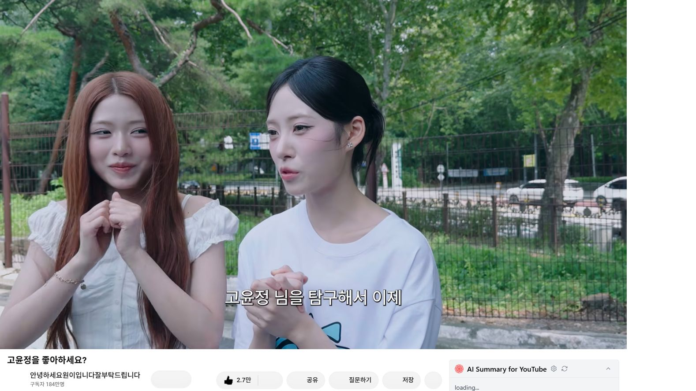
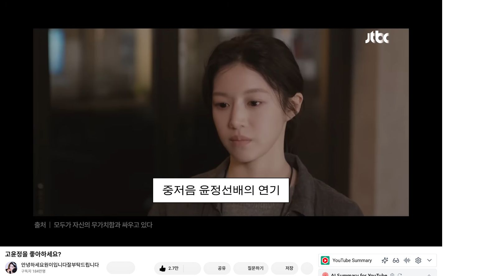
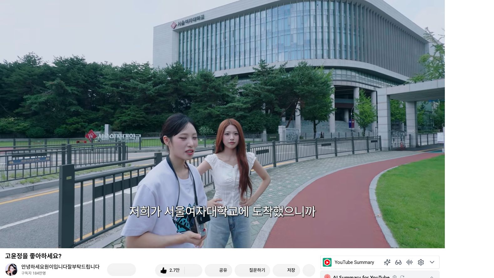
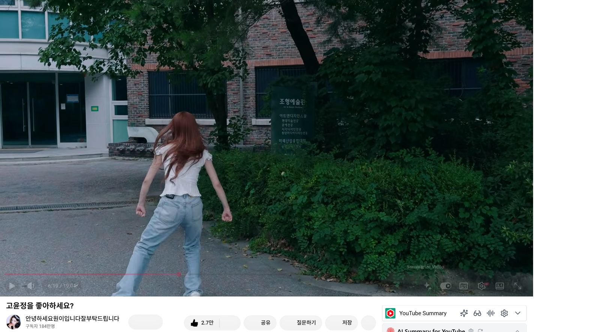
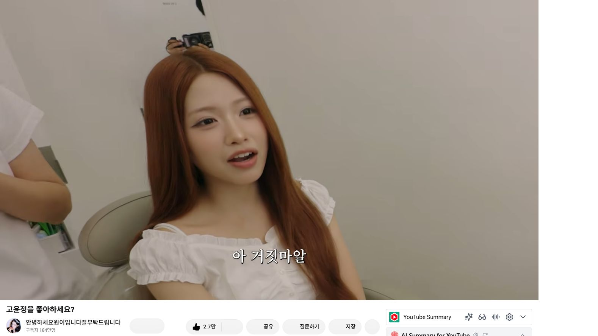
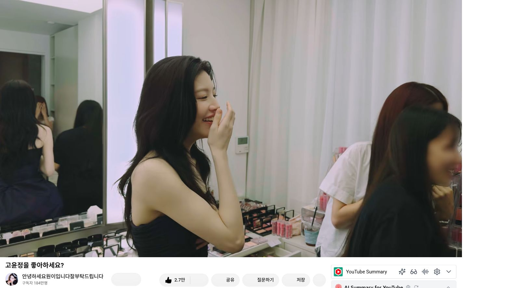
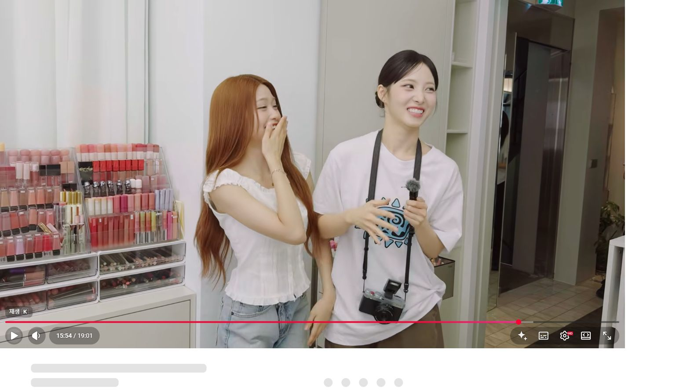
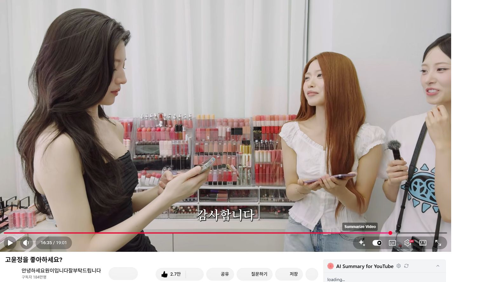
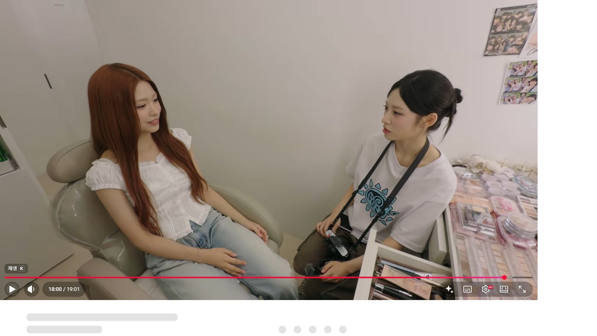

# 브링이슈 첫 글 발행안

## 발행 정보

- 추천 카테고리: 오늘 뜬 유튜브
- 콘텐츠 역할: 실시간 이슈 유입
- 원본 영상: [고윤정을 좋아하세요?](https://www.youtube.com/watch?v=6y_g78FQ3io)
- 원본 채널: 안녕하세요원이입니다잘부탁드립니다
- 영상 길이: 19분 1초
- 확인 시점: 2026-08-21, 공개 약 57분 후
- 확인 당시 반응: 조회수 약 37만 회, 좋아요 약 2.7만 개
- 본문 CTA: 원본 영상 보기 및 댓글 참여
- 제휴 링크: 사용하지 않음. 영상 속 제품명이 확인되지 않았으므로 추측 추천 금지

## 제목 후보

1. 고윤정·제나 드디어 만났다｜“다음에 밥 먹을까요?” 연락처 교환까지
2. 고윤정을 좋아하세요? 제나의 서울여대 성지순례가 진짜 만남으로 끝났다
3. 공개 1시간 만에 37만뷰, 고윤정과 제나의 만남이 터진 이유

## 추천 제목

고윤정·제나 드디어 만났다｜“다음에 밥 먹을까요?” 연락처 교환까지

## 게시용 본문

이 영상, 제목은 조용한데 결말은 꽤 셉니다.

제나가 좋아하는 배우 고윤정의 흔적을 찾아다니는 내용인 줄 알았거든요. 서울여대에 가서 사진을 따라 찍고, 고윤정을 실제로 본 사람들의 이야기를 듣는 정도로 끝날 줄 알았습니다.

그런데 영상 중반부터 분위기가 달라집니다. 같은 메이크업숍 건물에 고윤정이 있다는 이야기가 나오고, 장난처럼 이어지던 ‘팬의 탐구생활’이 실제 만남으로 바뀝니다.

*제나가 고윤정을 좋아하는 이유를 이야기하는 장면. 출처: 유튜브 ‘고윤정을 좋아하세요?’ 영상 캡처*

### 얼굴보다 먼저 말한 매력은 ‘목소리’였다

제나는 휴대전화 배경화면을 고윤정 사진으로 바꿔가며 쓸 정도로 팬이라고 합니다. 어떤 점이 좋으냐는 질문에는 또렷한 눈, 갸름한 얼굴형, 다양한 표정을 차례로 말합니다.

그런데 가장 좋아하는 포인트는 따로 있었습니다. 화려한 외모와 달리 목소리가 중음이라는 점이 좋다고 하더라고요.

그 대답이 의외로 구체적이라 재미있었습니다. 화면에서 느껴지는 이미지와 목소리 사이의 차이까지 좋아하고 있더라고요.

*고윤정의 목소리를 좋아한다고 설명하는 장면. 출처: 원본 영상 캡처*

### 서울여대에서 시작된 ‘고윤정 탐구’

간단한 퀴즈도 이어집니다. 출생연도, 가족관계, 좋아하는 색, 대학 전공을 묻는데 제나는 꽤 많은 답을 맞힙니다.

이후 두 사람은 고윤정이 미술을 전공했던 서울여대로 향합니다. 학교를 걷고, 조형예술관을 찾아가고, 과거 사진의 포즈까지 따라 찍습니다.

팬이라면 한 번쯤 해보고 싶을 법한 성지순례를 대신 보여주는 구간입니다. 이 대목에서 영상은 일부러 결말을 서두르지 않습니다. 학교와 메이크업숍을 차례로 거치며 기대를 계속 쌓습니다.

*서울여대에 도착해 사진을 남기는 장면. 출처: 원본 영상 캡처*

*고윤정이 공부했던 공간을 찾아가는 장면. 출처: 원본 영상 캡처*

### “지금 위에 계신데”라는 한마디

메이크업숍에서는 고윤정을 실제로 본 사람들에게 목격담을 듣습니다. 제나와 닮았는지를 묻고, 같은 건물과 엘리베이터를 이용했다는 이야기에도 신기해합니다.

그러다 “지금 위에 계신데”라는 말이 나옵니다.

제나는 처음엔 거짓말이라고 생각합니다. 웃다가 생긴 팔자주름을 다시 정리해 달라고 하고, 문 앞에서는 쉽게 들어가지도 못합니다. 준비된 리액션이라기보다 정말 당황한 사람의 반응에 가까워서 여기서부터 영상이 확 살아납니다.

*예상하지 못한 소식에 당황한 제나. 출처: 원본 영상 캡처*

### 고윤정과 제나, 결국 만났다

문이 열리고 고윤정이 등장합니다. 제나는 바로 말을 잇지 못하고, 고윤정은 제나의 영상을 본 적이 있다고 답합니다.

제나가 요즘 고윤정을 닮았다는 말을 듣는다는 질문도 나옵니다. 고윤정은 오히려 제나가 더 어리고 예쁘다며 분위기를 편하게 풀어줍니다.

서울여대에 다녀왔다는 이야기를 듣고는 자신의 학교라며 반가워하고, 두 사람은 ‘신라 공주’와 ‘한양 공주’라는 설정으로 사진도 남깁니다.

*고윤정을 실제로 만난 직후의 장면. 출처: 원본 영상 캡처*

### “다음에 밥 먹을까요?”에서 연락처 교환까지

가장 반응이 컸던 구간은 15분대입니다.

제나가 다음에 숍에서 먼저 인사하겠다고 하자 고윤정이 “다음에 밥 먹을까요?”라고 제안합니다. 이어 연락처까지 교환합니다. 영상을 보는 사람도 팬의 목표가 한 번에 몇 단계나 넘어간 듯한 기분을 느끼게 됩니다.

*만남이 다음 약속으로 이어지는 순간. 출처: 원본 영상 캡처*

*서로 연락처를 교환하는 장면. 출처: 원본 영상 캡처*

그리고 영상은 끝까지 무겁게 가지 않습니다. 제나가 다음에는 언니의 뿌리를 찾아주겠다고 하자 리브가 짧은 한마디로 받아칩니다. 댓글에서 마지막 장면을 다시 언급하는 사람이 많았던 이유도 이 타이밍 때문입니다.

*만남 뒤 소감을 이야기하는 장면. 출처: 원본 영상 캡처*

### 이 영상이 공개 직후 빠르게 퍼진 이유

처음부터 고윤정이 등장했다면 짧은 화제성으로 끝났을 수도 있습니다. 이 영상은 제나가 왜 팬인지 보여주고, 학교와 메이크업숍을 거치며 만남을 천천히 준비합니다.

그래서 실제 고윤정이 등장하는 순간이 단순한 게스트 출연이 아니라 ‘팬의 소원 성취’처럼 느껴집니다. 고윤정이 제나를 이미 알고 있었다는 점, 다음 식사 약속과 연락처 교환까지 이어졌다는 점도 만족감을 키웠고요.

공개 약 57분 뒤 확인했을 때 조회수는 약 37만 회였습니다. 업로드 직후 수치는 계속 변하지만, 초반 반응만으로도 사람들이 어느 장면에 끌렸는지는 분명해 보였습니다.

제일 재미있었던 장면은 어디였나요? 저는 문 앞에서 한참 망설이던 제나와, 마지막 한마디까지 이어지는 흐름이 가장 기억에 남았습니다.

원본 영상은 아래에서 볼 수 있습니다.

[유튜브에서 ‘고윤정을 좋아하세요?’ 전체 영상 보기](https://www.youtube.com/watch?v=6y_g78FQ3io)

---

영상 및 장면 출처: 유튜브 채널 ‘안녕하세요원이입니다잘부탁드립니다’, 〈고윤정을 좋아하세요?〉  
화면 캡처는 영상 내용을 소개하고 장면을 해설하기 위해 사용했습니다. 영상의 저작권은 원저작자에게 있습니다.

## 태그

#고윤정 #제나 #리브 #고윤정제나 #고윤정을좋아하세요 #안녕하세요원이입니다잘부탁드립니다 #유튜브화제영상 #브링이슈

## 수익 전환 후속 글

이번 글에는 상품 링크를 넣지 않는다. 다음 글에서 아래 순서로 구매 의도를 만든다.

1. 영상 또는 공식 메이크업 자료에서 제품명을 확인한다.
2. `고윤정 메이크업 포인트와 비슷한 분위기의 립·쿠션 고르는 법`으로 검색형 글을 작성한다.
3. 동일 제품이라고 확인된 항목과 분위기 대체품을 명확히 구분한다.
4. 승인된 제휴 링크 앞에 광고·제휴 고지를 표시한다.
5. 이 글과 구매형 후속 글을 서로 연결한다.

## 썸네일 문구

- 고윤정·제나 드디어 만났다
- “다음에 밥 먹을까요?”
- 성지순례 끝에 진짜 등장
