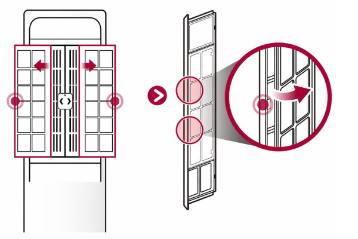
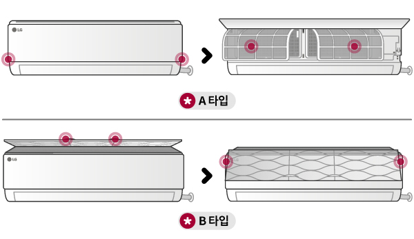
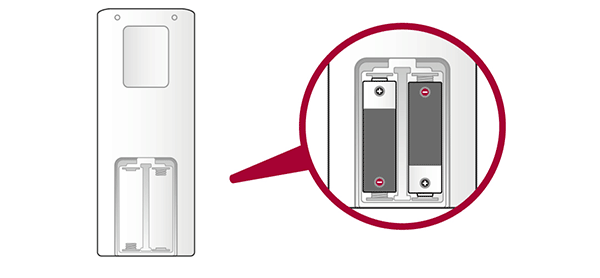
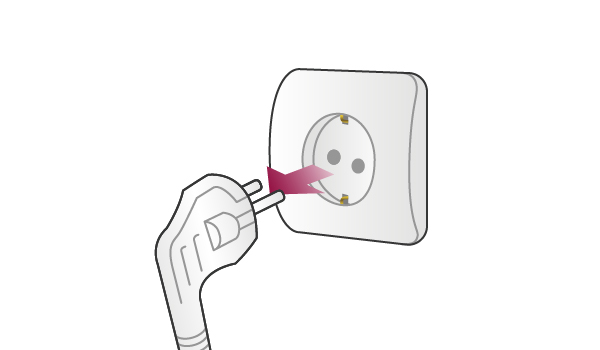

# 에어컨 올해 마지막으로 끄기 전, 이 4가지는 해두세요

더위가 한풀 꺺이면 에어컨 리모컨부터 서랍에 넣고 싶어집니다. 🌬️

하지만 전원만 끄고 바로 커버를 씌우면, 실내기 안에 습기가 남은 채 오랫동안 밀폐될 수 있죠.

내년 첫 냉방에서 냄새나 필터 먼지를 마주하지 않으려면, 올해 마지막 사용일에 마무리를 해두는 편이 좋습니다.

<mark>순서는 단순합니다. 내부 건조 → 필터 확인 → 리모컨 건전지 → 전원 차단입니다.</mark>

## 🌬️ 1. 가장 먼저 송풍으로 내부를 말리세요

LG전자는 에어컨을 오랫동안 사용하지 않기 전, 창문을 열고 **단독 공기청정 또는 송풍 운전을 1시간 이상** 하도록 안내합니다.

냉방 후 실내기 안에 남은 습기를 줄이는 단계입니다.

자동건조·AI건조 기능이 있는 제품이라면 기능이 정상적으로 끝나는지까지 확인하세요.

> 커버를 씌우기 전에 먼저 안쪽부터 말리는 것이 핵심입니다.

## 🧹 2. 필터는 ‘모두 물로 씻는 것’이 아닙니다

_LG전자가 안내한 스탠드형 필터 분리 예시입니다. 모델별 구조는 다를 수 있습니다._

먼지를 걸러내는 망사 형태의 **극세 필터**는 청소기나 부드러운 솔로 먼지를 제거할 수 있습니다.

오염이 심하면 중성세제를 풀어 씻고, 직사광선을 피해 바람이 잘 통하는 그늘에서 물기 없이 완전히 말립니다.

<mark>초미세먼지·탈취·집진 필터 등 일부 기능성 필터는 물세척하면 안 됩니다.</mark>

필터에 종이나 숯이 들어간 형태라면 먼저 모델명과 사용설명서를 확인하세요.

## 🔎 벽걸이형도 커버를 여는 방향이 다릅니다

_벽걸이형도 구조에 따라 필터를 꺼내는 방향이 다릅니다. 자료: LG전자_

앞면을 위로 여는 제품이 있고, 상단 흡입부를 올리는 제품도 있습니다.

잘 열리지 않는다고 세게 당기지 말고, 제품 라벨의 모델명을 검색해 공식 설명서를 먼저 확인하는 편이 안전합니다.

필터 안쪽 열교환기까지 분해하거나 약품을 직접 분사하는 작업은 제조사 안내나 전문 세척 범위를 확인하세요.

## 🔋 3. 리모컨 건전지를 빼서 보관하세요

_장기 미사용 전에는 리모컨 건전지를 분리합니다. 자료: LG전자_

에어컨 본체는 잘 정리하면서도 리모컨은 서랍에 그대로 넣는 경우가 많습니다.

건전지를 오래 넣어두면 누액이 발생해 리모컨 고장으로 이어질 수 있으므로, 장기 미사용 전에는 분리해 따로 보관합니다.

리모컨은 내년에 찾기 쉽도록 에어컨 옆의 정해둔 보관함에 넣어두세요.

## 🔌 4. 마지막에 전원을 차단하세요

_내부 건조와 필터 조립을 모두 끝낸 뒤 장기 미사용 전원을 차단합니다. 자료: LG전자_

전원 차단은 맨 나중입니다.

먼저 송풍 건조를 끝내고, 필터를 완전히 말려 다시 조립한 뒤 플러그를 빼거나 전용 차단기를 내립니다.

다만 실내기가 직결배선으로 설치됐거나 전원 차단 방법이 불분명하다면 임의로 분해하지 말고 설명서를 확인하세요.

## ⚠️ 커버는 완전히 마른 뒤에만

먼지를 막기 위해 커버를 사용할 수는 있지만, 내부에 습기가 남은 상태에서 통풍이 되지 않는 커버를 씌우는 것은 피해야 합니다.

<mark>‘커버 씌우기’가 마무리가 아니라, ‘완전 건조 확인’이 마무리입니다.</mark>

## ✅ 10분 점검표로 저장하세요

☐ 창문을 열고 송풍·공기청정 운전으로 내부 건조

☐ 모델명을 확인하고 물세척 가능 필터만 청소

☐ 필터를 직사광선을 피해 그늘에서 완전 건조

☐ 리모컨 건전지 분리

☐ 마지막에 전원 차단

에어컨 종료 관리는 내년 여름을 위한 첫 준비입니다. 📌

오늘 전원만 끄지 마시고, 내부 건조 시간부터 잡아두세요.

※ LG전자의 2026년 6월 18일 갱신 공식 안내를 2026년 8월 23일에 확인했습니다. 제조사와 모델에 따라 필터 구성·분리·전원 차단 방법이 다를 수 있으므로 자체 사용설명서를 우선하세요.

## 공식 참고자료

확인 기준일: 2026-08-23

- [LG전자 여름이 끝난 후 에어컨 장기 보관 가이드](https://www.lge.co.kr/support/solutions-20153047296738)
- [LG전자 필터 청소·교체 알림 안내](https://www.lge.co.kr/support/solutions-20152403079263)

## 태그

#에어컨관리 #에어컨사용종료 #에어컨송풍 #에어컨필터청소 #에어컨장기보관 #에어컨건조 #에어컨커버 #에어컨리모컨 #가을준비 #브링이슈
