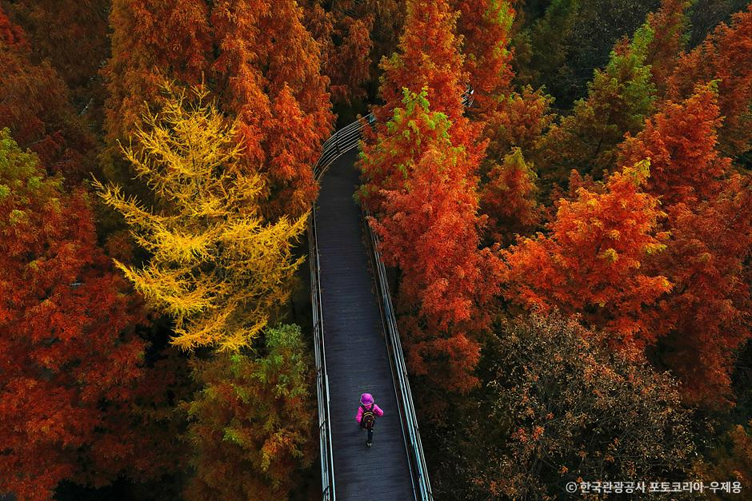

# 2026 단풍 숙소, 지금 잡아도 될까? 절정 날짜보다 먼저 볼 5가지

8월 말이 되면 가을 숙소부터 찾는 분들이 늘어납니다. 🍁

인기 숙소가 마감될까 봐 일단 결제하고 보지만, 정작 예약한 날에 단풍이 덜 들거나 이미 떨어져 있을 수도 있죠.

그렇다면 올해 단풍 절정일부터 맞히면 될까요?

<mark>지금은 절정일 하나를 맞히기보다, 날짜를 바꿀 수 있는 예약을 만드는 것이 먼저입니다.</mark>

## 📅 1. 아직 ‘정확한 절정일’은 확정된 것이 아닙니다

산림청은 매년 지역별 관측자료와 산악기상정보를 바탕으로 산림단풍 예측지도를 발표합니다.

2025년 예측지도도 **10월 1일**에 발표됐습니다.

당시 전망은 전국적으로 10월 하순부터 11월 초 사이였지만, 지역과 수종에 따라 차이가 있었습니다.

따라서 8월 23일 현재 “올해 내장산은 몇 월 며칠이 절정”처럼 한 날을 딱 집어 말하는 정보는 조심해야 합니다.

> 작년 날짜는 참고일 뿐, 올해 절정일을 보장하지 않습니다.

## 🔄 2. 숙소는 ‘최저가’보다 ‘변경 가능성’을 보세요

_숙소 사진보다 먼저 취소·환불 조건을 확인해야 합니다. 자료: 한국소비자원_

같은 방이라도 ‘환불 불가’와 ‘무료 취소 가능’의 가격은 다를 수 있습니다.

단풍 여행은 날씨와 색 변화의 변수가 크므로, 차이가 크지 않다면 일정을 조정할 수 있는 조건이 실용적입니다.

결제 전에는 다음을 같이 보세요.

✅ 무료 취소가 가능한 마지막 날짜와 시간

✅ 일정 변경이 취소 후 재예약 방식인지

✅ 플랫폼 규정과 숙박업체 규정 중 무엇이 적용되는지

✅ 취소 후 환불 완료까지 걸리는 예상 기간

<mark>‘무료 취소’라는 말만 보지 말고, 나의 숙박일을 기준으로 마지막 취소 시간을 달력에 적어두세요.</mark>

## 🚗 3. ‘명소 가까운 숙소’가 항상 가까운 것은 아닙니다

지도상 거리가 짧어도 가을 성수기에는 차량 통제와 주차 대기 때문에 실제 이동시간이 길어질 수 있습니다.

국립공원공단은 내장산의 **10~11월 가을 성수기**에 경내 차량 통제로 진입이 어려울 수 있다고 안내합니다.

숙소를 고를 때는 직선거리보다 실제 이동 방식을 먼저 정하는 편이 좋습니다.

- 새벽에 자가용으로 이동할지
- 숙소에 차를 두고 셔틀·버스를 이용할지
- 입구 근처보다 역·터미널 근처를 선택할지
- 산행 후 식사와 귀가까지 도보로 해결할지

## 🎫 4. 숙소만 예약하고 탐방 예약을 놓치지 마세요

인기 단풍 명소 중에는 특정 탐방로나 프로그램을 예약제로 운영하는 곳이 있습니다.

숙소 결제를 마쳤더라도 원하는 탐방로를 이용할 수 없다면 일정 전체가 틀어질 수 있죠.

예약 전에 국립공원공단·해당 시설의 공식 페이지에서 다음을 확인하세요.

✅ 탐방로 예약제 여부

✅ 주차장·셔틀버스 운영 방식

✅ 입장·케이블카·프로그램 예매 오픈일

✅ 기상악화 시 취소·변경 규정

## 📄 5. 결제 완료 화면을 저장하세요

한국소비자원은 온라인으로 숙박을 예약할 때 숙박일·소재지·요금과 취소·환급 규정을 꼼꼼히 확인하도록 안내합니다.

취소했다면 버튼만 누르고 끝내지 말고, 정상적으로 완료됐는지까지 확인해야 합니다.

보관할 자료는 복잡하지 않습니다.

- 예약번호와 숙박일이 보이는 화면
- 결제금액과 결제수단
- 예약 당시의 취소·환불 규정
- 취소 완료 이메일이나 문자

<mark>환불 규정은 나중에 다시 찾지 말고, 결제할 때 바로 캡처해 두는 것이 가장 간단합니다.</mark>

## ✨ 지금 예약한다면 이 순서로 보세요

**여행 권역 선택 → 변경 가능한 숙소 확보 → 탐방 예약 확인 → 공식 단풍 예측 발표 후 날짜 최종 조정**

이렇게 준비하면 오늘 숙소를 잡더라도, 올해 단풍 예측이 나온 뒤 선택을 조정할 수 있습니다.

숙소 가격만 저장하지 마시고, **무료 취소 마감일**도 함께 달력에 적어두세요. 📌

※ 2026년 8월 23일 확인 기준입니다. 올해 단풍 예측지도가 공개되면 지역별 날짜를 추가해 업데이트합니다.

## 공식 참고자료

확인 기준일: 2026-08-23

- [산림청 단풍 보도자료 검색](https://www.forest.go.kr/kfsweb/cop/bbs/selectBoardList.do?Popup=&bbsId=BBSMSTR_1036&ctgryLrcls=&mn=NKFS_04_02_01&ntcEndDt=&ntcStartDt=&orgId=&pageUnit=10&searchWrd=%EB%8B%A8%ED%92%8D&searchtitle=title)
- [국립공원공단 내장산 이용안내](https://res.knps.or.kr/contents/G/serviceGuide.do?parkId=B042)
- [한국소비자원 숙박 예약 취소·환급 안내](https://www.kca.go.kr/webzine/board/view?div=kca_2108&linkId=334&menuId=MENU00307)

## 태그

#단풍숙소 #단풍숙소예약 #2026단풍 #가을여행 #단풍여행 #숙박취소 #숙박환불 #내장산단풍 #가을숙소 #브링이슈
