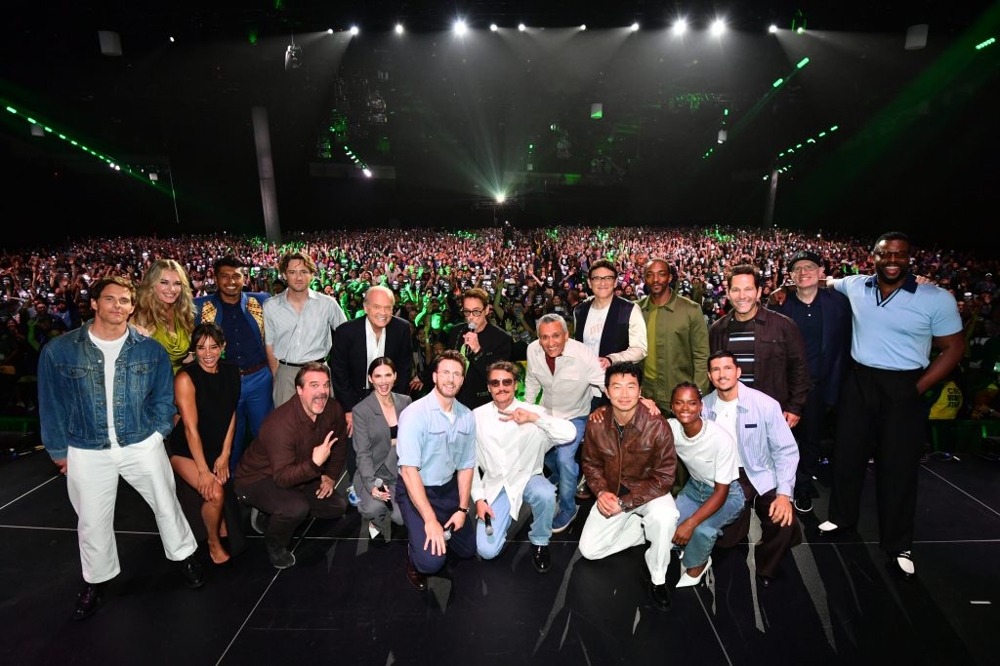
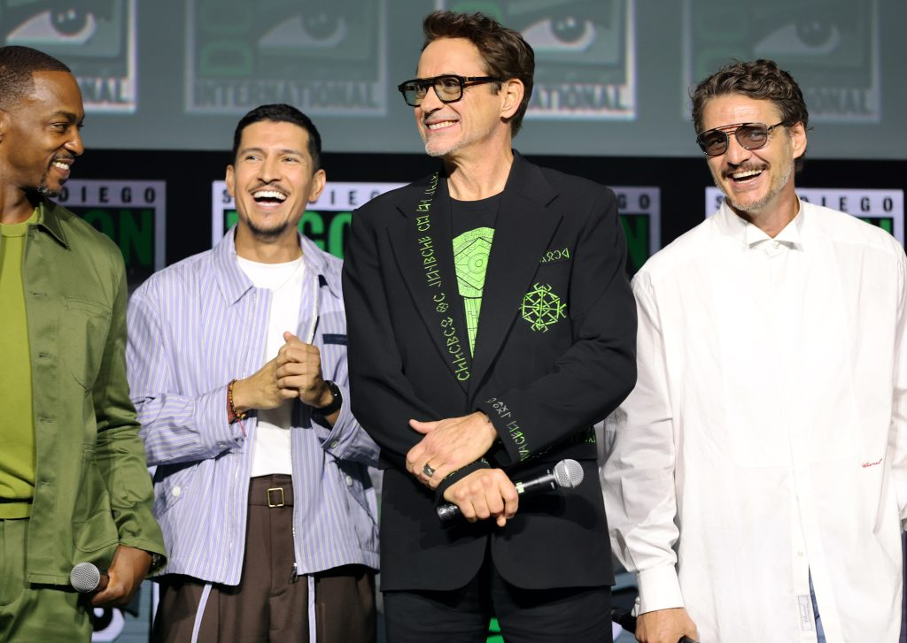
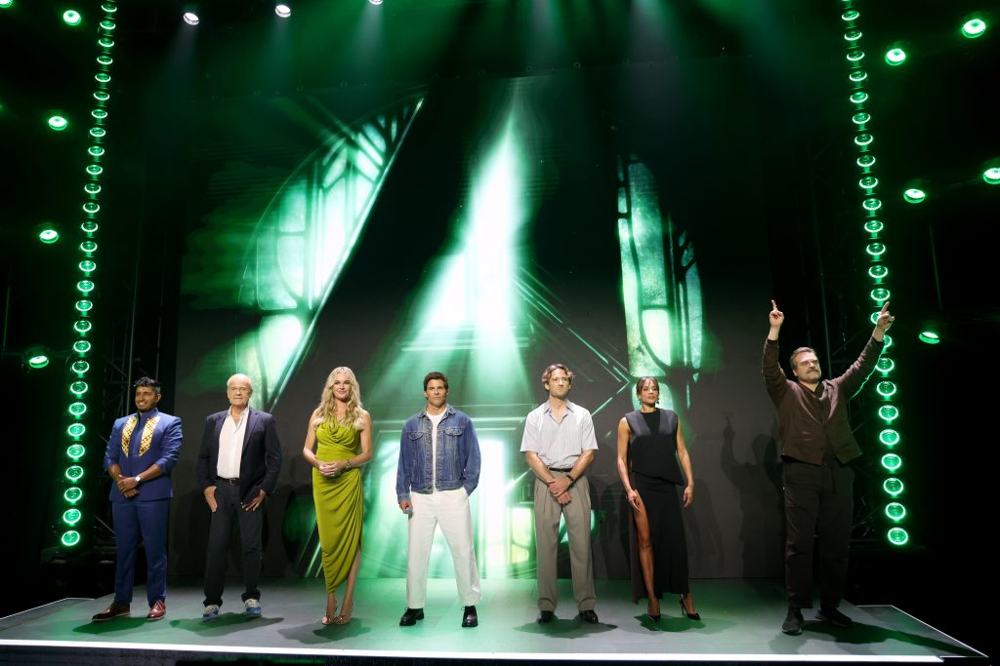

# 어벤져스 둠스데이, 5월이 아니다…현재 확정된 개봉일과 출연진

_2026 산디에고 코믹콘 마블 스튜디오 발표 현장입니다. 사진: The Walt Disney Company_

‘어벤져스: 엔드게임’ 이후의 가장 큰 이벤트가 점점 선명해지고 있습니다. 💚

하지만 검색해 보면 아직도 **2026년 5월 1일**과 **2026년 12월 18일**이 함께 나옵니다.

출연진도 루머와 공식 발표가 섞여 있죠.

<mark>2026년 8월 23일 현재 마블·디즈니 공식 기준 개봉일은 2026년 12월 18일입니다.</mark>

## 📅 왜 아직도 5월 1일로 알려져 있을까요?

2025년 3월 출연진 발표 당시 디즈니는 2026년 5월 1일 개봉을 안내했습니다.

이후 일정이 변경됐고, 현재 마블 영화 공식 페이지와 2026년 7월 25일 디즈니 코믹콘 발표는 모두 **12월 18일**을 명시합니다.

즉, 5월 1일은 이전 발표일이고 12월 18일이 현재 공식 일정입니다.

> 영화 개봉일은 바뀐 수 있으므로, 예전 기사보다 현재 공식 영화 페이지를 우선해야 합니다.

## 🎭 로버트 다우니 주니어는 아이언맨이 아닙니다

_닥터 둠으로 돌아오는 로버트 다우니 주니어. 사진: The Walt Disney Company_

로버트 다우니 주니어가 MCU로 돌아오는 것은 맞지만, 이번 역할은 토니 스타크가 아닙니다.

디즈니는 그가 **빅터 반 둠, 닥터 둠**으로 돌아온다고 공식 발표했습니다.

다만 영화 속 닥터 둠이 토니 스타크와 얼마나 닮은 존재인지, 왜 동일한 얼굴을 가졌는지는 아직 공식적으로 설명되지 않았습니다.

<mark>‘토니 스타크가 흑화했다’는 설명은 현재까지 공식 사실이 아닙니다.</mark>

## 🛡️ 크리스 에번스와 페기 카터도 돌아옵니다

2026년 7월 코믹콘 무대에는 **크리스 에번스**가 올랐습니다.

또한 **헤일리 앧웰**도 어벤져스: 둠스데이에서 페기 카터로 돌아온다고 확인했습니다.

여기에 스티브 로저스의 귀환을 알린 공식 티저까지 공개되면서, 이전 어벤져스 세대가 이야기에 어떻게 연결될지가 큰 관전 포인트가 됐습니다.

## 🌌 이야기의 핵심은 ‘세 개의 우주’입니다

_어벤져스·판타스틱 4·엑스맨 계열 배우들이 한자리에 모인 공식 현장입니다. 사진: The Walt Disney Company_

디즈니가 공개한 영화 설명은 생각보다 구체적입니다.

“서로 다른 세 개의 우주”에서 온 영웅들이 치명적인 충돌 경로에 올라 존재론적 위협에 맞선다는 내용입니다.

공식 출연진에는 어벤져스·뉴 어벤져스·판타스틱 4·엑스맨 계열의 배우들이 함께 포함돼 있습니다.

<mark>이 영화는 단순히 ‘어벤져스가 닥터 둠과 싸우는 이야기’보다, 세 우주가 한꺼번에 충돌하는 이벤트에 가깝습니다.</mark>

## 🎬 현재 확인된 주요 출연진

전체 배역은 매우 크지만, 팀별로 나누면 더 쉽게 보입니다.

### 이전 어벤져스·MCU

크리스 헴스워스, 앤서니 매키, 세바스찬 스탠, 톰 히들스턴, 폴 러드, 레티셔 라이트, 시무 리우, 플로렌스 퓨, 크리스 에번스, 헤일리 앧웰 등

### 판타스틱 4

페드로 파스칼, 바네사 커비, 이번 모스바락, 조셉 퀸

### 엑스맨 계열

패트릭 스튜어트, 이안 맥켈런, 켈시 그래머, 제임스 마스던, 레베카 로민, 앨런 커밍, 채닝 테이텀 등

### 닥터 둠

로버트 다우니 주니어

모든 배우의 분량과 소속 우주, 대립 구도는 아직 공개되지 않았습니다.

## ❌ 아직 확인되지 않은 것

- 닥터 둠이 토니 스타크의 멀티버스 변종인지
- 스파이더맨이 어떤 비중으로 등장하는지
- 세 개의 우주가 정확히 어느 타임라인인지
- 누가 되돌아오거나 퇴장하는지
- 국내 극장의 정확한 예매 오픈일과 상영 포맷

이 부분은 공식 예고편과 국내 배급 공지가 나온 뒤 다시 확인해야 합니다.

## ✅ 지금 기억할 네 가지

**12월 18일 개봉 → 루소 형제 감독 → RDJ는 닥터 둠 → 세 개의 우주 충돌**

여기까지가 2026년 8월 23일 현재 공식적으로 정리할 수 있는 핵심입니다.

루머보다 공식 예고편이 나올 때마다 확정 정보를 갱신하겠습니다. 📌

※ 이 글은 스포일러와 유출 영상을 사용하지 않고 마블·디즈니 공식 발표만 정리했습니다.

## 공식 참고자료

확인 기준일: 2026-08-23

- [마블 공식 어벤져스: 둠스데이 영화 페이지](https://www.marvel.com/movies/avengers-kang-dynasty)
- [The Walt Disney Company 2026 산디에고 코믹콘 발표](https://thewaltdisneycompany.com/news/marvel-studios-comic-con-2026/)
- [The Walt Disney Company 2025 출연진 발표](https://thewaltdisneycompany.com/news/marvel-studios-avengers-doomsday-cast/)

## 태그

#어벤져스둠스데이 #AvengersDoomsday #닥터둠 #로버트다우니주니어 #크리스에번스 #페기카터 #마블 #MCU #마블영화 #브링이슈
