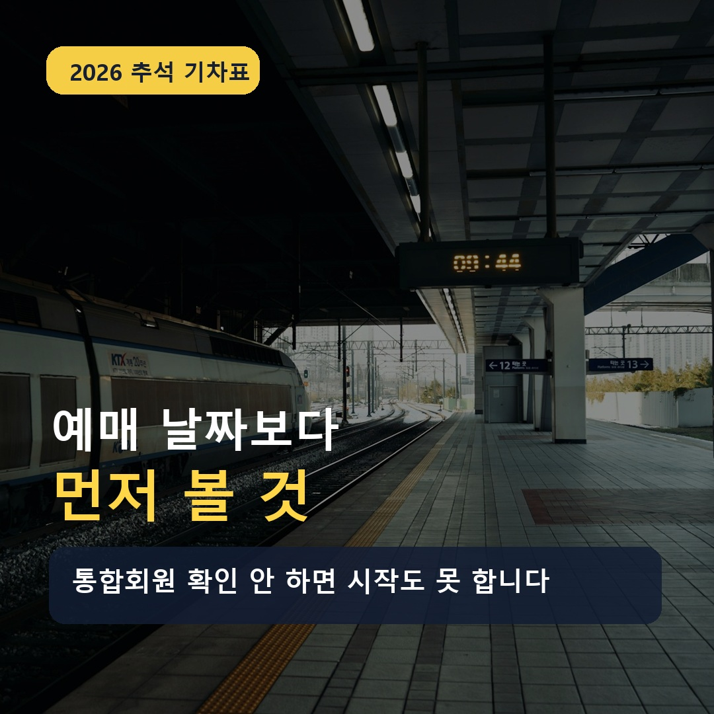
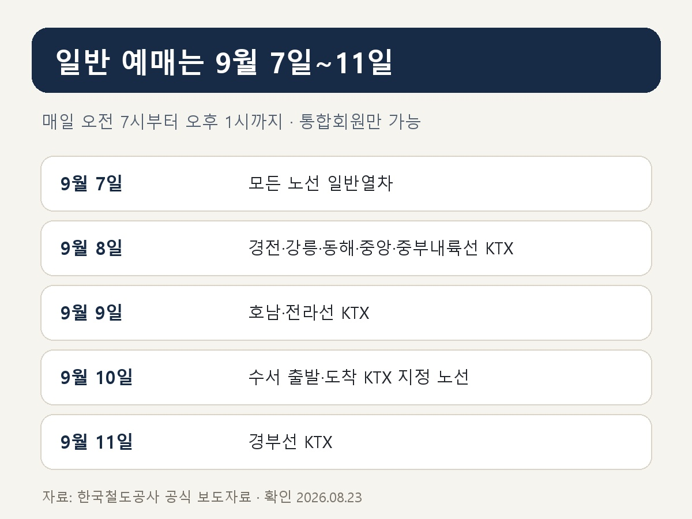
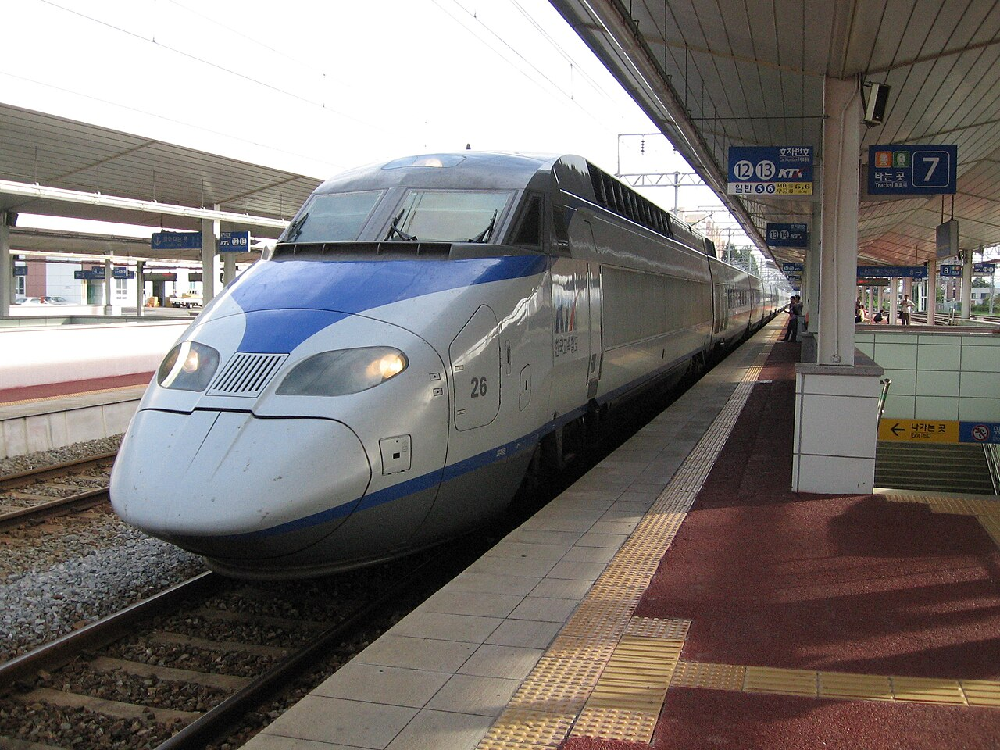
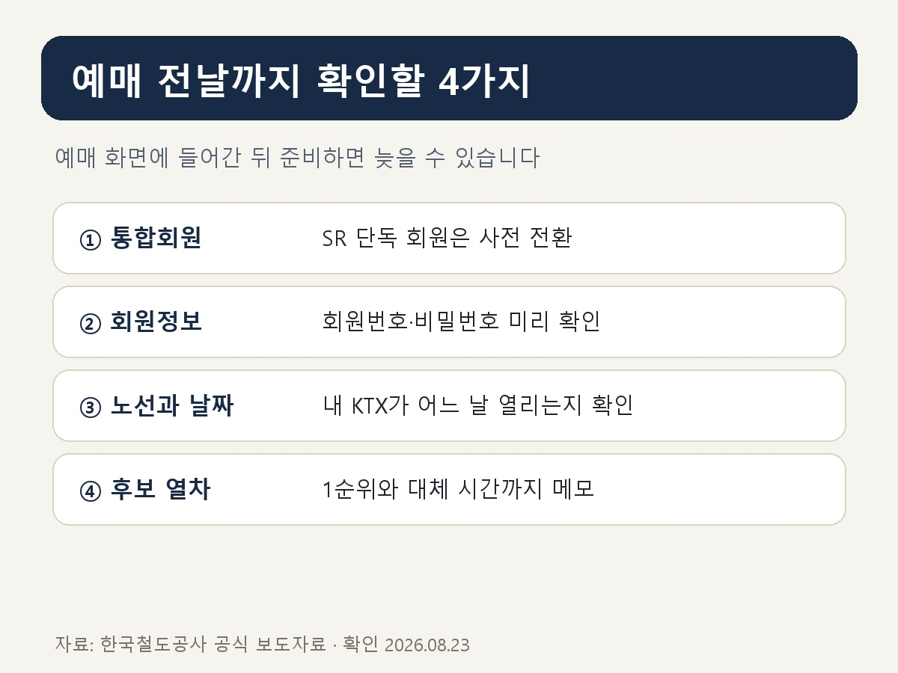
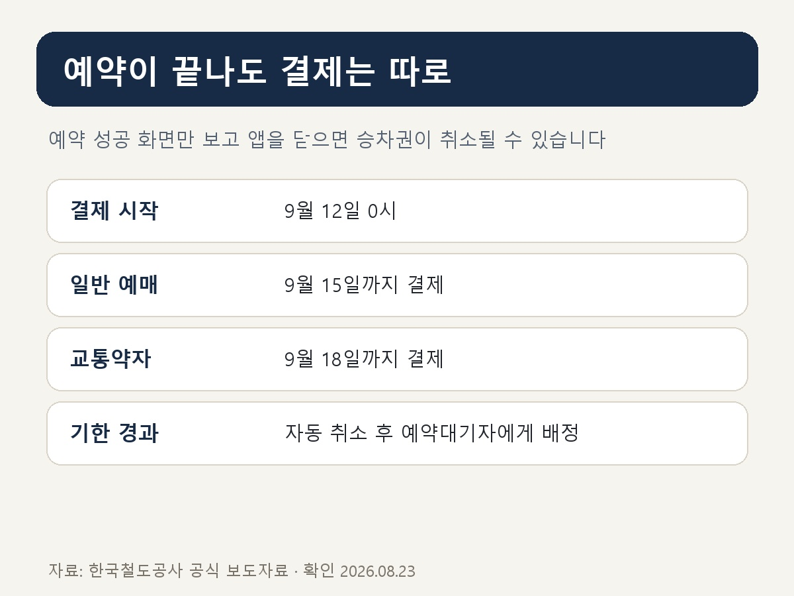

# 2026 추석 기차표 예매, 날짜보다 먼저 확인할 것이 있습니다

추석 기차표는 예매 날짜만 기억하면 된다고 생각하기 쉽습니다.

그런데 **2026년은 예매 화면에 들어가기 전부터 확인할 것이 하나 더 생겼습니다.**

바로 코레일과 SR의 **통합회원 여부**입니다. 🚄

<mark>기존 코레일 회원은 자동 전환되지만, SR에만 가입했던 분은 통합회원 전환을 먼저 마쳐야 합니다.</mark>

예매 당일에 회원가입부터 시작하면 정작 열차를 고를 시간이 부족해질 수 있습니다.

_Google AI Studio/Flow 계열 제미나이로 제작한 이해용 이미지입니다. 실제 예매 화면이나 특정 인물이 아닙니다._

실제 예매는 몇 분 안에 끝나지만, 가족이 함께 움직인다면 후보 시간과 회원 상태를 맞춰보는 준비가 먼저입니다.

_추석 열차표는 예매 당일보다 전날 준비가 더 중요합니다. 사진: Charlie Chen/Unsplash_

## 📌 먼저 날짜부터 정리해볼게요

2026년 추석 승차권 예매 대상은 **9월 23일부터 27일까지 운행하는 열차**입니다.

교통약자 사전예매는 9월 3일과 4일, 모든 국민 대상 일반예매는 **9월 7일부터 11일까지** 진행됩니다.

일반예매 시간은 매일 **오전 7시부터 오후 1시까지**입니다.

_2026 추석 일반예매 노선별 일정. 한국철도공사 공식 발표를 바탕으로 재구성했습니다._

## 🚆 내 기차는 어느 날 열릴까?

올해 일반예매는 한꺼번에 열리지 않습니다.

**9월 7일**에는 ITX-새마을·마음, 무궁화호 등 모든 노선의 일반열차가 열립니다.

**9월 8일**에는 경전·강릉·동해·중앙·중부내륙선 KTX,

**9월 9일**에는 호남·전라선 KTX가 열립니다.

**9월 10일**에는 경부·경전·동해·호남·전라선 가운데 수서역에서 출발하거나 도착하는 KTX,

**9월 11일**에는 경부선 KTX를 예매할 수 있습니다.

서울에서 동대구로 가는 KTX처럼 운행 노선에 따라 예매 기회가 두 날짜에 걸쳐 생기는 구간도 있습니다.

<mark>출발역과 도착역만 보지 말고, 내가 타려는 열차가 실제로 어느 노선에 속하는지까지 확인해야 합니다.</mark>

_승강장에 정차한 KTX. 사진: Aurelijus Valeiša/Wikimedia Commons, CC BY-SA_

## ⏱️ 올해는 예매 시간이 3분입니다

일반예매는 명절 예매 전용 페이지에 접속한 뒤 **3분 안에 완료**해야 합니다.

이 시간에 가족과 출발 시간을 상의하거나 어느 열차를 탈지 처음부터 검색하면 마음이 급해질 수밖에 없습니다.

_Google AI Studio/Flow 계열 제미나이로 제작한 이해용 이미지입니다. 실제 예매 화면이 아닙니다._

이른 아침 예매 시작을 기다리는 순간에는 작은 준비 차이가 훨씬 크게 느껴집니다.

_예매 전날까지 확인할 네 가지를 정리한 자체 설명 카드입니다._

✅ 통합회원 전환 여부

✅ 회원번호와 비밀번호

✅ 출발역·도착역과 예매 날짜

✅ 1순위 열차와 대체 시간대

왕복으로 예매한다면 귀성편과 귀경편의 후보 시간을 따로 적어두세요.

가족 표를 함께 예매할 경우에는 인원과 좌석 수도 미리 확인하는 것이 좋습니다.

<mark>예매 화면에서는 고민하지 않고 선택만 할 수 있게 만드는 것이 핵심입니다.</mark>

## 📱 어디에서 예매할 수 있을까?

이번 추석 승차권은 모바일 앱 **코레일+**와 코레일 홈페이지의 **명절 예매 전용 웹페이지**에서 비대면으로 진행됩니다.

검색광고나 출처가 불분명한 링크를 누르기보다 코레일 공식 홈페이지나 공식 앱에서 직접 들어가는 편이 안전합니다.

또한 접속 대기 중 화면을 벗어나거나 여러 창을 동시에 열면 흐름이 꼬일 수 있으므로 한 기기, 한 화면에 집중하는 편이 좋습니다.

## ⚠️ 예약 성공 화면만 보고 끝내면 안 됩니다

추석 승차권은 예약과 결제가 동시에 끝나는 방식이 아닙니다.

결제는 **9월 12일 0시부터** 시작됩니다.

일반예매 승차권은 **9월 15일까지**, 교통약자 사전예매 승차권은 **9월 18일까지** 결제해야 합니다.

_예약 후 결제 기한까지 확인해야 승차권이 유지됩니다. 한국철도공사 공식 발표를 바탕으로 재구성했습니다._

기한 안에 결제하지 않은 표는 자동으로 취소되고 예약대기자에게 순서대로 넘어갑니다.

_Google AI Studio/Flow 계열 제미나이로 제작한 이해용 이미지입니다. 실제 달력이나 특정 인물이 아닙니다._

예약에 성공한 직후 결제 마감일을 달력에 표시해두면 마지막 단계까지 놓치지 않기 쉽습니다.

<mark>‘예매 성공’보다 마지막 결제 확인이 진짜 끝입니다.</mark>

## 👵 교통약자 사전예매 대상도 넓어졌습니다

9월 3일과 4일 사전예매 대상은 65세 이상 고령자, 등록 장애인, 교통지원 대상 국가유공자와 임산부입니다.

이번 추석부터 임산부도 사전예매 대상에 포함됐습니다.

인터넷 이용이 익숙하지 않은 대상자는 명절 예매 전용 전화번호를 통한 전화예매도 가능합니다.

다만 사전예매 승차권은 교통약자 본인이 함께 이용하는 경우에만 사용할 수 있으므로 가족이 대신 표만 사용하는 방식은 피해야 합니다.

## ✍️ 마지막으로 이것만 기억하세요

2026 추석 기차표 예매에서 가장 먼저 할 일은 빠른 인터넷을 찾는 것이 아닙니다.

**통합회원 확인 → 내 노선의 예매일 확인 → 후보 열차 메모 → 결제일 저장**

이 네 단계를 예매 전날까지 끝내는 것입니다.

가족과 함께 이동할 예정이라면 이 글을 저장해두고, 오늘 바로 예매 날짜부터 공유해보세요. 😊

※ 이후 변경 공지가 나올 수 있으므로 예매 직전 코레일 공식 공지를 다시 확인하세요.

## 공식 참고자료

확인 기준일: 2026-08-23

- [한국철도공사, 코레일 추석 연휴 승차권 예매 공식 발표](https://info.korail.com/info/selectBbsNttView.do?bbsNo=199&integrDeptCode=&key=911&nttNo=27180&pageIndex=28&searchCnd=all&searchCtgry=&searchKrwd=)

## 태그

#2026추석기차표 #추석기차표예매 #추석KTX예매 #코레일추석예매 #코레일통합회원 #추석승차권 #KTX예매 #추석연휴 #기차표예매 #브링이슈
