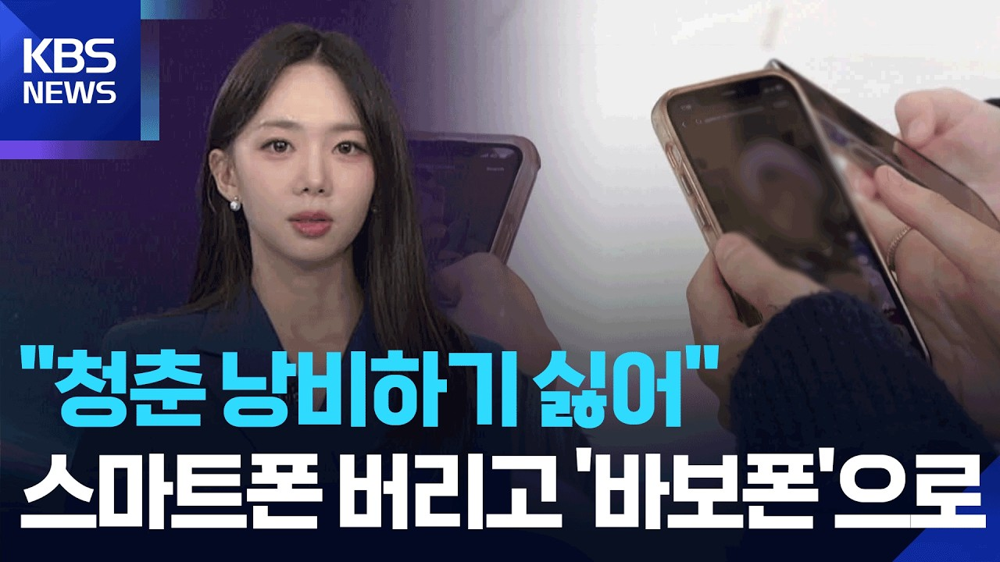
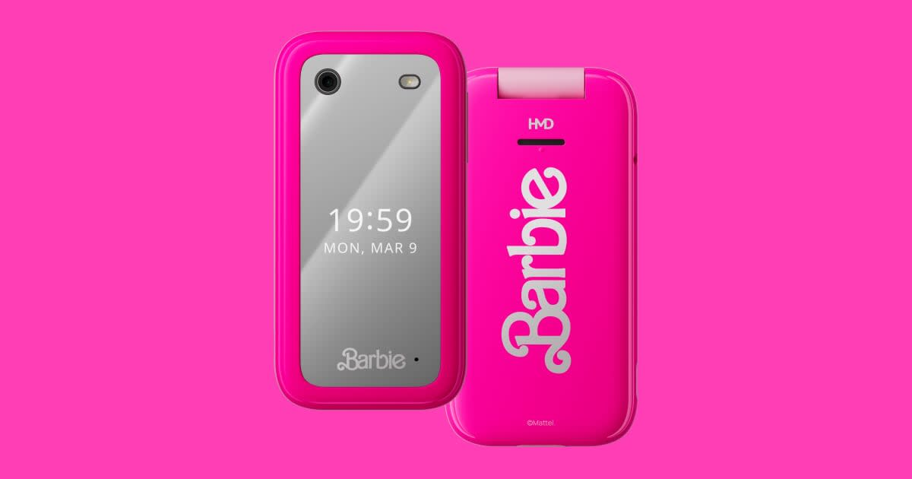

# 스마트폰 버리고 플립폰으로? 사기 전에 먼저 확인할 6가지

_KBS W언박싱이 소개한 스마트폰 피로와 플립폰 회귀. 화면: KBS News 공식 영상_

눈을 뜨자마자 알림을 확인하고, 잠깐 쉬려다가 짧은 영상을 한참 넘겨본 적 있으신가요? 📱

최근에는 이 피로를 앱 하나가 아니라 **휴대전화 자체를 바꾸는 방식**으로 끊으려는 사람이 다시 주목받고 있습니다.

KBS W언박싱은 2026년 8월 18일 영상에서 Z세대의 플립폰·덤폰 회귀 현상을 다뤘습니다.

<mark>그런데 디지털 디톡스를 하고 싶다고 곧바로 플립폰부터 사는 것이 정답은 아닙니다.</mark>

## 🤔 왜 하필 불편한 플립폰일까요?

영상이 보여준 핵심은 최신 기기를 싫어해서가 아닙니다.

알림, 추천 피드, 무한 스크롤처럼 **한 번 열면 계속 보게 되는 구조에서 물리적으로 멀어지고 싶은 것**에 가깝습니다.

KBS는 전화와 문자 정도만 남긴 구형 폴더폰뿐 아니라 스마트폰의 기본 성능은 유지하면서 소셜미디어 기능을 제한한 기기도 덤폰 범주로 소개했습니다.

> 중요한 것은 폴더 모양이 아니라, 내가 시간을 빼앗기는 기능을 얼마나 줄일 수 있느냐입니다.

## 🎀 실제 플립폰은 어느 정도까지 될까요?

_전화·문자 중심 플립폰의 실제 사례. 이미지: HMD 공식 제품 페이지_

영상에도 등장한 분홍색 플립폰과 비슷한 실제 제품으로 **HMD Barbie Phone 4G**가 있습니다.

공식 사양을 보면 4G 통신, 2.8인치 화면, 0.3MP 카메라, 128MB 저장공간, 최대 32GB microSD를 지원합니다.

USB-C와 블루투스도 있지만, 우리가 스마트폰에서 당연하게 쓰는 앱 환경과는 완전히 다릅니다.

<mark>‘예쁜 보조폰’과 ‘매일 쓰는 주력폰’은 필요한 조건이 다릅니다.</mark>

## ✅ 구매 전에 확인할 6가지

### 1. 카카오톡과 업무 메신저

전화·문자만 가능한 기기라면 단체 대화, 사진 전송, 회사 인증을 놓칠 수 있습니다.

### 2. 은행·증권·본인인증

모바일 뱅킹, 공동인증서, OTP, 간편결제가 주력폰에 묶여 있는지 먼저 확인해야 합니다.

### 3. 지도·교통·택시

길찾기와 버스 도착 정보, 택시 호출을 자주 쓴다면 기능이 제한된 기기 하나로 생활하기 어렵습니다.

### 4. 국내 통신 호환

해외 플립폰은 4G라고 적혀 있어도 국내 통신사 주파수·VoLTE·유심 개통 조건이 맞지 않을 수 있습니다.

구매 전에 판매자가 아니라 **사용할 통신사에 모델명과 개통 가능 여부를 직접 확인**하는 편이 안전합니다.

### 5. 사진과 저장공간

0.3MP 카메라와 128MB 저장공간은 기록용 스마트폰 카메라와 비교할 수준이 아닙니다.

사진을 자주 찍는다면 보조폰 방식이 현실적일 수 있습니다.

### 6. 비상 상황

가족 위치 공유, 의료 앱, 긴급 알림처럼 꼭 필요한 기능까지 함께 사라지지 않는지 점검해야 합니다.

## 🧪 돈 쓰기 전, 7일만 이렇게 시험해보세요

새 기기를 주문하기 전에 현재 스마트폰으로 먼저 실험할 수 있습니다.

**SNS 로그아웃 → 홈 화면에서 앱 제거 → 불필요한 알림 끄기 → 화면을 흑백으로 변경 → 침실 밖에서 충전**

이 상태로 7일을 써보면 내가 줄이고 싶은 것이 기기 자체인지, 특정 앱과 알림인지 더 분명해집니다.

그래도 계속 스마트폰을 열게 된다면 그때 보조 플립폰이나 미니멀폰을 검토해도 늦지 않습니다.

## 🌿 완전히 끊는 대신 ‘두 대 운영’도 방법입니다

평일 낮에는 전화·문자 중심 보조폰을 쓰고, 금융·지도·인증이 필요할 때만 스마트폰을 켜는 방식입니다.

Light Phone III처럼 전화 외에 카메라·알람을 기본 제공하고 지도·캘린더 같은 도구를 선택적으로 추가하는 제품도 있습니다.

다만 이런 해외 기기도 국내 통신 호환과 사후지원은 별도로 확인해야 합니다.

<mark>디지털 디톡스의 목표는 최신 기술을 버리는 것이 아니라, 시간을 쓰는 주도권을 되찾는 것입니다.</mark>

플립폰을 사고 싶은 마음이 들었다면 오늘은 결제보다 먼저 **없어도 되는 앱 세 개**부터 골라보세요. 📌

※ 특정 제품을 광고하거나 구매를 권유하는 글이 아닙니다. 제품 사양과 국내 사용 가능 여부는 구매 시점의 제조사·통신사 안내를 다시 확인하세요.

## 공식 참고자료

확인 기준일: 2026-08-23

- [KBS News W언박싱 공식 영상](https://www.youtube.com/watch?v=MTcsx6ddFlE)
- [HMD Barbie Phone 4G 공식 사양](https://www.hmd.com/en_int/hmd-barbie-phone/specs)
- [Light Phone III 공식 사용 안내](https://support.thelightphone.com/hc/en-us/articles/36100487624980-Light-Phone-III-Introduction)

## 태그

#플립폰 #덤폰 #디지털디톡스 #폴더폰 #바비폰 #스마트폰중독 #디지털미니멀리즘 #Z세대 #휴대폰추천 #브링이슈
