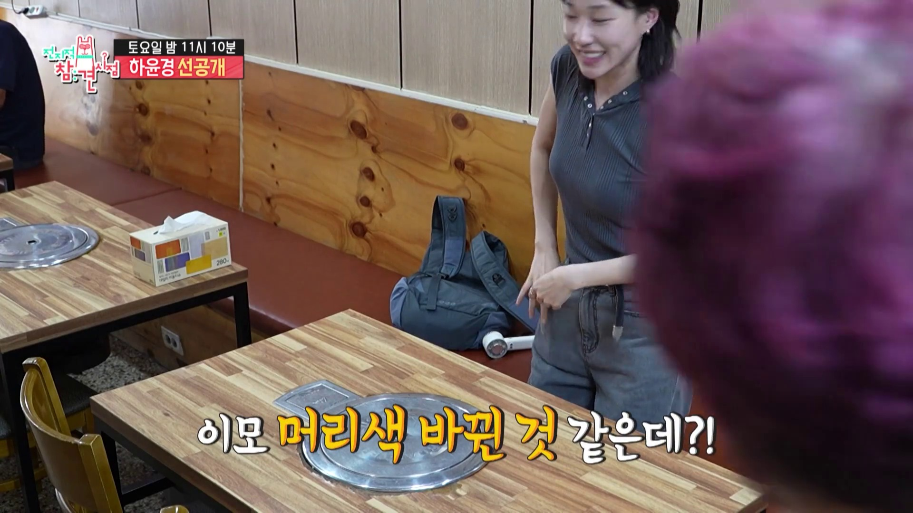
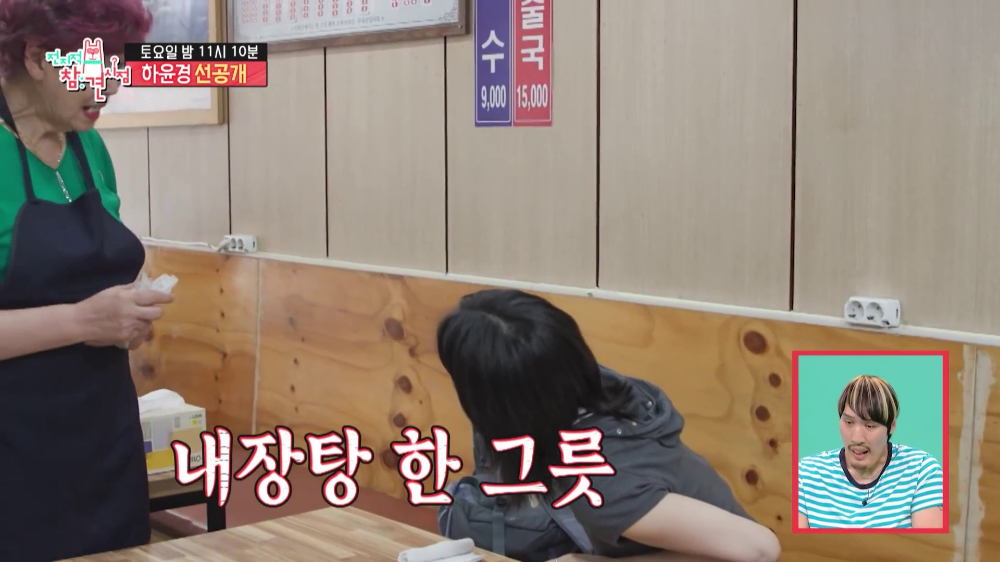
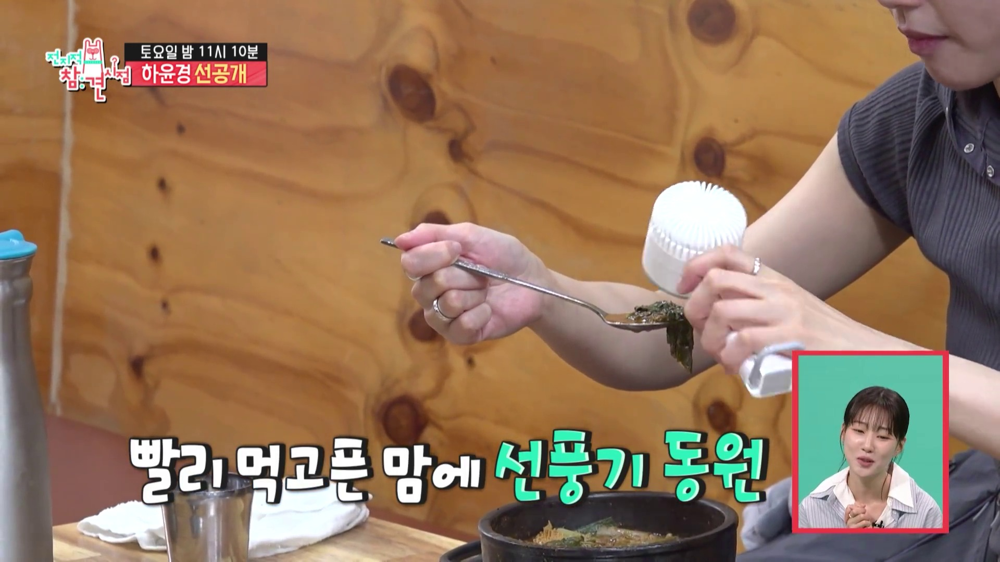
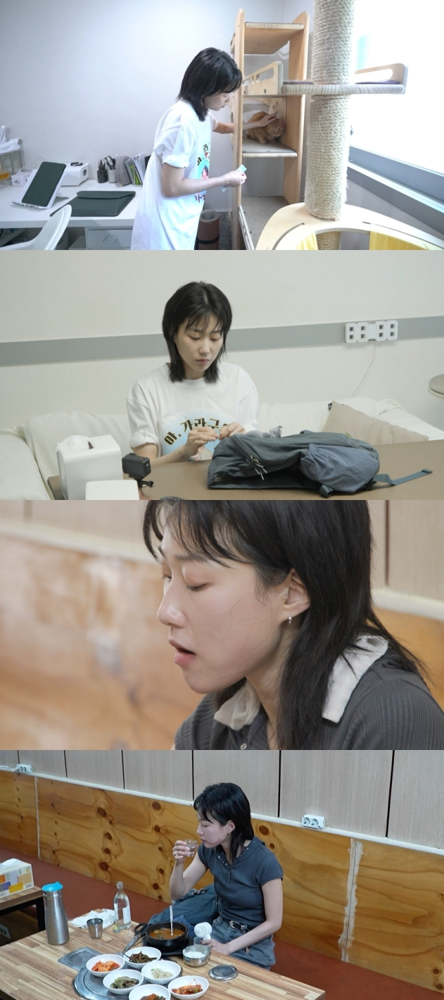

# ‘봄날의 햇살’ 하윤경 맞아? 내장탕 혼밥에서 드러난 진짜 반전

_내장탕 혼밥 장면을 담은 MBC예능 공식 YouTube 섬네일입니다._

작품 속에서는 일을 똑소리 나게 해내는 단정한 인물로 기억됩니다. ☀️

그런데 휴일의 하윤경은 조금 달랐습니다.

단골 식당에 혼자 들어가 내장탕을 주문하고, 뜨거운 국물은 손선풍기로 식히며 자연스럽게 한 끼를 즐겼죠.

<mark>화제가 된 건 내장탕보다, 그 공간에 완전히 편안해 보이는 사람의 표정이었습니다.</mark>

## 👀 첫 장면부터 ‘진짜 단골’ 같았던 이유

_00:00:36, 식당 직원의 달라진 머리색을 바로 알아본 장면. 화면: MBC예능 공식 YouTube_

식당에 들어간 하윤경이 먼저 반응한 것은 메뉴판이 아니었습니다.

직원의 머리색이 바뀐 것 같다며 자연스럽게 인사를 건넸죠.

자주 오가던 공간과 사람을 기억하고 있었다는 뜻입니다.

<mark>이 짧은 인사 하나가 ‘방송을 위해 찾은 맛집’과 ‘평소 다니던 단골집’의 차이를 만들었습니다.</mark>

## 🍲 내장탕 하나, 망설임 없는 주문

_00:00:56, 별도의 메뉴 고민 없이 내장탕을 주문하는 장면. 화면: MBC예능 공식 YouTube_

오랜만에 왔다고 이야기한 뒤, 하윤경은 내장탕 하나를 주문합니다.

어떤 메뉴를 먹을지 고민하거나 설명을 길게 듣는 장면도 없었습니다.

익숙한 곳에서 평소처럼 주문하는 모습 그대로였죠.

> 하윤경 내장탕 장면의 핵심은 ‘무엇을 먹었나’보다 ‘얼마나 자연스러웠나’에 있었습니다.

## 🌬️ 손선풍기로 국물을 식히는 순간

_00:02:45, 빨리 먹고 싶은 뜨거운 국물을 손선풍기로 식히는 장면. 화면: MBC예능 공식 YouTube_

이 장면은 짧지만 인물의 성격을 가장 잘 보여줍니다.

뜨거운 국물을 빨리 먹고 싶어 손선풍기를 숟가락 가까이 가져갔습니다.

예능을 위해 특별한 모습을 만든 것보다, 평소의 작은 습관이 그대로 나온 순간에 가깝게 느껴집니다.

## 🥢 김치와 반찬에서 더 잘 보인 관계

_반려묘를 돌보는 집사, 연기를 준비하는 배우, 단골집에서 식사하는 사람이라는 세 모습을 함께 담은 iMBC 공식 스틸입니다._

음식이 나오자 하윤경은 김치가 정말 맛있다며 반가워했습니다.

반찬이 잘 나온다는 설명에도 평소 이 식사를 즐겼던 사람의 익숙함이 묻어났죠.

내장탕 한 그릇보다 더 많은 이야기를 전한 것은 식당 직원과의 자연스러운 대화였습니다.

## 🍶 낮술 장면은 왜 반전으로 보였을까

방송에서는 대낮에 술을 주문하는 모습도 짧게 담겼습니다.

작품 속 ‘봄날의 햇살’처럼 따뜻하고 단정한 이미지를 기억했던 시청자에게는 뜻밖의 순간이었을 겁니다.

하지만 주목할 지점은 술 자체가 아니라, 혼자서도 낯선 눈치 없이 자신의 휴일을 즐기는 태도입니다.

<mark>낮술을 따라 하는 것이 아니라, 자신만의 편안한 휴일 루틴이 있다는 점이 반전의 핵심입니다.</mark>

## ✨ 짧은 클립인데도 기억에 남는 이유

세게 만든 반전은 금방 소모됩니다.

반면 사람이 익숙한 공간에서 보이는 작은 습관은 오래 남습니다.

직원의 바뀐 머리색을 알아보는 것, 익숙한 메뉴를 바로 주문하는 것, 손선풍기로 국물을 식히는 것.

그 자연스러운 연결이 시청자가 기억하던 하윤경의 이미지에 새로운 색을 더했습니다.

<mark>단정한 배우 하윤경과 편안한 휴일의 하윤경. 둘 중 하나가 반전이라기보다 둘 다 같은 사람의 자연스러운 모습이었습니다.</mark>

여러분은 직원의 머리색을 알아본 장면과 손선풍기로 국물을 식힌 장면 중 어느 쪽이 더 기억에 남았나요? 😊

※ 음주는 성인에게만 허용되며, 음주 후에는 운전하면 안 됩니다.

## 공식 참고자료

확인 기준일: 2026-08-23

- [MBC예능 공식 YouTube 클립](https://www.youtube.com/watch?v=PMMFUsdFblA)
- [iMBC 공식 기사](https://enews.imbc.com/News/RetrieveNewsInfo/515316)

## 태그

#하윤경 #하윤경내장탕 #하윤경전참시 #전참시 #전참시412회 #하윤경혼밥 #MBC예능 #오늘뜬유튜브 #브링이슈
