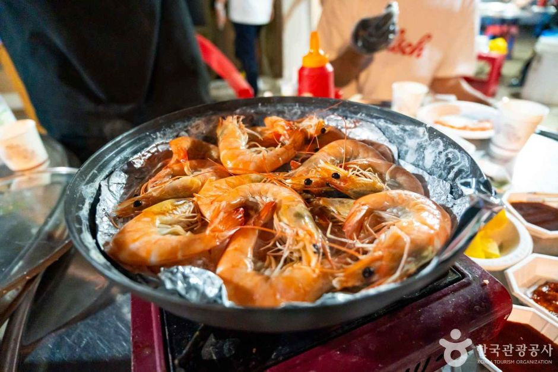
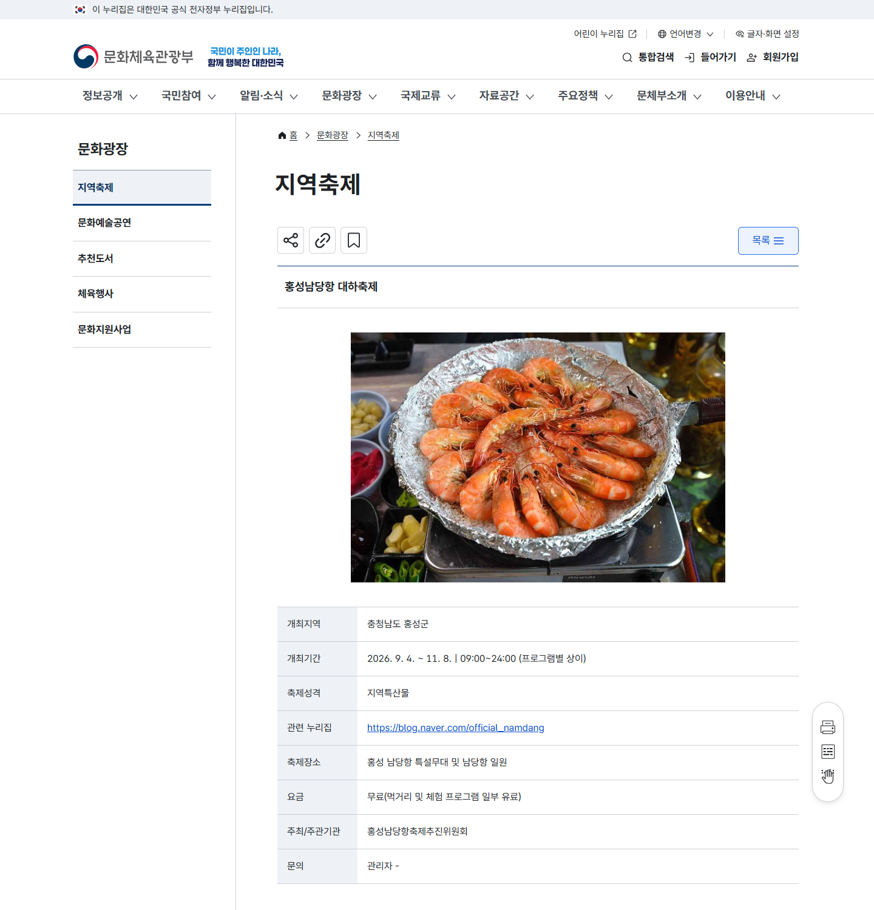

# 2026 홍성 남당항 대하축제, 1kg 가격부터 공연 날짜까지 미리 보세요

가을이 시작되면 서해안에서 가장 먼저 생각나는 음식 가운데 하나가 대하입니다. 🦐

올해 홍성 남당항에서는 **9월 4일부터 11월 8일까지** 제31회 대하축제가 열립니다.

기간은 두 달이 넘지만, 공연이 집중되는 날짜와 조용히 식사하기 좋은 시기는 서로 다릅니다.

<mark>가족 나들이라면 ‘축제 기간’만 보지 말고 가격·공연 날짜·주변 동선을 함께 확인하는 편이 좋습니다.</mark>

_대하 소금구이. 사진: 한국관광공사 포토코리아, 공공누리 제1유형_

## 📅 축제는 언제 열리나요?

문화체육관광부 공식 안내 기준으로 축제는 **2026년 9월 4일부터 11월 8일까지** 이어집니다.

장소는 홍성 남당항 특설무대와 남당항 일원입니다.

운영시간은 오전 9시부터 자정까지로 안내돼 있지만, 실제 공연과 체험 시간은 프로그램마다 다를 수 있습니다.

_문화체육관광부가 안내한 2026 홍성남당항 대하축제 일정과 장소입니다._

입장 자체는 무료입니다.

다만 먹거리와 일부 체험 프로그램은 별도 비용이 발생합니다.

## 🎤 공연을 보고 싶다면 날짜가 중요합니다

개막공연은 **9월 4일부터 6일까지** 예정돼 있습니다.

추석공연은 **9월 25일부터 26일까지** 마련됩니다.

공연 분위기까지 즐기고 싶다면 이 기간이 맞지만, 방문객이 몰릴 가능성도 함께 생각해야 합니다.

반대로 공연보다 대하 식사와 바다 산책이 목적이라면 개막 주말과 추석 공연일을 피한 평일 방문이 한결 여유로울 수 있습니다.

<mark>‘무엇을 먹을까’보다 ‘공연을 볼 것인가’를 먼저 정하면 방문 날짜를 고르기 쉬워집니다.</mark>

_Google Flow 웹에서 제작한 이해용 이미지입니다. 실제 축제 현장이 아닙니다._

## 💳 올해 대하 가격은 얼마인가요?

홍성군 발표를 인용한 지역 보도에 따르면 축제 기간 판매가는 1kg 기준으로 통일 운영될 계획입니다.

✅ 포장 판매: **4만5000원**

✅ 식당 판매: **6만원**

식당 판매가는 자리와 조리 형태가 포함된 가격으로 이해할 수 있지만, 상차림·추가 메뉴·음료 비용까지 모두 포함됐다고 단정해서는 안 됩니다.

주문 전에는 총중량과 추가 비용, 남은 음식 포장 가능 여부를 먼저 물어보는 편이 안전합니다.

<mark>가격은 방문 직전 공식 축제 블로그와 현장 안내에서 한 번 더 확인하세요.</mark>

## 🚗 대하만 먹고 돌아오기 아쉽다면

남당항 주변에는 해양분수공원과 남당노을전망대가 있습니다.

차량 이동이 가능하다면 서해와 천수만을 내려다볼 수 있는 홍성스카이타워도 함께 묶어볼 수 있습니다.

추천 순서는 간단합니다.

**낮 도착 → 대하 식사 → 남당항 산책 → 노을 감상**

공연일에는 행사장 주변이 혼잡할 수 있으므로 식사 예약이나 주차 가능 여부를 출발 전에 확인하는 편이 좋습니다.

아직 공식 셔틀버스 시간과 전체 주차 안내가 모두 공개된 것은 아니므로, 확인되지 않은 후기만 믿고 시간을 촘촘하게 잡지는 마세요.

## ✅ 출발 전 체크리스트

✅ 방문일이 개막·추석 공연일인지 확인

✅ 대하 포장 또는 식당 이용 방식 결정

✅ 추가 상차림·메뉴 비용 문의

✅ 주차와 귀가 시간을 고려해 노을 동선 설정

✅ 비나 강풍 예보 확인

## ✍️ 한 줄로 정리하면

2026 홍성남당항 대하축제는 9월 4일부터 11월 8일까지입니다.

공연을 원하면 개막 주말이나 추석 공연일을, 여유로운 식사와 산책을 원하면 그 외 날짜를 고르는 방식이 좋습니다.

<mark>포장 4만5000원, 식당 6만원은 홍성군 발표 인용 보도 기준이며 현장 추가 비용은 다시 확인해야 합니다.</mark>

가족과 가을 나들이를 계획하고 있다면 이 글을 저장해두고 방문 날짜부터 함께 정해보세요. 😊

※ 2026년 8월 23일 확인한 문화체육관광부 공식 안내와 홍성군 발표 인용 보도 기준입니다. 행사 내용과 가격은 현장 사정에 따라 변경될 수 있습니다.

## 공식 참고자료

확인 기준일: 2026-08-23

- [문화체육관광부 지역축제, 「홍성남당항 대하축제」](https://www.mcst.go.kr/site/s_culture/festival/festivalView.jsp?pRo=3&pSeq=12604)
- [중도일보, 「31년 전통 홍성 대하축제, 9월 4일 개막」(홍성군 발표 인용)](https://m.joongdo.co.kr/view.php?key=20260820010006155)
- 한국관광공사 포토코리아 사진 3036688, 공공누리 제1유형

## 태그

#홍성남당항대하축제 #2026대하축제 #남당항대하축제 #홍성대하축제 #남당항대하가격 #대하1kg가격 #홍성가볼만한곳 #가을축제 #충남여행 #브링이슈
