# 퇴직연금 수령방법, 일시금과 연금 중 무엇을 고를까

퇴직을 앞두고 IRP 계좌까지 만들었는데, 막상 마지막 화면에서 손이 멈추는 분이 많습니다.

`일시금으로 한 번에 받을지`, 아니면 `연금으로 나눠 받을지` 골라야 하기 때문입니다. 세금만 보면 연금이 좋아 보이지만, 당장 목돈이 필요한 사람에게도 같은 답이 맞을까요?

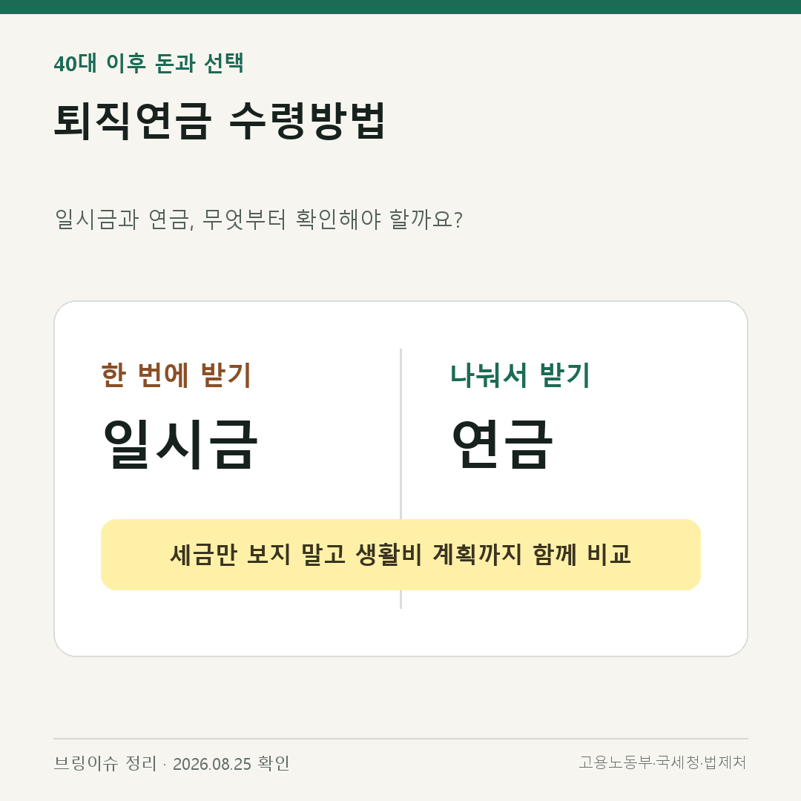

## 먼저 결론부터 말씀드리면

[노란 형광펜] **일시금과 연금은 세금 하나만 보고 고르면 안 됩니다.**

- 일시금은 당장 필요한 큰돈과 부채 상환 계획을 먼저 봅니다.
- 연금은 매달 필요한 생활비와 수령 기간을 먼저 봅니다.
- 그다음 금융회사에 두 방식의 예상 세액을 각각 요청해 비교합니다.

IRP를 먼저 해지한 뒤 계산하려고 하지 말고, 해지 전에 예상 수령액과 세액부터 확인하는 순서가 안전합니다.

## 연금으로 받으려면 어떤 조건이 있을까

고용노동부는 퇴직연금을 55세 이후 연금 또는 일시금으로 받을 수 있는 제도로 설명합니다.

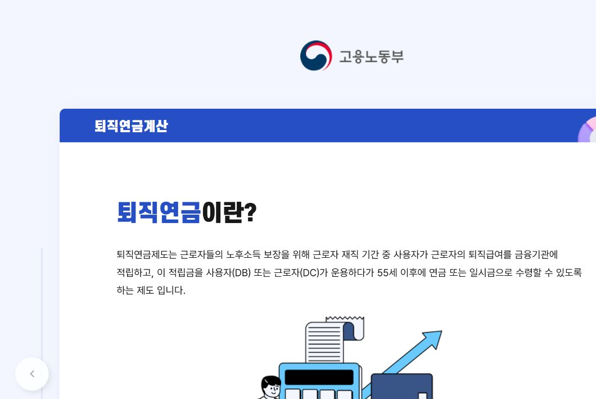

고용노동부 사이트를 직접 열어 확인한 첫 화면입니다. 퇴직급여를 금융기관에 적립한 뒤 DB 또는 DC 방식으로 운용하고, 55세 이후 연금이나 일시금으로 수령하는 구조를 설명하고 있습니다.

### 내가 가입한 제도부터 구분하세요

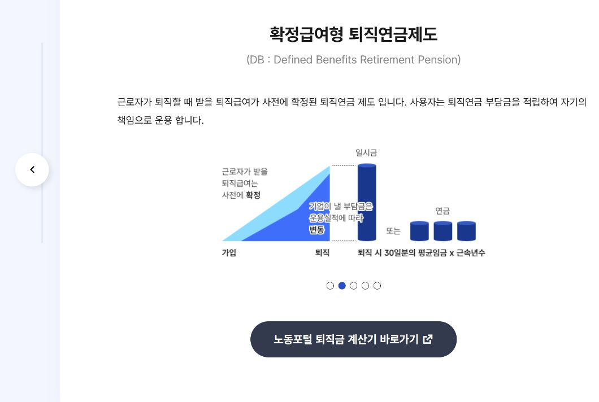

DB형은 퇴직할 때 받을 급여가 사전에 정해지는 방식입니다. 회사가 적립금을 운용한다는 점이 핵심입니다.

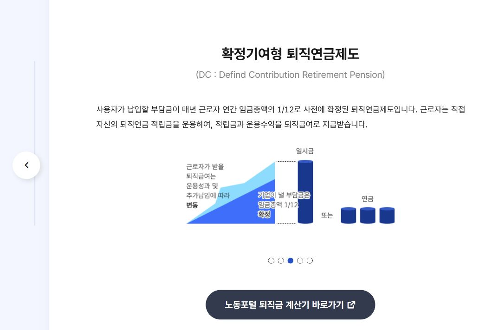

DC형은 회사가 낼 부담금이 정해지고, 근로자가 적립금을 직접 운용합니다. 따라서 운용 결과에 따라 최종 금액이 달라질 수 있습니다.

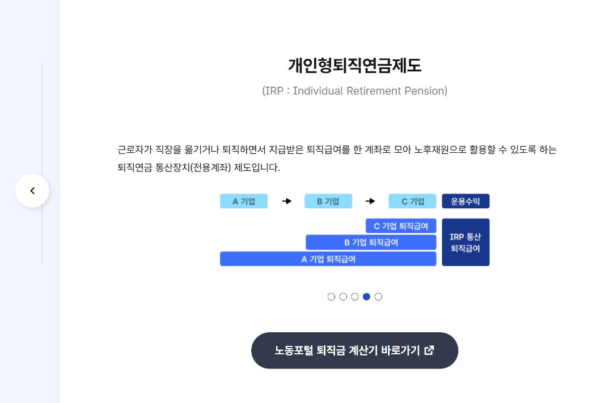

IRP는 여러 직장에서 받은 퇴직급여를 한 계좌에 모아 노후 재원으로 관리하는 계좌입니다. 일시금과 연금의 선택은 이 계좌에서 실제로 마주치게 됩니다.

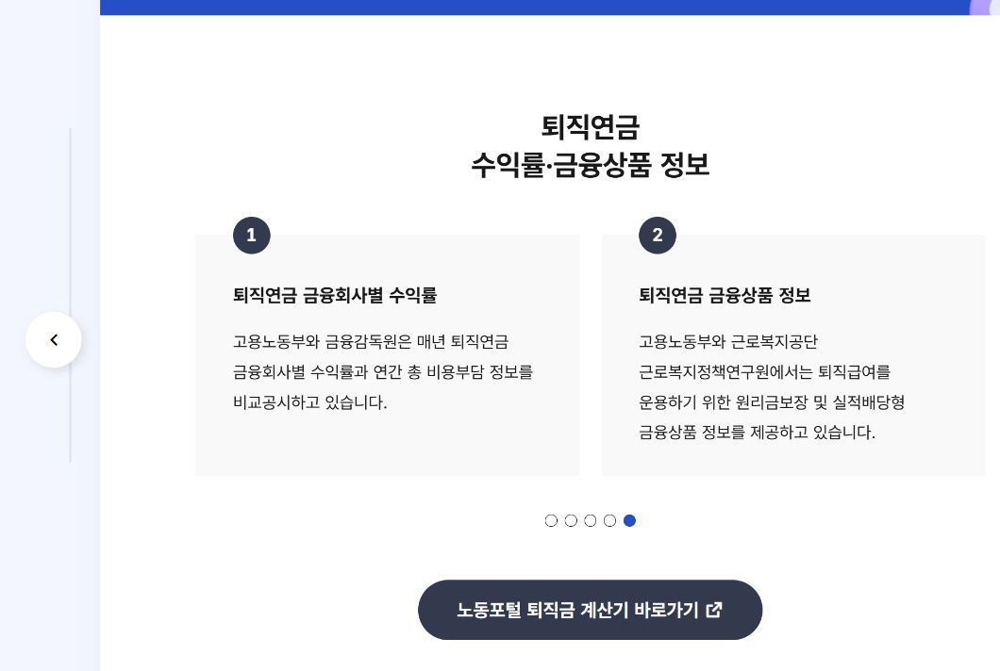

어디에서 운용할지 비교할 때는 금융회사별 수익률뿐 아니라 총비용과 상품 구성도 함께 확인해야 합니다. 고용노동부 화면에서도 비교공시와 금융상품 정보를 별도로 안내하고 있습니다.

개인형퇴직연금제도, 즉 IRP의 구체적인 수급 요건은 시행령에 나와 있습니다. 연금은 55세 이상 가입자에게 지급하고, 연금 지급기간은 5년 이상이어야 합니다. 일시금도 55세 이상으로서 일시금 수급을 원하는 가입자에게 지급하는 것이 기본 기준입니다.

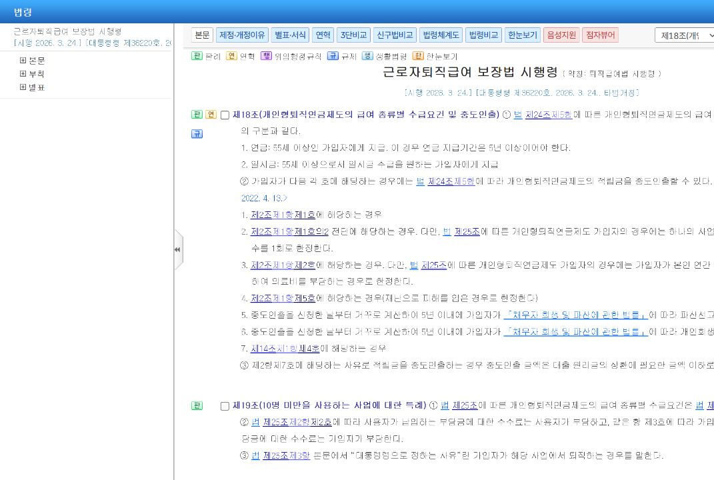

국가법령정보센터 사이트에서 `제18조`를 직접 선택한 화면입니다. 법령명과 시행일이 함께 보여 현재 적용되는 규정인지 확인할 수 있습니다.

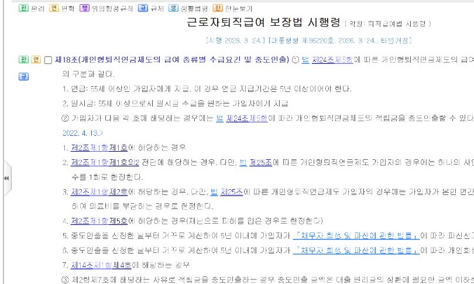

글자가 잘 보이도록 수급 요건 부분만 다시 잘랐습니다. 연금은 55세 이상 가입자에게 지급하며, 지급기간은 5년 이상이어야 한다는 내용이 보입니다. 바로 아래에는 55세 이상으로서 일시금 수령을 원하는 가입자의 기준도 나옵니다.

다만 퇴직 시점, 계좌 종류, 예외 사유에 따라 실제 처리 방식은 달라질 수 있습니다. 본인의 IRP를 관리하는 금융회사에서 수령 가능 시점부터 확인하는 게 좋습니다.

## 일시금과 연금, 차이는 이렇게 보세요

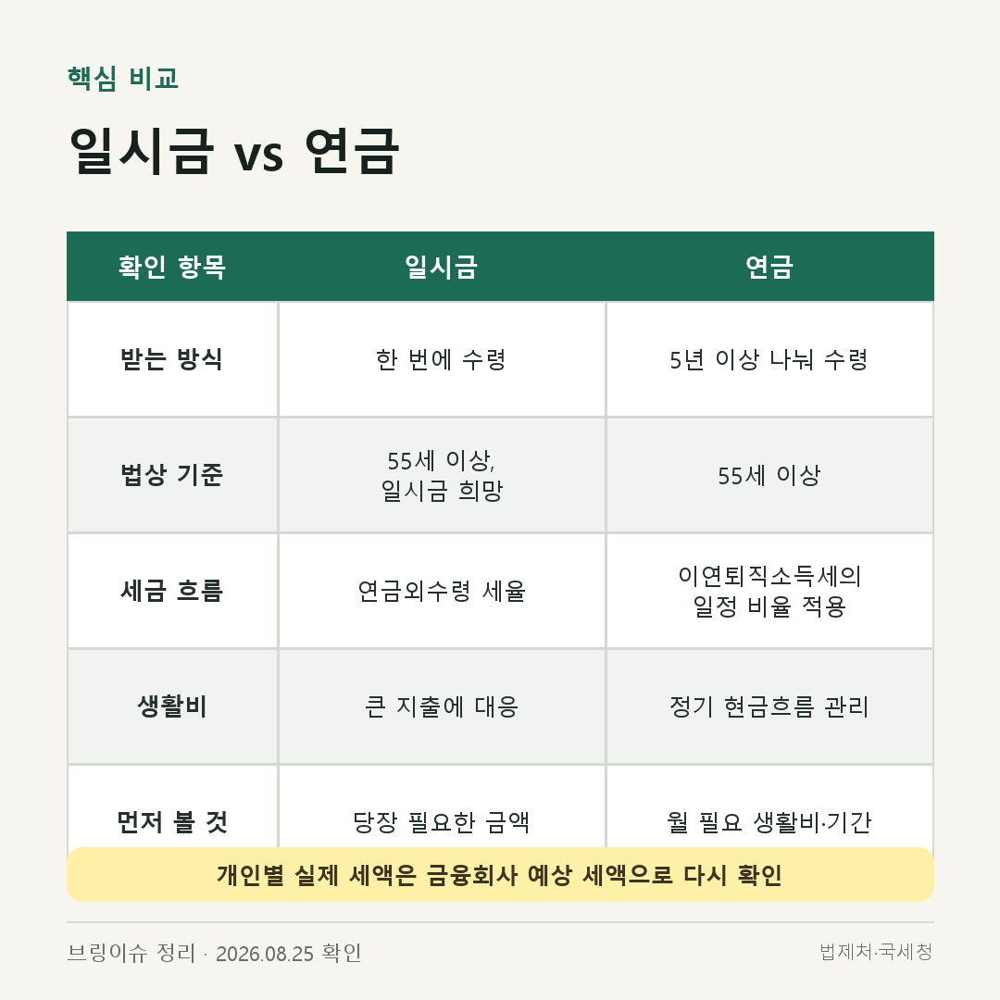

일시금은 한 번에 큰돈을 확보할 수 있다는 장점이 있습니다. 주택대출 상환이나 꼭 필요한 치료비처럼 지출 시점이 분명하다면 검토할 이유가 있습니다. 반대로 계획 없이 생활비로 섞이면 노후 자금이 예상보다 빨리 줄 수 있습니다.

연금은 돈을 나눠 받아 정기적인 현금 흐름을 만들기 쉽습니다. 국세청 기준상 퇴직급여에서 넘어온 이연퇴직소득을 연금으로 받으면 연금외수령 때보다 낮은 비율의 세율 구조가 적용됩니다.

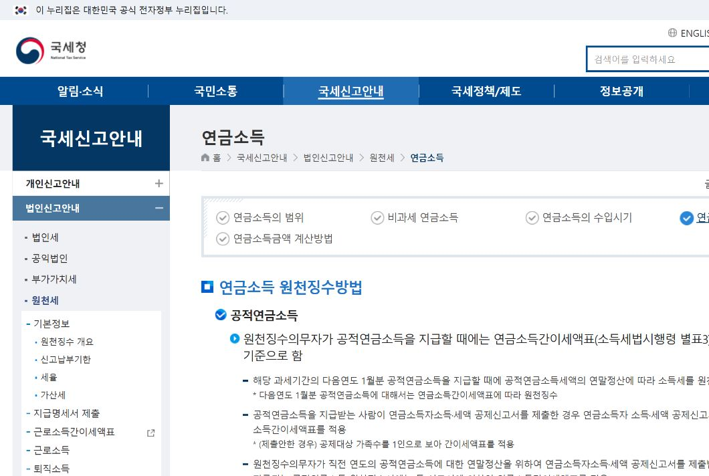

국세청 사이트에서 연금소득 원천징수 방법 페이지를 직접 연 화면입니다. 기관 로고와 메뉴, 페이지 제목이 함께 보여 출처를 바로 확인할 수 있습니다.

2026년 1월 1일 이후 수령분부터는 연금 실제 수령연차가 길어질수록 적용 비율이 더 낮아지는 구간도 생겼습니다. 다만 이 숫자를 내 계좌 전체 금액에 그대로 곱해서 세금을 계산하면 안 됩니다.

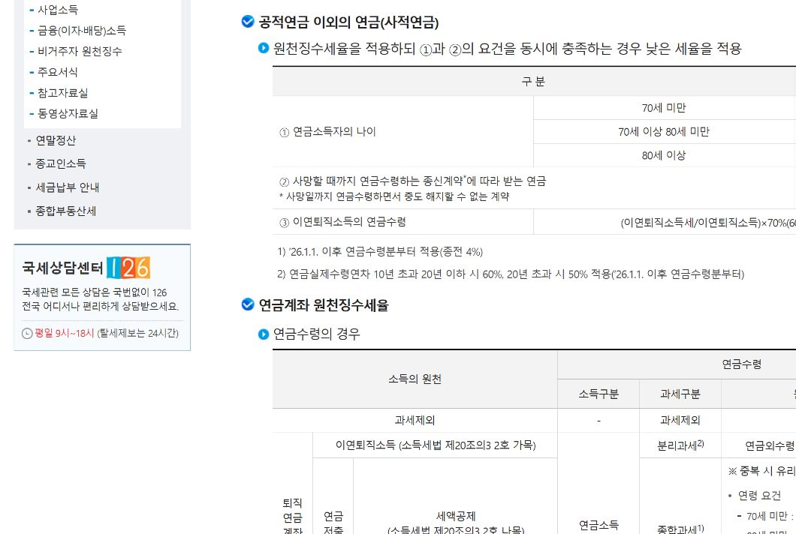

국세청 화면에서는 사적연금의 연령별 기준과 이연퇴직소득의 연금수령 기준을 나누어 안내합니다. 2026년부터 달라진 연금 실제 수령연차별 적용 비율도 이 부분에서 확인할 수 있습니다.

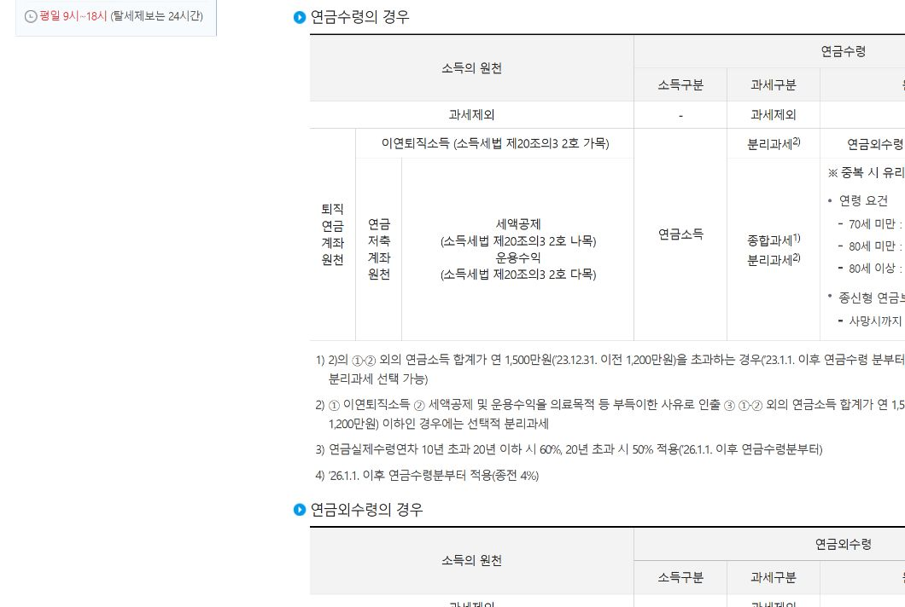

표 아래 주석에는 연금 실제 수령연차가 10년을 초과하면 적용 비율이 달라지는 기준이 적혀 있습니다. 일시금과 연금을 비교할 때 단순히 한 세율만 적용하면 안 되는 이유입니다.

## 결정 전에 이 순서로 확인하세요

### 1. 내 퇴직연금 유형과 적립금을 확인합니다

회사에서 운용한 제도가 DB인지 DC인지, 퇴직급여가 어느 IRP로 들어왔는지부터 확인합니다. 계좌가 여러 개라면 퇴직급여 원금과 개인 추가 납입금을 구분해서 봅니다.

### 2. 연금 수령 가능 시점을 확인합니다

55세 이상인지, 금융회사에서 연금 개시 신청이 가능한지, 몇 년에 걸쳐 받을 것인지 확인합니다.

### 3. 두 방식의 예상 세액을 같은 날 비교합니다

금융회사에 다음 두 금액을 함께 요청하면 됩니다.

- 오늘 일시금으로 받을 때의 세후 예상액
- 5년, 10년, 20년 등 기간별 연금 예상액과 세금

### 4. 앞으로의 생활비와 큰 지출을 적어 봅니다

향후 3~5년 안에 꼭 필요한 목돈과 매달 부족한 생활비를 나눠 적습니다. 이 표를 예상 수령액 옆에 놓아야 선택이 현실적으로 보입니다.

## 같은 IRP 안에서도 돈의 출처가 다릅니다

[노란 형광펜] **퇴직급여 원금과 내가 추가로 납입한 돈은 과세 기준이 같지 않을 수 있습니다.**

퇴직급여에서 넘어온 돈은 이연퇴직소득 기준을 보고, 개인이 추가 납입한 돈은 세액공제를 받았는지와 운용수익이 얼마인지 따로 확인해야 합니다.

따라서 ‘연금이면 세율 몇 퍼센트’처럼 한 줄로 계산하기보다, 금융회사에 원천별 예상 세액표를 요청하는 편이 정확합니다.

## 금융회사에 물어볼 5가지

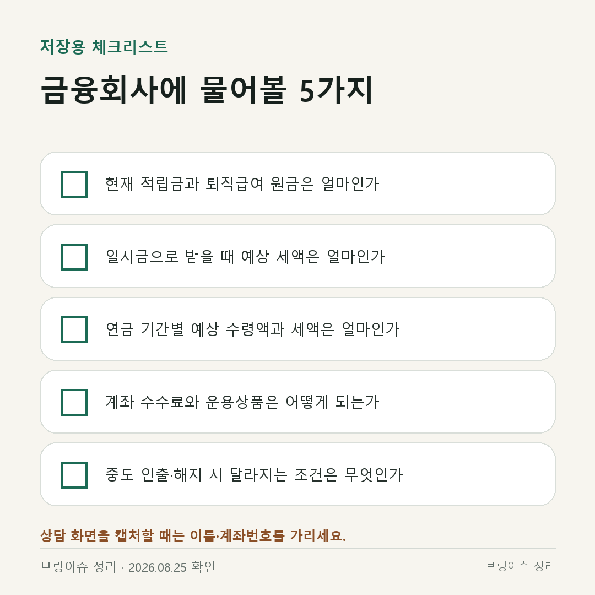

1. 현재 적립금 중 퇴직급여 원금은 얼마인가요?
2. 지금 일시금으로 받으면 예상 세액과 세후 금액은 얼마인가요?
3. 연금 기간별 예상 수령액과 세금은 얼마인가요?
4. 계좌 수수료와 현재 운용상품은 어떻게 되나요?
5. 중도 인출이나 해지 시 달라지는 조건은 무엇인가요?

상담 화면이나 서류를 저장할 때는 이름과 계좌번호를 반드시 가리세요.

## 한 줄로 정리하면

일시금은 `지금 필요한 목돈`, 연금은 `앞으로 필요한 생활비`를 기준으로 먼저 나눠 생각하면 됩니다.

[노란 형광펜] **최종 결정 전에는 같은 날짜 기준으로 일시금과 연금의 세후 예상액을 모두 받아 비교하세요.**

이 글은 일반적인 제도 설명입니다. 개인별 세금과 적합한 수령 방식은 퇴직급여 원금, 추가 납입금, 수령 기간과 다른 소득에 따라 달라질 수 있습니다.

## 확인한 공식 자료

- 고용노동부 퇴직연금 안내 — 2026년 8월 26일 실제 화면 확인
- 국가법령정보센터 근로자퇴직급여 보장법 시행령 제18조 — 2026년 8월 26일 실제 화면 확인
- 국세청 연금소득·연금계좌 원천징수 안내 — 2026년 8월 26일 실제 화면 확인

## 제목 후보

1. 퇴직연금 수령방법, 일시금과 연금 중 무엇을 고를까
2. 퇴직연금 일시금 vs 연금, 세금보다 먼저 볼 4가지
3. IRP 수령방법, 해지 전에 꼭 비교할 예상 세액과 생활비

추천 제목: **퇴직연금 수령방법, 일시금과 연금 중 무엇을 고를까**

태그: 퇴직연금수령방법, 퇴직연금일시금, 퇴직연금연금수령, IRP수령방법, 퇴직연금세금, 노후생활비

확인 필요: 게시 직전 금융회사별 실제 신청 화면과 최신 과세 안내를 재확인합니다.
