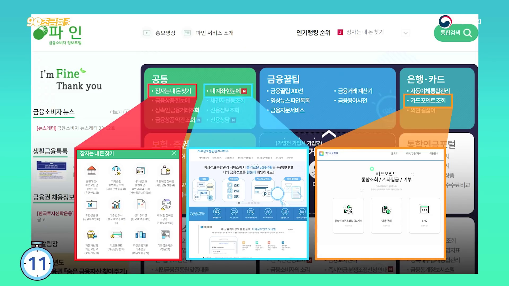
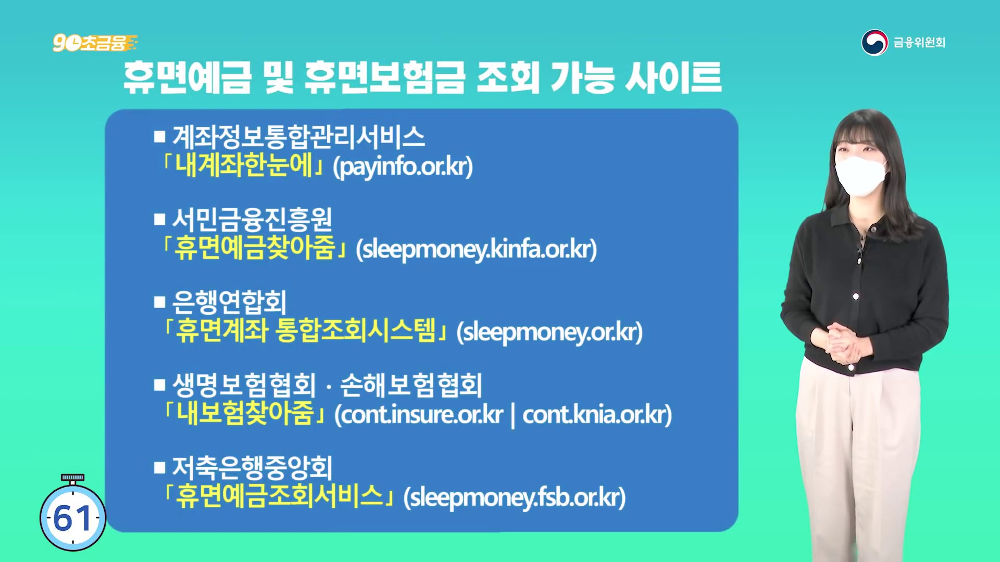
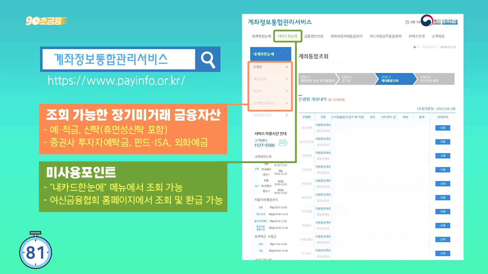
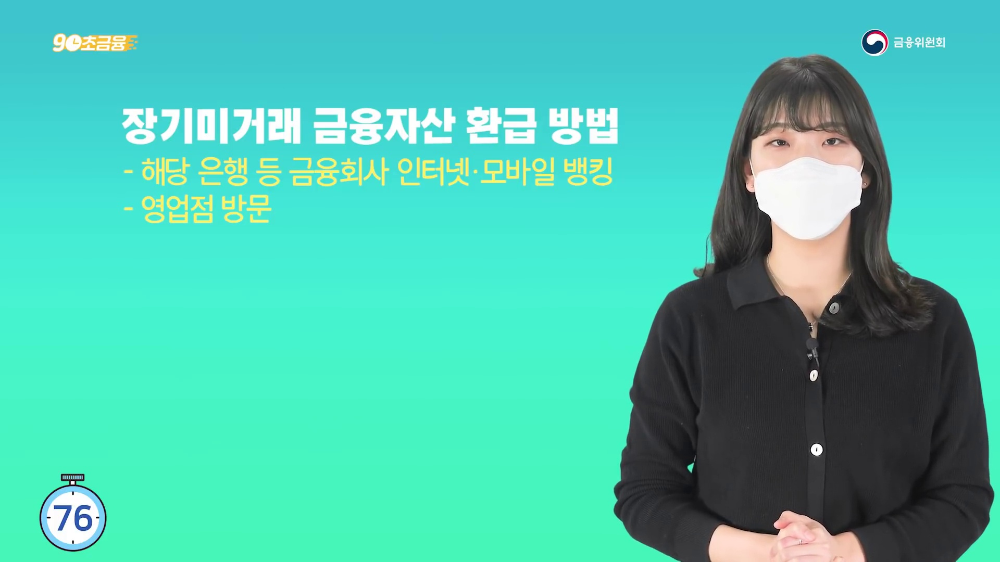
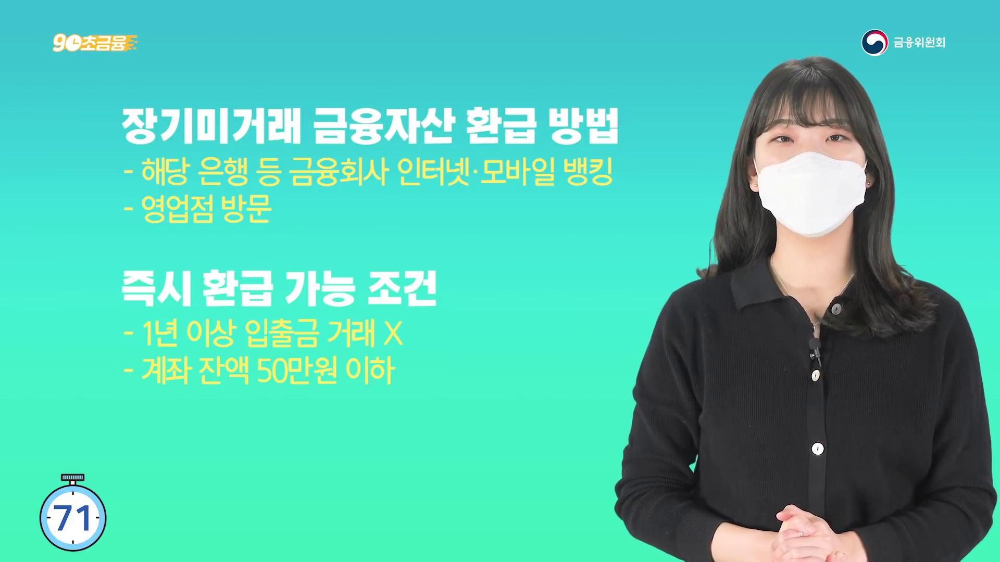
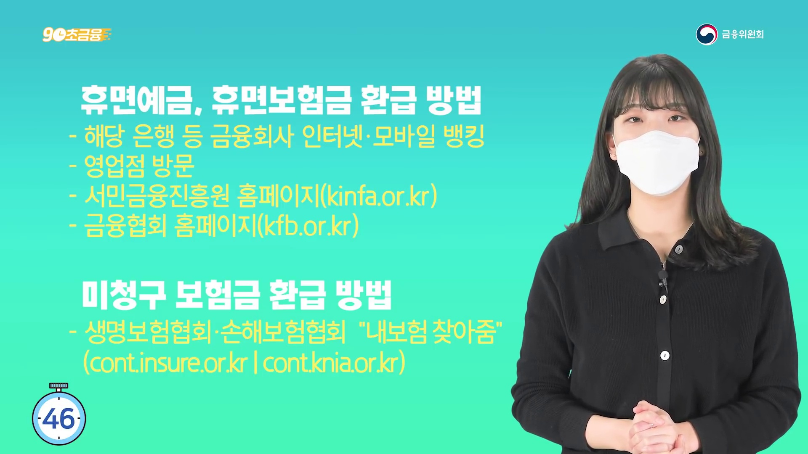

# 휴면예금 조회, 문자 링크 말고 여기서 확인하세요

예전에 만든 통장이나 만기가 지난 보험에 돈이 남아 있다는 문자를 받으면 반가우면서도 찜찜합니다.

정말 돌려받을 돈이 있는 건지, 개인정보를 노린 가짜 문자인지 구분하기 어렵기 때문입니다.

이럴 때 문자 속 링크부터 누를 필요는 없습니다.

<mark>서민금융진흥원 공식 홈페이지의 ‘휴면예금 찾아줌’에 직접 접속해 조회하는 것이 가장 먼저 할 일</mark>입니다.

조회 결과가 없을 수도 있지만, 오래된 계좌라 기억나지 않는다는 이유만으로 확인을 미룰 필요도 없습니다.

_금융위원회 공식 영상에 등장하는 금융소비자정보포털 ‘파인’ 화면입니다. 문자 링크가 아니라 공식 포털에서 조회 경로를 시작하세요._

---

## 💰 휴면예금은 어떤 돈일까?

서민금융진흥원은 법령과 약관에 따라 소멸시효가 완성된 예금이나 보험금 등을 금융회사로부터 출연받아 관리한다고 안내합니다.

공식 안내에 포함된 휴면재산은 생각보다 범위가 넓습니다.

- 은행·저축은행의 예금과 적금
- 생명보험·손해보험·우체국보험의 해지환급금과 만기보험금 등
- 은행이 발행한 자기앞수표의 발행대금
- 명의개서를 하지 않은 주식에서 발생한 배당금이나 주식

통장을 오래 쓰지 않았다고 해서 모든 잔액이 곧바로 같은 방식의 휴면예금이 되는 것은 아닙니다. 실제 조회 결과와 지급 가능 여부는 공식 서비스에서 확인해야 합니다.

## 🔎 공식 조회 화면은 이렇게 생겼습니다

검색 결과의 광고나 문자 링크를 통하지 않고, 주소창에서 서민금융진흥원 홈페이지로 직접 들어가세요.

공식 화면에는 **금융서비스 → 휴면예금 → 휴면예금 안내** 경로와 ‘휴면예금 조회·지급 바로가기’ 버튼이 표시됩니다.

_금융위원회 영상은 계좌정보통합관리서비스, 서민금융진흥원 휴면예금 찾아줌, 은행연합회, 보험협회, 저축은행중앙회 경로를 구분해 보여줍니다._

<u>휴면예금 안내 문자를 받았더라도 문자 안의 링크를 누르지 말고 공식 홈페이지를 새로 열어 확인하세요.</u>

---

## 📱 온라인에서 무엇을 할 수 있을까?

휴면예금 찾아줌에서는 서민금융진흥원에 출연된 휴면예금과 휴면보험금을 조회하고 지급 신청을 할 수 있습니다.

_장기미거래 금융자산은 계좌정보통합관리서비스에서도 확인할 수 있습니다. 화면에 표시된 공식 주소와 기관명을 먼저 확인하세요._

출연 내역과 지급 내역 확인서 발급, 상속인의 휴면예금 조회도 안내하고 있습니다.

다만 사망한 가족의 전체 금융거래를 한 번에 확인하는 서비스와 휴면예금 찾아줌은 범위가 다를 수 있습니다. 공식 페이지는 전 금융권 상속인 금융거래의 경우 금융감독원 상속인 금융거래조회서비스를 이용하라고 안내합니다.

<mark>본인 돈을 찾는 조회와 상속인의 금융재산 조회는 같은 절차가 아니므로 메뉴를 구분해야 합니다.</mark>

## 🏦 온라인이 어렵다면 방문 신청도 가능합니다

공식 안내에는 서민금융통합지원센터와 출연 금융회사 방문 신청 방법도 나옵니다.

_장기미거래 금융자산은 해당 금융회사 인터넷·모바일뱅킹 또는 영업점에서 환급할 수 있다고 안내합니다._

서민금융통합지원센터는 방문 전 서민금융콜센터를 통한 예약이 필요하다고 안내돼 있으므로, 가까운 센터로 바로 출발하기 전에 공식 홈페이지에서 예약 방법과 운영시간을 확인하세요.

온라인 신청 경로로는 서민금융 잇다, 정부24, 어카운트인포, 내보험찾아줌, 일부 은행 앱과 마이데이터도 소개돼 있습니다.

여러 서비스를 한꺼번에 설치하기보다 자신이 이미 이용하는 공식 앱이나 서민금융진흥원 공식 페이지 한 곳에서 시작하는 편이 덜 헷갈립니다.

_영상에 나온 즉시 환급 조건은 장기미거래 금융자산 안내 기준입니다. 실제 적용 여부는 조회한 금융회사의 현재 안내를 확인하세요._

---

## ⚠️ 이런 문자는 한 번 더 의심하세요

휴면예금을 찾아준다며 수수료를 먼저 보내라고 하거나, 원격제어 앱을 설치하게 하거나, 신분증과 카드 비밀번호 전체를 요구한다면 진행을 멈추세요.

공식 알림처럼 보여도 발신자 이름만 믿어서는 안 됩니다.

📌 링크 주소가 기관 공식 도메인과 다른 경우

📌 오늘 안에 신청하지 않으면 돈이 사라진다고 재촉하는 경우

📌 조회 전에 수수료나 보증금을 요구하는 경우

📌 원격제어 앱이나 출처가 불분명한 파일을 설치하게 하는 경우

📌 계좌 비밀번호나 인증번호 전체를 요구하는 경우

이런 상황이라면 링크를 닫고 기관 대표 홈페이지에 직접 접속해 사실 여부를 확인하세요.

<u>인증이 끝난 화면에는 이름과 계좌정보가 표시될 수 있으므로 캡처해 블로그나 단체방에 올리지 마세요.</u>

## 🧾 조회 전에 준비할 것

본인 명의 휴대전화와 공동·금융인증서 등 서비스가 요구하는 본인인증 수단을 준비하세요.

인증 과정과 지급 방법은 이용 경로 및 현재 서비스 정책에 따라 달라질 수 있습니다. 화면에 표시되는 최신 안내를 그대로 따르고, 이해되지 않는 단계에서는 다음 버튼을 누르기 전에 공식 고객센터에서 확인하세요.

<mark>조회 자체보다 중요한 것은 ‘공식 사이트에서 본인이 직접 인증하고 신청했는지’입니다.</mark>

---

## ✅ 오늘 확인할 순서

_휴면예금·휴면보험금은 금융회사, 서민금융진흥원, 금융협회 공식 경로를 통해 환급하도록 안내합니다._

1. 문자 속 링크는 누르지 않습니다.
2. 서민금융진흥원 공식 홈페이지에 직접 접속합니다.
3. 금융서비스의 휴면예금 안내 메뉴를 엽니다.
4. 휴면예금 조회·지급 바로가기를 선택합니다.
5. 본인인증 후 조회 결과와 지급 안내를 확인합니다.
6. 결과 화면의 개인정보는 공개하지 않습니다.

오래전에 만든 계좌가 떠오르지 않더라도 공식 조회를 한 번 해보는 데 큰 준비가 필요하지는 않습니다.

부모님이나 배우자가 휴면예금 안내 문자를 받았다면 링크를 전달하기보다, 옆에서 공식 홈페이지 주소를 함께 확인해 주세요. 😊

※ 실제 지급 가능 여부와 신청 절차는 조회 시점의 서민금융진흥원 및 금융회사 공식 안내를 따르세요.

## 공식 참고자료

확인 기준일: 2026-08-26

- [서민금융진흥원, 휴면예금 찾아줌 공식 안내](https://www.kinfa.or.kr/financialLife/sleepmoney.do)
- [금융위원회, 숨은 금융자산 조회·환급 방법 공식 영상](https://www.youtube.com/watch?v=TPEFszY7j90)

## 태그

#휴면예금조회 #휴면예금찾아줌 #휴면보험금조회 #휴면예금지급 #서민금융진흥원 #숨은돈찾기 #휴면계좌조회 #생활금융 #금융사기예방 #브링이슈
