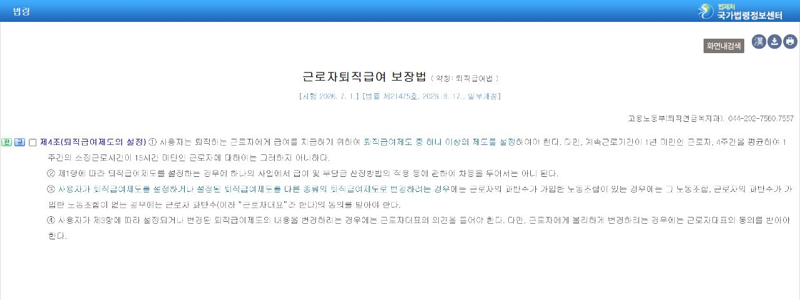
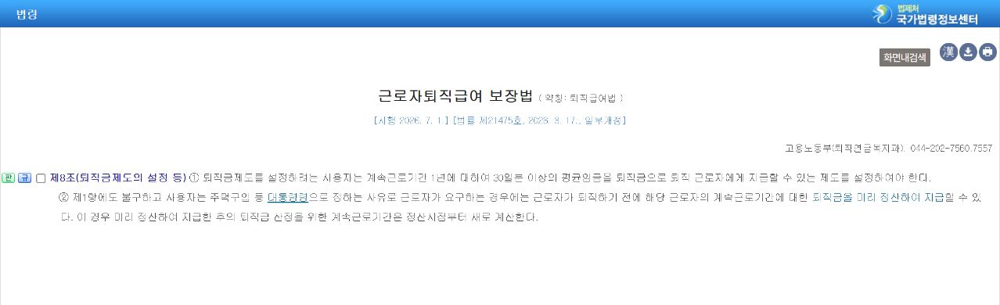
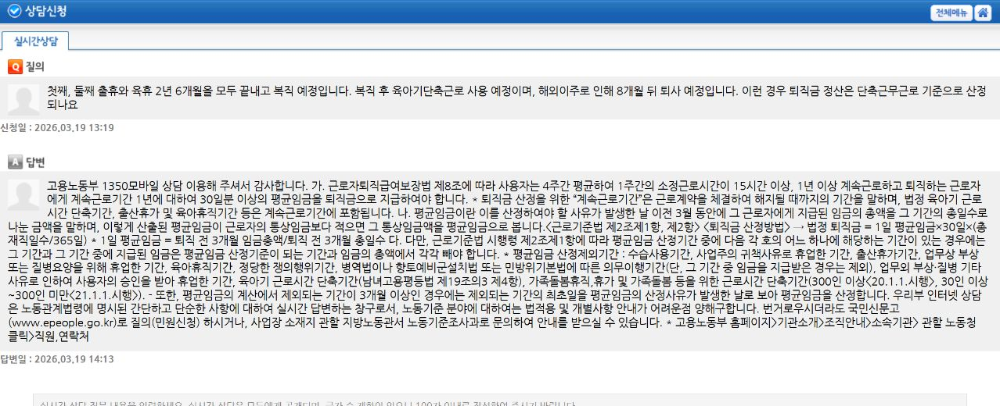
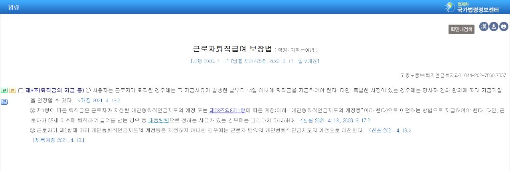

# 퇴직금 지급기준, 1년·주 15시간·14일을 먼저 확인하세요

퇴사를 앞두면 가장 먼저 떠오르는 질문이 있습니다.

“나는 퇴직금을 받을 수 있을까?”

인터넷에는 ‘1년만 채우면 된다’는 설명이 많지만, 실제로는 근무기간과 주당 소정근로시간을 함께 봐야 합니다. 받을 수 있는 금액을 계산할 때도 마지막 월급만 보는 것이 아니라 **퇴직 전 3개월의 평균임금**이 기준이 됩니다.

오늘은 현행 「근로자퇴직급여 보장법」과 고용노동부 안내를 기준으로, 퇴직 전에 확인해야 할 순서를 정리해보겠습니다.

> **먼저 결론부터 말하면, 4주 평균 주 15시간 이상 일한 기간이 1년 이상인지 확인하는 것이 출발점입니다.**

## 1. ‘1년 이상’만 보지 말고 주당 근로시간도 봐야 합니다

법은 계속근로기간이 1년 미만인 근로자와, 4주를 평균해 1주간 소정근로시간이 15시간 미만인 근로자에게는 퇴직급여제도 설정 의무의 예외를 두고 있습니다.

따라서 다음 두 가지를 같이 확인해야 합니다.

- 근로계약을 맺고 실제로 계속 일한 기간이 1년 이상인지
- 4주 평균 주당 소정근로시간이 15시간 이상인지

여기서 ‘소정근로시간’은 실제로 야근까지 포함해 일한 시간이 아니라, 근로계약에서 정한 근로시간을 뜻합니다. 아르바이트나 단시간 근로자라면 급여명세서만 보지 말고 근로계약서를 함께 꺼내보는 것이 좋습니다.

주 15시간 이상과 미만을 오간 기간이 섞여 있다면 단순히 입사일과 퇴사일만 넣어 계산하기 어렵습니다. 이 경우에는 15시간 미만인 기간을 어떻게 볼지 개별 근무기록을 기준으로 확인해야 합니다.

> **계약서, 출퇴근 기록, 급여명세서는 퇴사 전에 한 번에 내려받아 두세요. 퇴사 후 사내 시스템 접근이 막히면 확인이 훨씬 번거로워집니다.**

## 2. 퇴직금은 ‘1년당 30일분 평균임금’이 기준입니다

퇴직급여법 제8조는 계속근로기간 1년에 대해 30일분 이상의 평균임금을 지급할 수 있는 제도를 두도록 정하고 있습니다.

고용노동부가 안내하는 기본 계산식은 다음과 같습니다.

`퇴직금 = 1일 평균임금 × 30일 × (총 재직일수 ÷ 365)`

1일 평균임금은 원칙적으로 퇴직 전 3개월 동안 받은 임금 총액을 그 3개월의 총일수로 나눠 계산합니다. 이 때문에 ‘마지막 월급 × 근속연수’로 단순 계산한 금액과 실제 퇴직금이 다를 수 있습니다.

## 3. 계산할 때 자주 빠뜨리는 돈이 있습니다

평균임금에 어떤 항목이 들어가는지는 이름보다 지급 성격이 중요합니다. 기본급뿐 아니라 정기적 상여금, 수당, 연차 관련 금품 등이 영향을 줄 수 있습니다.

반대로 모든 돈이 자동으로 포함되는 것도 아닙니다. 개인적인 경조금이나 실비 변상 성격의 금액처럼 임금으로 보기 어려운 항목도 있습니다.

퇴사 전에는 아래 자료를 나란히 놓고 보는 편이 안전합니다.

1. 퇴직일 이전 3개월 급여명세서
2. 최근 1년 상여금 지급 내역
3. 사용하지 않은 연차와 연차수당 처리 내역
4. 근로계약서와 취업규칙
5. 휴직·휴업·출산휴가·육아휴직 기간

특히 출산휴가나 육아휴직처럼 평균임금 산정에서 제외될 수 있는 기간이 있다면 3개월 급여만 기계적으로 나누면 결과가 어긋날 수 있습니다. 고용노동부 계산기 결과도 입력값에 따라 달라지므로, 특수한 근무 이력이 있다면 관할 노동관서나 고용노동부 1350을 통해 확인하는 것이 좋습니다.

## 4. 퇴직 후 지급기한은 원칙적으로 14일입니다

퇴직급여법 제9조에 따르면 사용자는 지급 사유가 발생한 날부터 14일 이내에 퇴직금을 지급해야 합니다. 다만 특별한 사정이 있고 당사자가 합의하면 지급기일을 연장할 수 있습니다.

회사에서 “다음 급여일에 주겠다”고 말하는 것만으로 지급기일이 자동으로 연장되는 것은 아닙니다. 연장에 동의했다면 날짜와 내용을 문자나 서면으로 남겨두는 편이 좋습니다.

또한 퇴직금은 원칙적으로 근로자가 지정한 개인형퇴직연금제도(IRP) 계정으로 이전되는 경우가 있으므로, 회사가 요청하는 계좌가 일반 통장인지 IRP 계좌인지도 구분해야 합니다. 연령이나 지급액 등 법에서 정한 예외가 있을 수 있어 회사 담당자와 금융기관에 함께 확인하는 것이 안전합니다.

## 5. 퇴사 전에 이 순서대로 확인하세요

- 입사일과 마지막 근무일을 확정한다.
- 주 15시간 미만으로 일한 기간이 있는지 살핀다.
- 최근 3개월 급여명세서와 최근 1년 상여금 내역을 받는다.
- 휴직·휴업 등 평균임금 산정 제외 가능 기간을 표시한다.
- 회사가 계산한 퇴직금 산정서를 요청한다.
- IRP 계좌가 필요한지 확인한다.
- 퇴직일로부터 14일 이내 지급 여부를 확인한다.

> **퇴직금은 퇴사한 뒤에 기억을 더듬어 계산하기보다, 퇴사 전에 자료를 모아 회사 계산표와 대조하는 것이 가장 빠릅니다.**

## 마지막으로

퇴직금 지급기준은 숫자 세 개로 기억하면 정리가 쉽습니다.

**1년, 주 15시간, 퇴직 후 14일.**

다만 중간에 단시간 근무, 휴직, 상여금, 연차수당 같은 변수가 있으면 계산 결과가 달라질 수 있습니다. 이 글은 일반적인 기준을 정리한 것이며, 개별 분쟁이나 구체적인 법률 판단이 필요한 경우에는 고용노동부 1350 또는 관할 지방고용노동관서에 확인하시기 바랍니다.

### 공식 자료

- 국가법령정보센터, 「근로자퇴직급여 보장법」 제4조·제8조·제9조 (시행 2026. 7. 1.)
- 고용노동부 1350 모바일상담, 퇴직금 지급요건 및 평균임금 산정 안내 (2026. 3. 19.)

#퇴직금 #퇴직금지급기준 #퇴직금계산 #평균임금 #퇴직금14일 #주15시간 #퇴사준비
