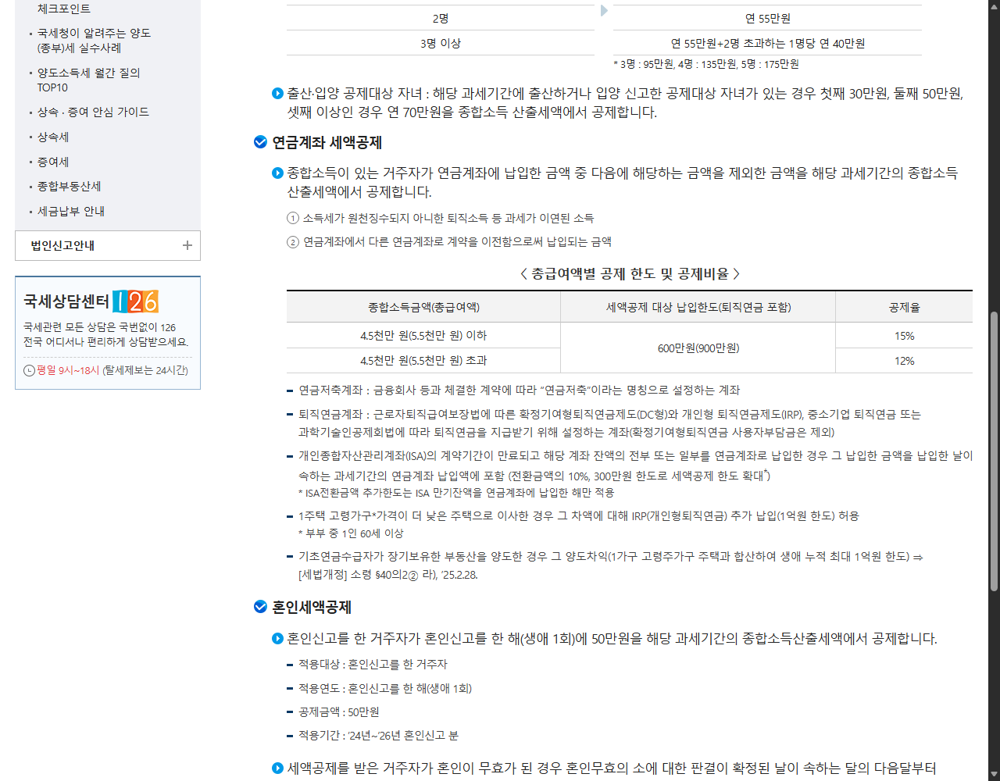

# 연금저축 세액공제액과 실제 환급액이 다른 이유

연금저축에 600만 원을 넣으면
99만 원을 전부 돌려받는 걸까요?

꼭 그렇지는 않습니다.

<mark>세액공제액은 세금에서 빼주는 계산 금액이고,
실제 환급액은 이미 낸 세금까지 반영한 최종 결과입니다.</mark>

두 금액이 왜 달라지는지,
어디에서 확인해야 하는지 순서대로 살펴보겠습니다.

---

## ✅ 30초 결론부터

- 연금저축 세액공제 대상 납입 한도는 연 600만 원입니다.
- 총급여 구간에 따라 국세 공제율은 15% 또는 12%입니다.
- 계산된 공제액이 실제 환급액과 그대로 같지는 않습니다.

<u>원천징수영수증의 결정세액과 기납부세액을 함께 확인해야 합니다.</u>

## 1. 먼저 세액공제액을 계산합니다

국세청은 총급여 구간에 따라
연금계좌 세액공제율을 15% 또는 12%로 안내합니다.

지방소득세까지 반영해 흔히 계산하는 비율은
각각 16.5%와 13.2%입니다.

| 적용 비율 | 300만 원 납입 | 600만 원 납입 |
|---|---:|---:|
| 국세 15% | 45만 원 | 90만 원 |
| 국세 12% | 36만 원 | 72만 원 |
| 지방소득세 포함 16.5% | 49만 5천 원 | 99만 원 |
| 지방소득세 포함 13.2% | 39만 6천 원 | 79만 2천 원 |

_국세청 공식 화면에서 연금계좌 납입 한도와 15%·12% 공제율을 확인할 수 있습니다._

---

## 2. 그런데 환급액은 왜 더 적을까요?

연말정산은 연금저축 한 항목만 따로 계산하지 않습니다.

급여에서 미리 낸 세금과 각종 공제를 모두 반영한 뒤,
최종 세금보다 더 낸 금액이 있을 때 차액을 돌려줍니다.

따라서 결정세액이 이미 0에 가깝다면
연금저축 공제액이 계산돼도 환급액은 작을 수 있습니다.

> 세액공제 한도와 실제로 돌려받는 금액은 같은 뜻이 아닙니다.

## 🔍 3. 원천징수영수증에서 볼 숫자

- 올해 연금저축·IRP에 직접 납입한 금액
- 총급여 또는 종합소득금액 구간
- 원천징수영수증의 결정세액
- 이미 납부한 세금인 기납부세액

‘600만 원을 넣으면 99만 원을 무조건 돌려받는다’는 설명에는
개인의 정산 상태가 빠져 있습니다.

<mark>납입액을 정하기 전에는
예상 세액공제액과 실제 환급 가능액을 따로 보세요.</mark>

## 4. 실제 확인 순서

1. 연금저축과 IRP의 올해 납입액을 확인합니다.

2. 총급여 또는 종합소득금액 구간을 확인합니다.

3. 국세청 기준으로 예상 세액공제액을 계산합니다.

4. 원천징수영수증의 결정세액과 기납부세액을 비교합니다.

5. 홈택스 예상세액 계산에 다른 공제 항목도 함께 입력합니다.

<u>납입 금액을 확정하기 전에 예상세액 계산 결과를 한 번 저장해두세요.</u>

개인별 소득과 다른 공제 항목에 따라
최종 환급액은 달라질 수 있습니다.

## 태그

#연금저축세액공제 #연금저축환급액 #연말정산환급 #결정세액 #기납부세액 #생활금융 #브링이슈
