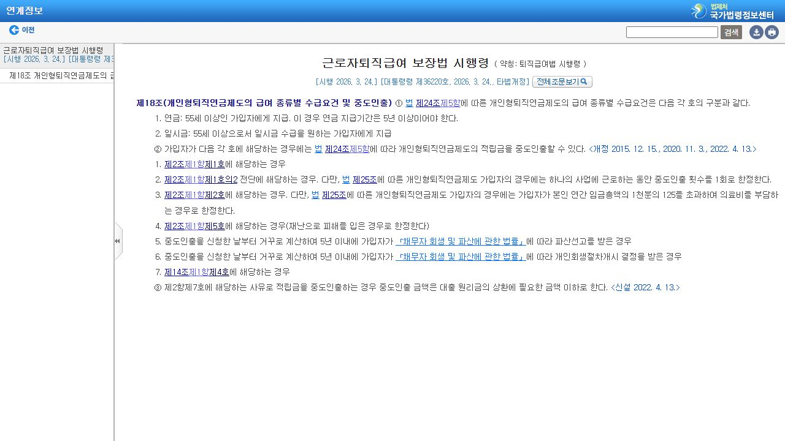

# IRP 중도인출, 급하다고 바로 꺼낼 수 있을까?

IRP에 돈이 보여도 일반 통장처럼 필요한 만큼 바로 찾을 수 있는 것은 아닙니다.

<mark>IRP 중도인출은 법에서 정한 사유에 해당하고 금융회사가 증빙을 확인해야 가능합니다.</mark>

사유에 해당하더라도 세금 처리가 모두 같은 것도 아닙니다.

---

## ✅ 1. 대표적인 중도인출 사유

고용노동부 안내와 관련 법령에서 확인되는 대표 사유는 다음과 같습니다.

📌 무주택자의 본인 명의 주택 구입

📌 무주택자의 주거 목적 전세금·보증금 부담

📌 본인·배우자·부양가족의 장기 요양과 일정 기준을 넘는 의료비 부담

📌 파산선고 또는 개인회생절차 개시 결정

📌 재난 피해 등 법령이 정한 경우

_국가법령정보센터의 현행 「근로자퇴직급여 보장법 시행령」 제18조 화면입니다. 개인형퇴직연금제도의 중도인출 근거와 사유를 직접 확인할 수 있습니다._

<u>‘생활비가 부족하다’, ‘대출을 갚고 싶다’는 사정만으로는 자동으로 중도인출 사유가 되지 않습니다.</u>

---

## 2. 세금은 돈의 출처에 따라 달라집니다

IRP 안에는 퇴직금, 세액공제를 받은 개인 납입금, 세액공제를 받지 않은 납입금, 운용수익이 섞여 있을 수 있습니다.

그래서 같은 금액을 인출해도 어떤 돈부터 빠지는지와 인출 사유에 따라 과세 방식이 달라질 수 있습니다.

특히 세액공제를 받은 납입금과 운용수익을 연금 외 방식으로 꺼내면 기타소득세 대상이 될 수 있어 금융회사에 예상세액을 먼저 요청해야 합니다.

---

## 🔎 3. 신청 전에 준비할 것

1. 내가 해당하는 법정 사유를 정확히 선택합니다.
2. 금융회사에 필요한 증빙 목록과 유효기간을 확인합니다.
3. 인출 가능 금액과 예상세액을 서면 또는 앱 화면으로 확인합니다.
4. 일부 인출인지 계좌 해지인지 구분합니다.

<mark>IRP 중도인출은 ‘가능한가’만 묻지 말고 ‘얼마를 받고 계좌가 어떻게 남는가’까지 확인해야 합니다.</mark>

서류를 발급받기 전에 가입 금융회사 고객센터에 사유와 기준일을 먼저 설명하세요.

※ 실제 가능 여부와 세금은 가입 형태·적립금 구성·증빙에 따라 달라질 수 있습니다.

공식 안내: https://www.law.go.kr/LSW/lsLinkCommonInfo.do?chrClsCd=010202&lspttninfSeq=71031

## 태그

#IRP중도인출 #퇴직연금중도인출 #IRP세금 #전세금IRP #의료비IRP #노후자금 #브링이슈
