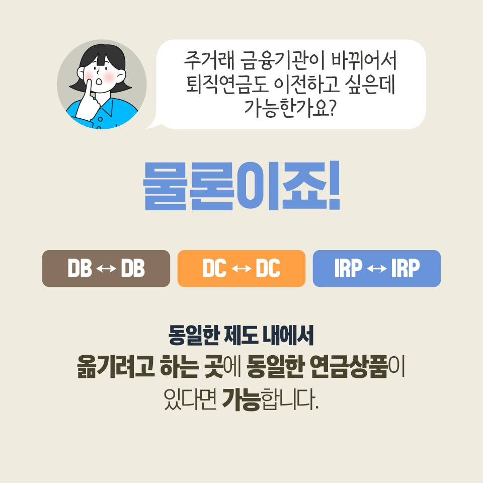
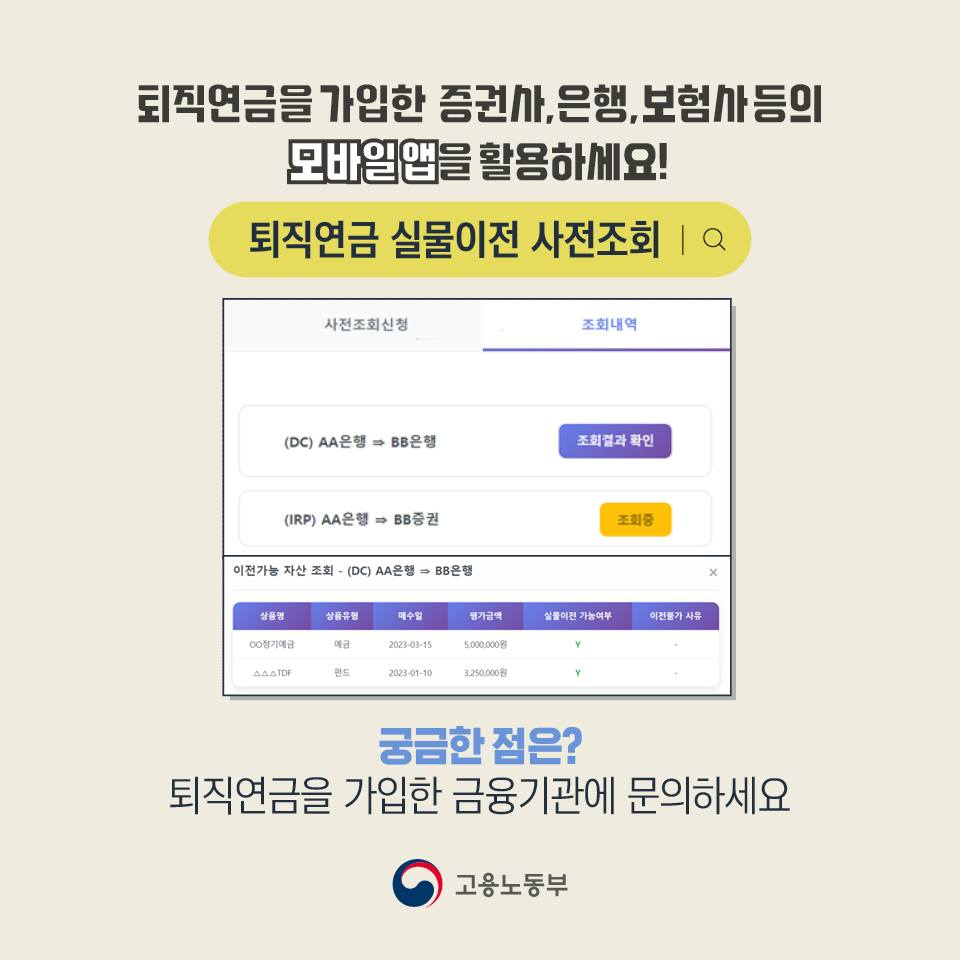

# IRP 금융회사 옮기기, 해지하지 않고 이전하는 방법

수수료나 상품 구성이 마음에 들지 않아 IRP를 옮기고 싶을 때 기존 계좌부터 해지하면 안 됩니다.

<mark>IRP는 새 금융회사에서 이전을 신청해 기존 적립금을 계약이전하는 방식이 기본입니다.</mark>

해지 후 현금으로 받아 다시 넣는 것과 계약이전은 세금 처리가 달라질 수 있습니다.

---

## ✅ 1. 이전 순서는 이렇게 진행됩니다

1. 옮길 금융회사에서 새 IRP 계좌를 개설합니다.
2. 새 금융회사 앱·영업점에서 이전 신청을 합니다.
3. 기존 금융회사의 의사 확인 절차를 진행합니다.
4. 보유 상품의 실물이전 가능 여부를 사전조회합니다.
5. 옮길 수 없는 상품은 매도·현금 이전 여부를 결정합니다.

_고용노동부는 IRP는 IRP끼리 같은 제도 안에서 옮기고, 옮길 금융회사에도 동일한 연금상품이 있어야 실물이전할 수 있다고 안내합니다._

_가입 금융회사의 앱이나 홈페이지에서 상품별 실물이전 가능 여부를 먼저 조회할 수 있습니다._

공식 안내: https://moel.go.kr/news/cardinfo/view.do?bbs_seq=20250701716

---

## 2. 수수료보다 먼저 볼 세 가지

**보유 상품이 그대로 이동하는가**

동일한 제도 안에서 새 금융회사도 같은 상품을 취급하면 실물이전이 가능할 수 있습니다. 그렇지 않은 상품은 매도 후 현금으로 옮겨야 하므로 매도 시점의 손익과 시장 공백을 확인해야 합니다.

**중도해지 비용이 있는 상품인가**

예금, 보험, 펀드마다 정리 조건이 다릅니다. 상품별 예상 정산액을 확인하세요.

**새 금융회사에서 같은 상품을 살 수 있는가**

수수료가 낮아도 원하는 예금·펀드·ETF가 없다면 이전 목적이 사라집니다.

---

## 🔎 3. 이전 전후로 캡처할 화면

📌 기존 계좌 총 적립금과 상품별 평가액

📌 상품별 만기·중도해지 예상액

📌 이전 신청 접수번호와 예정일

📌 새 계좌 입금액과 이전 완료일

📌 새 계좌의 수수료와 투자 가능 상품

<u>이전 기간 중 시장이 움직일 수 있으므로, 매도일과 재매수 가능일을 반드시 물어보세요.</u>

<mark>IRP 이전의 목적은 단순히 앱을 바꾸는 것이 아니라 비용·상품·관리 편의를 개선하는 것입니다.</mark>

기존 금융회사에 해지 요청을 하기 전, 새 금융회사에서 ‘계약이전’ 메뉴를 먼저 찾으세요.

※ 실제 이전 기간과 상품 처리 방식은 금융회사 및 보유 상품에 따라 달라집니다.

## 태그

#IRP이전 #IRP금융회사이전 #퇴직연금이전 #IRP수수료 #연금계좌이전 #노후자금 #브링이슈
