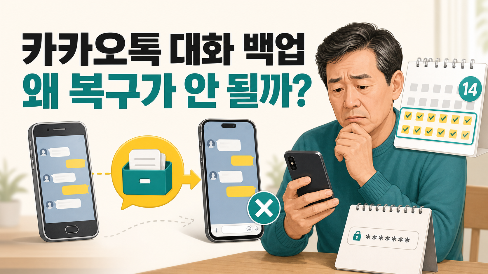
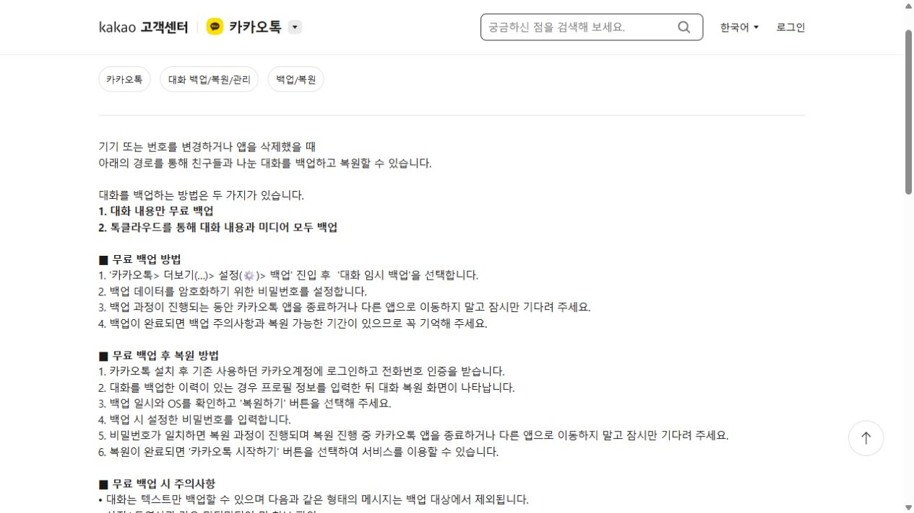
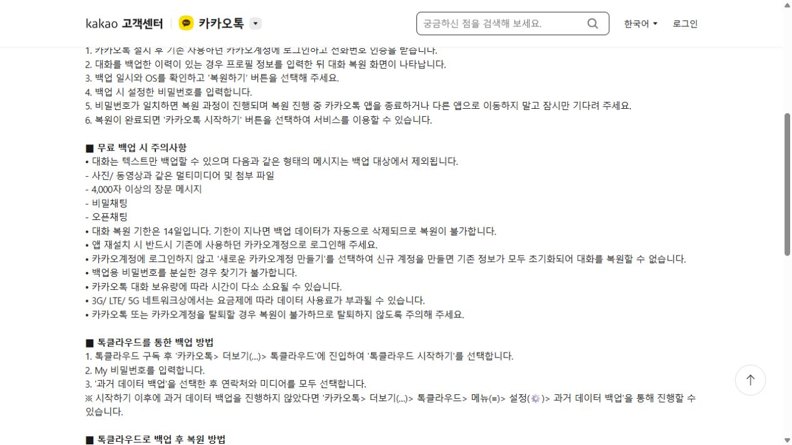

# 카카오톡 대화 백업했는데 복구가 안 되는 이유

새 휴대폰에서 카카오톡에 로그인했는데 대화가 보이지 않으면 백업부터 다시 확인해야 합니다.

<mark>카카오톡 대화 백업은 계정 로그인만으로 자동 복구되는 기능이 아닙니다.</mark>

백업 시점, 전화번호 인증, 계정, 복원 비밀번호와 14일의 복원 기한이 맞아야 합니다. 📱

---

## ✅ 1. 바꾸기 전 휴대폰에서 먼저 할 일

카카오톡에서 **더보기(…) → 설정(⚙️) → 백업 → 대화 임시 백업**으로 들어가 백업을 완료합니다.

완료 화면에 표시되는 백업 일시와 복원 기한을 캡처해 두세요.

복원 비밀번호는 카카오계정 비밀번호와 다를 수 있으므로 따로 기억해야 합니다.

_카카오 고객센터가 안내하는 무료 대화 백업과 복원 순서입니다._

> 백업 완료 화면을 확인하지 않았다면 새 휴대폰 초기화부터 진행하지 마세요.

---

## 2. 복구가 안 될 때 확인할 순서

1. 기존 휴대폰에서 백업이 실제 완료됐는지 확인합니다.
2. 새 휴대폰에서 같은 전화번호와 카카오계정으로 인증했는지 봅니다.
3. 복원 화면을 건너뛰지 않았는지 확인합니다.
4. 백업할 때 만든 복원 비밀번호를 정확히 입력합니다.
5. 백업일로부터 14일의 복원 기한이 지나지 않았는지 확인합니다.

---

## ⚠️ 3. 일반 대화 백업에 포함되지 않을 수 있는 것

무료 백업은 텍스트 대화만 대상입니다. 사진·동영상 등 첨부 파일, 4,000자 이상의 장문 메시지, 비밀채팅과 오픈채팅은 제외됩니다.

_무료 백업 제외 항목, 14일 복원 기한, 기존 카카오계정 로그인 조건을 한 화면에서 확인할 수 있습니다._

중요한 사진과 파일은 카카오톡 백업만 믿지 말고 휴대폰 사진첩이나 별도 저장공간에 따로 보관하세요.

<u>대화가 중요하다면 ‘백업 완료’와 ‘사진·파일 별도 저장’을 두 단계로 생각하는 것이 안전합니다.</u>

---

## 🔎 4. 휴대폰 교체 전 체크리스트

📌 카카오계정 이메일 또는 로그인 방법 확인

📌 대화 백업 완료 시각 확인

📌 복원 비밀번호 별도 기록

📌 중요한 사진·동영상·문서 별도 저장

📌 새 휴대폰에서 복원 완료 후 기존 기기 정리

<mark>가장 흔한 실수는 새 휴대폰 로그인을 먼저 하고, 나중에 백업을 찾는 것입니다.</mark>

기존 휴대폰이 아직 켜진다면 초기화하지 말고 백업 상태부터 확인하세요.

※ 메뉴 이름과 지원 범위는 카카오톡 버전에 따라 달라질 수 있으므로 카카오 고객센터의 최신 안내를 함께 확인하세요.

공식 안내: https://cs.kakao.com/helps_html/1073209313

## 태그

#카카오톡백업 #카카오톡복구 #카톡대화백업 #휴대폰교체 #카톡복원 #스마트폰문제해결 #브링이슈
