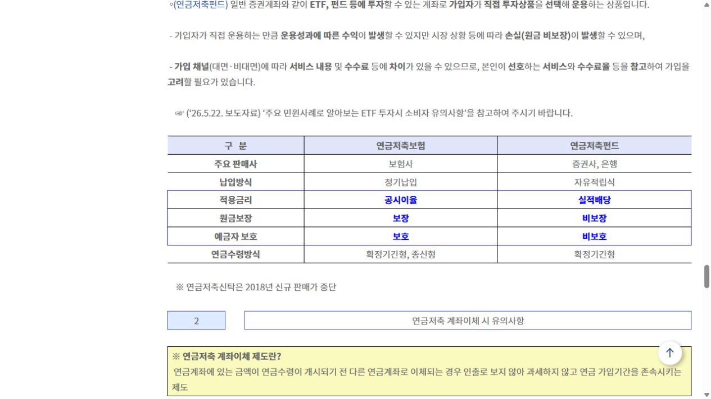

# 연금저축펀드와 연금저축보험, 무엇이 다를까?

둘 다 이름에 ‘연금저축’이 들어가지만 돈이 움직이는 방식은 꽤 다릅니다.

<mark>연금저축펀드는 직접 상품을 골라 운용하는 계좌에 가깝고, 연금저축보험은 보험사의 납입·공시이율·사업비 구조를 확인해야 하는 상품입니다.</mark>

세액공제만 보고 선택하면 유지 과정에서 불편해질 수 있습니다. 😊

<u>이름이 비슷해도 수익이 나는 방식과 중간에 그만둘 때의 비용은 다릅니다.</u>

---

## ✅ 1. 핵심 차이를 한 번에 보기

| 확인 항목 | 연금저축펀드 | 연금저축보험 |
|---|---|---|
| 주요 판매사 | 증권사·은행 | 보험사 |
| 납입 방식 | 자유적립식 | 정기납입 |
| 적용 방식 | 실적배당 | 공시이율 |
| 원금 보장 | 비보장 | 보장 |
| 연금 수령 | 확정기간형 | 확정기간형·종신형 |

_금융위원회가 정리한 공식 비교표입니다. 판매사·납입방식·적용금리·원금보장·연금수령 방식이 한 화면에 정리돼 있습니다._

---

## 2. 이런 사람은 확인 포인트가 다릅니다

**가격 변동을 감수하고 직접 운용하고 싶다면**

연금저축펀드에서 어떤 상품을 살 수 있는지, 위험자산 비중과 보수를 확인하세요.

**매달 정해진 금액을 오래 납입하는 편이 편하다면**

연금저축보험의 납입기간, 사업비, 공시이율, 중도해지 환급률을 먼저 확인하세요.

**기존 상품이 마음에 들지 않는다면**

바로 해지하지 말고 연금계좌 계약이전이 가능한지 확인하세요. 해지와 이전은 세금 결과가 다를 수 있습니다.

---

## 🔎 3. 가입 전 질문 다섯 가지

📌 10년 이상 유지할 수 있는 금액인가?

📌 손실이 나도 직접 운용을 계속할 수 있는가?

📌 사업비와 총보수는 얼마인가?

📌 중도해지 시 실제 환급액은 얼마인가?

📌 다른 금융회사로 옮길 때 절차와 비용은 무엇인가?

<mark>좋은 연금저축은 수익률이 가장 높아 보이는 상품이 아니라, 내가 이해하고 끝까지 유지할 수 있는 상품입니다.</mark>

비교표를 저장해 두고 두 금융회사에서 같은 질문에 대한 답을 받아보세요.

※ 특정 상품 추천이 아닌 일반적인 비교 기준입니다.

공식 안내: https://www.fsc.go.kr/no010101/87144

## 태그

#연금저축펀드 #연금저축보험 #연금저축차이 #연금상품비교 #노후준비 #연금계좌 #브링이슈
