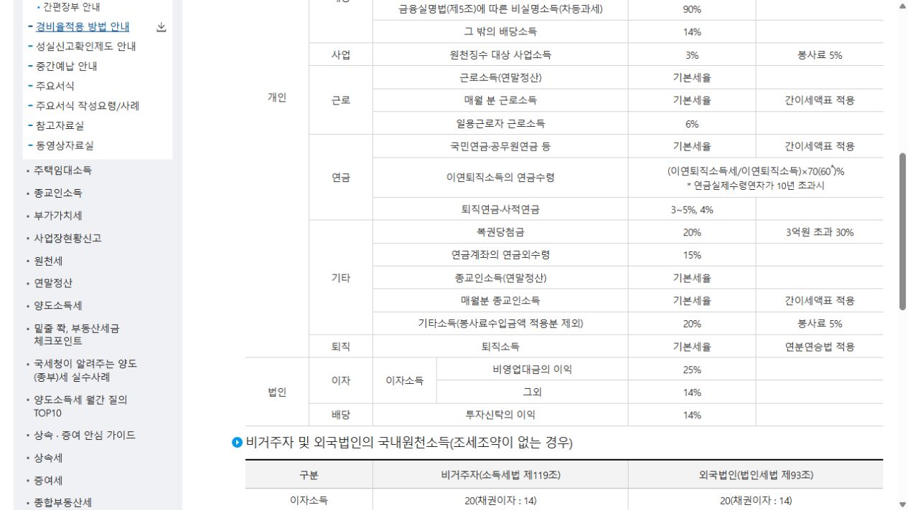

# 연금저축 중도해지, 세금은 얼마나 붙을까?

연금저축 계좌의 평가금액이 곧바로 내가 받을 금액이라고 생각하면 안 됩니다.

<mark>중도해지하면 세액공제를 받은 납입금과 운용수익에 연금 외 수령 세금이 적용될 수 있습니다.</mark>

다만 계좌 안의 모든 원금에 똑같이 세금이 붙는 것은 아닙니다.

---

## ✅ 1. 먼저 돈을 세 구역으로 나눠보세요

| 계좌 안의 돈 | 확인할 내용 |
|---|---|
| 세액공제를 받은 납입금 | 연금 외 수령 과세 가능 |
| 세액공제를 받지 않은 납입금 | 과세 제외 여부 확인 |
| 운용수익 | 연금 외 수령 과세 가능 |

_국세청 원천징수세율 표에서 ‘연금계좌의 연금외수령’ 항목을 직접 확인한 화면입니다. 표의 15%는 국세 기준이며 실제 원천징수에는 지방소득세가 함께 반영될 수 있습니다._

<u>예전에 세액공제를 신청하지 않은 납입금이 있다면 금융회사 기록에 제대로 반영됐는지도 확인해야 합니다.</u>

---

## 2. 해지 전에 반드시 받아볼 숫자

앱에 표시되는 평가금액만 보지 말고 금융회사에 아래 항목을 요청하세요.

📌 오늘 해지할 경우 세전 평가금액

📌 예상 세금과 실제 입금 예정액

📌 세액공제 받지 않은 원금 반영 여부

📌 해지하지 않고 납입만 중단할 수 있는지

📌 다른 금융회사로 계약이전할 수 있는지

상품이 마음에 들지 않는 것이 이유라면 해지보다 이전이 유리할 수 있습니다. 급전이 필요하다면 일부 인출 가능 여부와 부득이한 인출 사유도 따로 확인해야 합니다.

---

## 🔎 3. 해지와 납입중단은 다릅니다

당장 추가 납입이 어렵다고 계좌까지 없앨 필요는 없습니다.

자동이체를 줄이거나 멈춘 뒤 기존 자산을 유지할 수 있는지 먼저 확인하세요.

<mark>중도해지 결정은 세금만이 아니라 보유 상품의 손익, 수수료, 다시 가입할 때의 조건까지 함께 봐야 합니다.</mark>

해지 버튼을 누르기 전에 예상 실수령액을 캡처해 두고 다른 선택지와 비교하세요.

※ 구체적인 과세는 가입 시기·공제 내역·인출 사유에 따라 달라질 수 있습니다.

공식 안내: https://www.nts.go.kr/nts/cm/cntnts/cntntsView.do?cntntsId=7703&mi=2233

## 태그

#연금저축중도해지 #연금저축세금 #연금저축해지 #연금계좌 #연금외수령 #생활금융 #브링이슈
