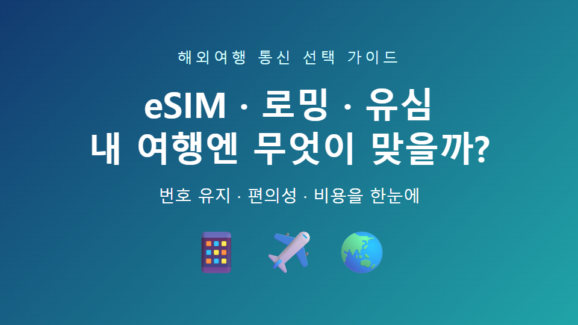
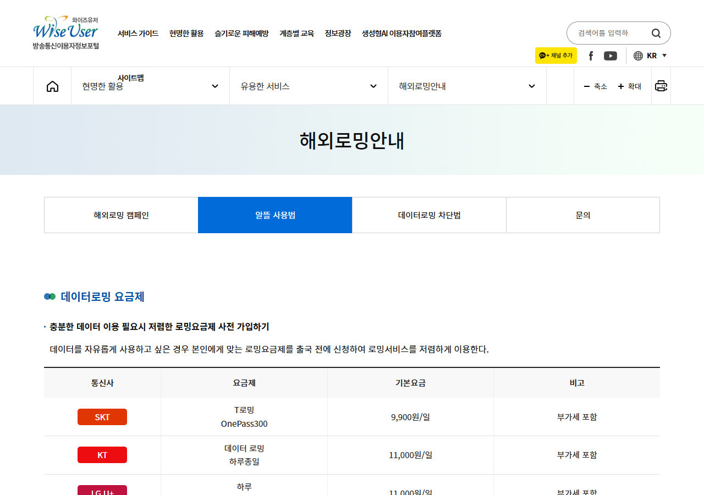
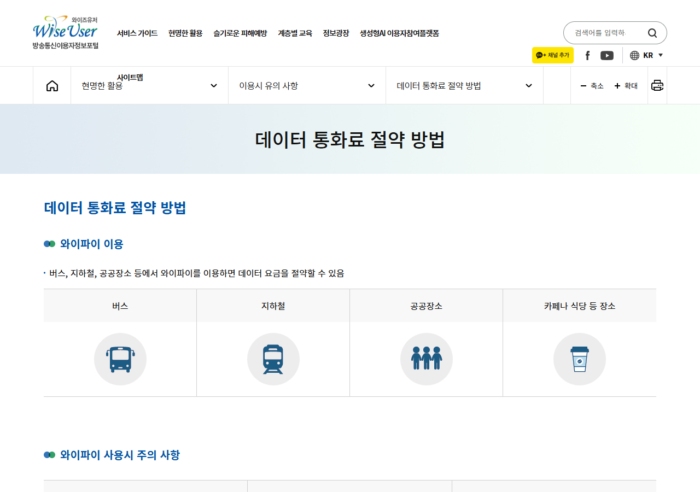

# 해외여행 eSIM·로밍·유심 차이, 내 여행에는 무엇이 맞을까?

해외여행을 준비하다 보면 마지막까지 남는 선택이 있습니다.

바로 **eSIM·통신사 로밍·현지 유심**입니다.

가격만 보면 현지 유심이 끌리고,
편의성만 보면 로밍이 편해 보입니다.

하지만 한국 번호로 문자와 전화를 받아야 하는지,
휴대전화가 eSIM을 지원하는지에 따라 답이 달라집니다.

---

## 1. 세 방식의 차이부터 한눈에 보세요

| 구분 | 통신사 로밍 | eSIM | 현지 유심 |
|---|---|---|---|
| 준비 | 출국 전 요금제 신청 | QR 또는 앱으로 개통 | 현지·국내에서 유심 구매 |
| 한국 번호 | 유지하기 쉬움 | 설정에 따라 병행 가능 | 유심 교체 시 수신이 어려울 수 있음 |
| 편의성 | 가장 간단 | 유심 교체가 필요 없음 | 실물 유심 교체 필요 |
| 확인할 점 | 요금·제공량 | 단말 지원 여부 | 분실·보관, 번호 수신 여부 |

> 한국 번호 인증 문자가 중요하면 ‘가장 싼 상품’보다 번호 유지 가능 여부를 먼저 확인하세요.

---

## 2. 로밍이 맞는 사람

회사 전화나 카드 승인 문자처럼
한국 번호를 계속 써야 한다면 로밍이 편합니다.

통신사 앱에서 요금제와 제공 데이터를 확인하고,
출국 전에 신청해두면 현지 도착 후 설정이 단순합니다.

다만 기본 데이터 로밍을 아무 요금제 없이 켜면
예상보다 비용이 커질 수 있습니다.

---

## 3. eSIM이 맞는 사람

유심을 빼지 않고 여행용 회선을 추가하고 싶다면
eSIM이 실용적입니다.

다만 모든 휴대전화가 eSIM을 지원하는 것은 아닙니다.

구매 전에는 모델명과 통신사 잠금 여부,
통화 포함 여부, 데이터 활성화 시점을 확인하세요.

QR은 출국 전에 저장하되,
실제 개통 시점은 상품 안내를 따르는 편이 안전합니다.

---

## 4. 현지 유심이 맞는 사람

장기간 머물거나 현지 통화가 필요하다면
현지 유심이 유리할 수 있습니다.

방송통신이용자정보포털은 현지 유심이 저렴하고 빠를 수 있지만,
한국 번호 수신이 어려울 수 있다고 안내합니다.

유심을 교체했다면 기존 유심을 잃어버리지 않도록
별도 케이스에 보관하세요.

---

## 5. 출국 전 마지막 체크리스트

- 내 휴대전화가 eSIM을 지원하는지
- 한국 번호로 인증 문자를 받아야 하는지
- 통화가 필요한지, 데이터만 필요한지
- 핫스팟 사용이 가능한지
- 데이터 제공량과 속도 제한이 있는지
- 개통·환불 조건이 언제까지인지

> 결론은 간단합니다. 번호 유지와 편의는 로밍, 유심 교체 없는 데이터는 eSIM, 장기 체류와 현지 통화는 현지 유심부터 비교해보세요.

공식 확인: [방송통신이용자정보포털 해외 로밍 안내](https://wiseuser.go.kr/application.do?boardno=2913&boardtypecode=5330&sorting=2)

※ 요금과 지원 단말은 상품별로 달라질 수 있으므로 결제 전 통신사·판매사 안내를 다시 확인하세요.

#해외여행 #eSIM #해외로밍 #현지유심 #여행준비

