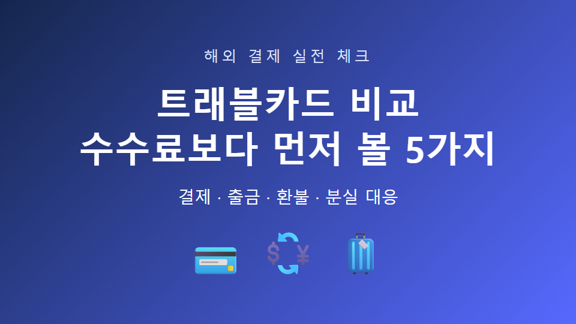
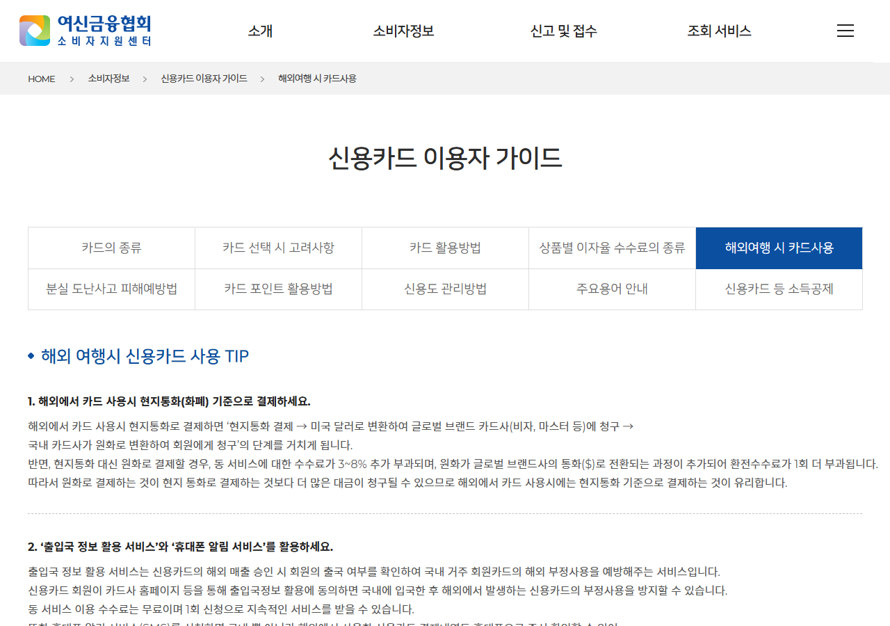
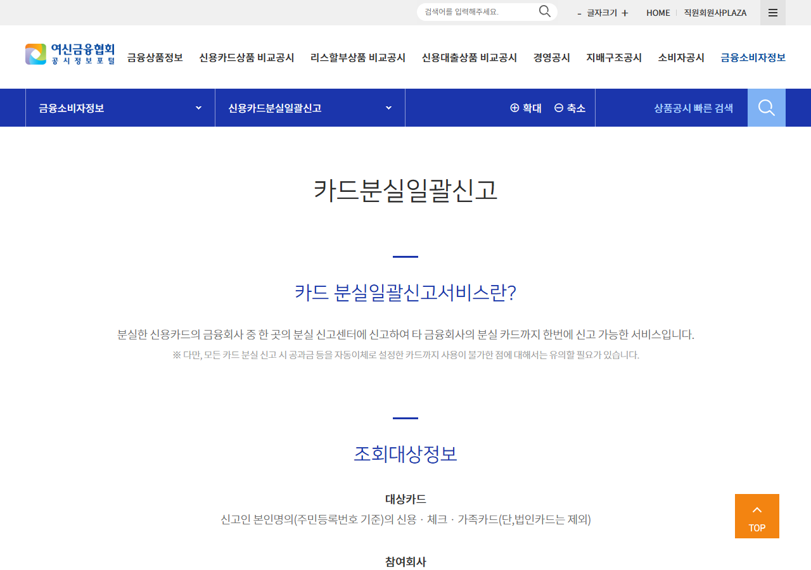

# 트래블카드 비교, 환전 수수료보다 먼저 볼 5가지

트래블카드를 고를 때
‘환전 수수료 무료’ 문구만 보는 경우가 많습니다.

하지만 실제 여행에서는 충전 방식과 출금 한도,
해외 원화결제 여부가 더 큰 차이를 만들기도 합니다.

---

## 1. 해외 결제 통화를 먼저 확인하세요

해외에서 원화로 결제하면 편해 보이지만,
DCC라는 해외 원화결제 수수료가 붙을 수 있습니다.

여신금융협회는 해외 원화결제 시
약 3~8%의 추가 비용이 발생할 수 있다고 안내합니다.

> 결제 단말기에서 KRW와 현지 통화가 보이면 현지 통화를 선택하는 편이 일반적으로 유리합니다.

---

## 2. 충전과 환불 방식을 보세요

자동 충전인지 직접 충전인지,
남은 외화를 원화로 되돌릴 때 비용이 있는지 확인하세요.

여행이 끝난 뒤 소액 잔액이 남을 수 있으므로
최소 충전 단위와 환불 조건도 중요합니다.

---

## 3. ATM 출금 조건을 따져보세요

카드사가 출금 수수료를 면제하더라도
현지 ATM 운영사가 별도 수수료를 받을 수 있습니다.

무료 출금 횟수와 월 한도,
현지 ATM 화면에 표시되는 추가 비용을 함께 보세요.

---

## 4. 지원 국가와 결제망을 확인하세요

여행할 국가의 통화를 지원하는지,
카드의 국제 브랜드가 현지에서 널리 쓰이는지 확인하세요.

여신금융협회는 출국 전 카드의 국제 브랜드 표시,
유효기간과 영문 이름을 점검하도록 안내합니다.

---

## 5. 분실·도난 대응이 쉬운지 보세요

앱에서 즉시 잠글 수 있는지,
해외에서도 고객센터에 연결할 수 있는지 확인하세요.

카드사 연락처를 휴대전화 메모와 동행자에게 남겨두면
분실 상황에서 시간을 줄일 수 있습니다.

---

## 6. 한 장으로 끝내는 선택 순서

1. 여행 국가의 통화 지원 여부

2. 현지 통화 결제와 DCC 차단 가능 여부

3. 충전·환불 조건

4. ATM 무료 횟수와 한도

5. 분실 시 앱 잠금과 고객센터

> ‘수수료 0원’ 한 줄보다 실제 여행 동선에서 결제·출금·분실 대응이 가능한지를 먼저 보세요.

공식 확인: [여신금융협회 해외 카드 이용 안내](https://customer.crefia.or.kr/common/forward.xx?url=%2Fcustomer%2Fguard%2FguardCreditcardUseGuide5)

※ 카드별 혜택과 한도는 달라질 수 있으므로 상품설명서와 약관을 확인하세요.

#트래블카드 #해외여행 #환전 #해외결제 #여행준비

