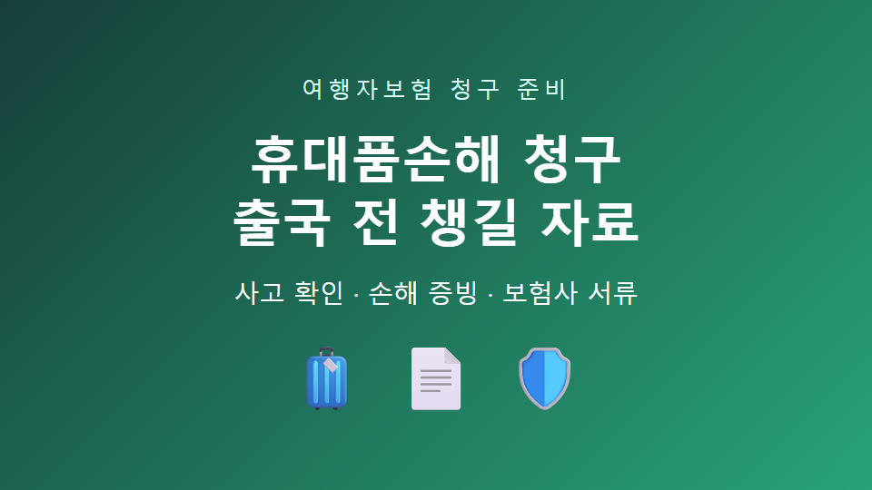
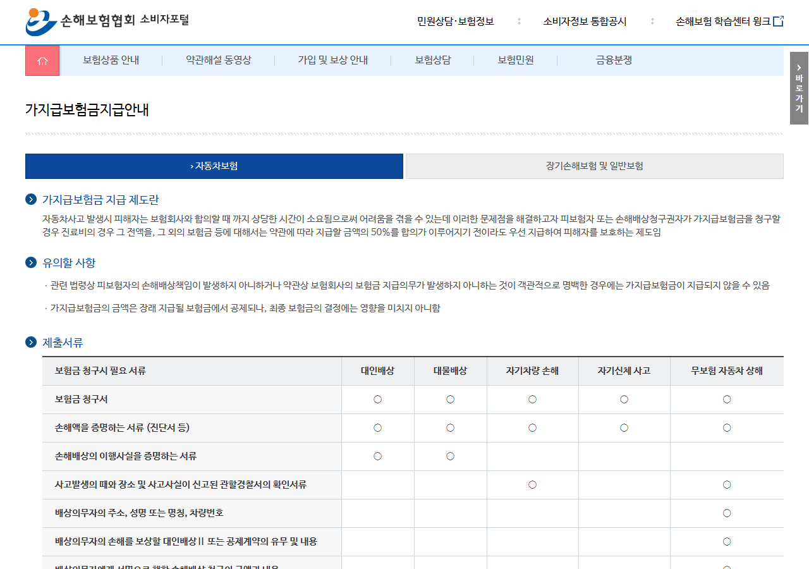

# 여행자보험 휴대품손해 청구, 출국 전 준비할 자료

여행 중 휴대전화나 가방을 잃어버리면
당황해서 무엇부터 해야 할지 놓치기 쉽습니다.

보험에 가입했더라도 사고 사실과 손해액을 보여주는 자료가 부족하면
추가 확인에 시간이 걸릴 수 있습니다.

---

## 1. 가입 전에 보장 범위를 확인하세요

‘휴대품손해’가 포함돼 있는지,
도난·파손·분실 중 무엇을 보장하는지 먼저 보세요.

자기부담금과 물품 1개당 한도,
보장 제외 물품도 약관에서 확인해야 합니다.

> 단순 분실과 도난은 약관에서 다르게 취급될 수 있으므로 ‘잃어버렸다’는 표현만으로 판단하지 마세요.

---

## 2. 사고 직후 현지 확인서를 받으세요

도난이라면 현지 경찰에 신고하고,
사고 장소와 시간, 물품이 적힌 확인서를 요청하세요.

항공사나 숙소에서 발생한 사고라면
해당 업체의 사고 확인 자료도 보관합니다.

---

## 3. 손해액을 보여주는 자료를 모으세요

구매 영수증과 카드 결제 내역,
제품명·모델명·구매 시점을 확인할 자료를 준비하세요.

파손이라면 물품 전체와 파손 부위를 촬영하고,
수리 견적서나 수리 불가 확인서를 받아두면 좋습니다.

---

## 4. 귀국 후 보험사 서류를 확인하세요

손해보험협회 안내처럼 보험금 청구서와 신분증 사본,
사고와 손해를 증명하는 자료가 기본이 됩니다.

다만 상품과 사고 유형에 따라
보험사가 추가 자료를 요구할 수 있습니다.

따라서 제출 전 가입 보험사의 앱이나 고객센터에서
휴대품손해 전용 목록을 다시 확인하세요.

---

## 5. 출국 전 휴대전화에 저장할 목록

- 보험증권과 계약번호
- 보험사 해외 고객센터
- 휴대품 사진과 모델명
- 고가 물품 구매 내역
- 여권 사본과 여행 일정
- 현지 경찰·항공사 확인서가 필요하다는 메모

> 사고가 난 뒤 기억에 의존하지 않도록, 출국 전 사진과 계약 정보를 한 폴더에 모아두세요.

공식 확인: [손해보험협회 보험금 청구 안내](https://consumer.knia.or.kr/consumer/general-guide/0201.do)

※ 실제 보상 여부와 제출 서류는 가입 상품의 약관과 보험사 심사에 따라 달라집니다.

#여행자보험 #휴대품손해 #보험금청구 #해외여행 #여행준비

